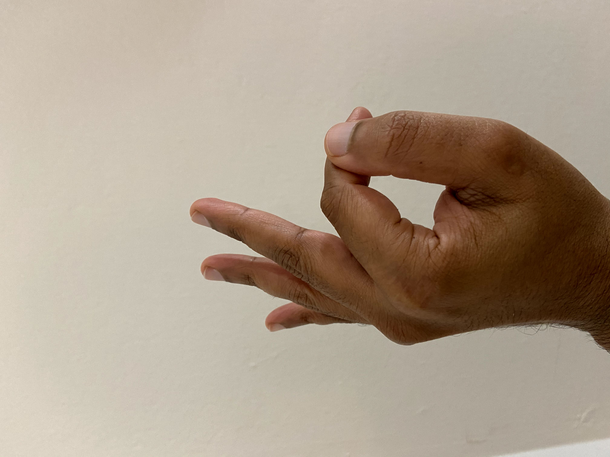

# Ahamkara Mudra

[TOC]

## How to do?
Touch your thumb to the middle phalange (the space between two lines) of the index finger. Ensure the thumb is outside your palm and not inside.

## Benefits
* Improves self confidence, assertiveness
* People have low self esteem, or dominated easily by others can practice this to improve their well being
