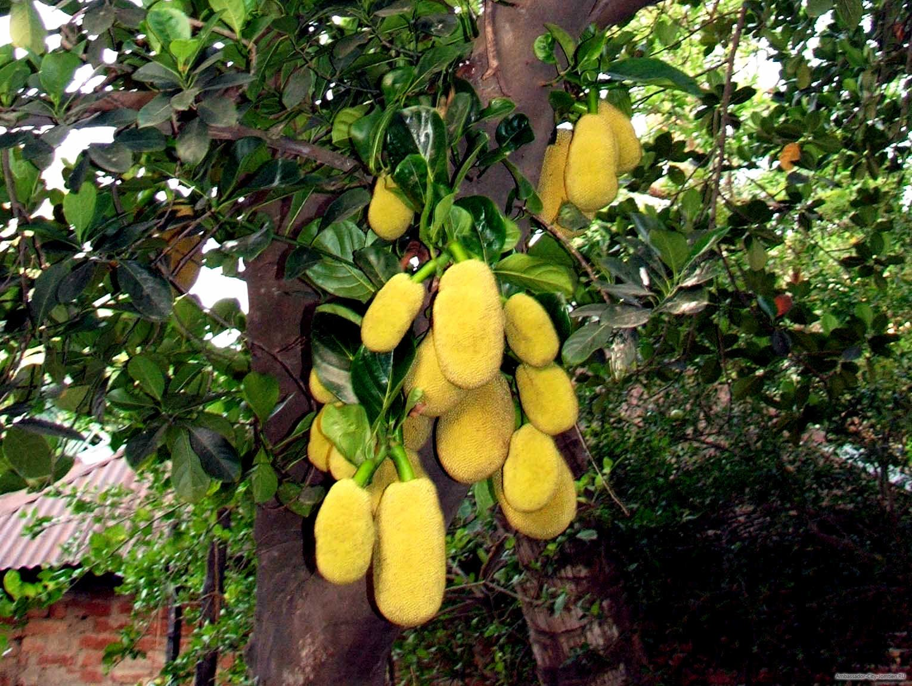

# Ayurwiki.org/Ayurwiki:Featured Page/May/Week/1

<h4 style="background-color: #90EE90; padding: 4px; border-top: 2px solid #006400;">Featured page: *Artocarpus hirsutus*</h4>

[Artocarpus hirsutus - Wild Jack, Jungle Jack](herbs/Artocarpus_hirsutus_-_Wild_Jack,_Jungle_Jack.md) - a tree seen in evergreen and semi-evergreen forests in India. Uses include Pimples, Cracks in Skin, Sores, Diarrhoea, Skin diseases, Intrinsic haemorrhage, Poisons.

Propagation: Seeds, Cuttings, Airlayers.

**Chemical Composition:** The Artocarpus species are rich in phenolic compounds including flavonoids, stilbenoids, arylbenzofurons and Jacalin, a lectin.

[Read more](herbs/Artocarpus_hirsutus_-_Wild_Jack,_Jungle_Jack.md)
