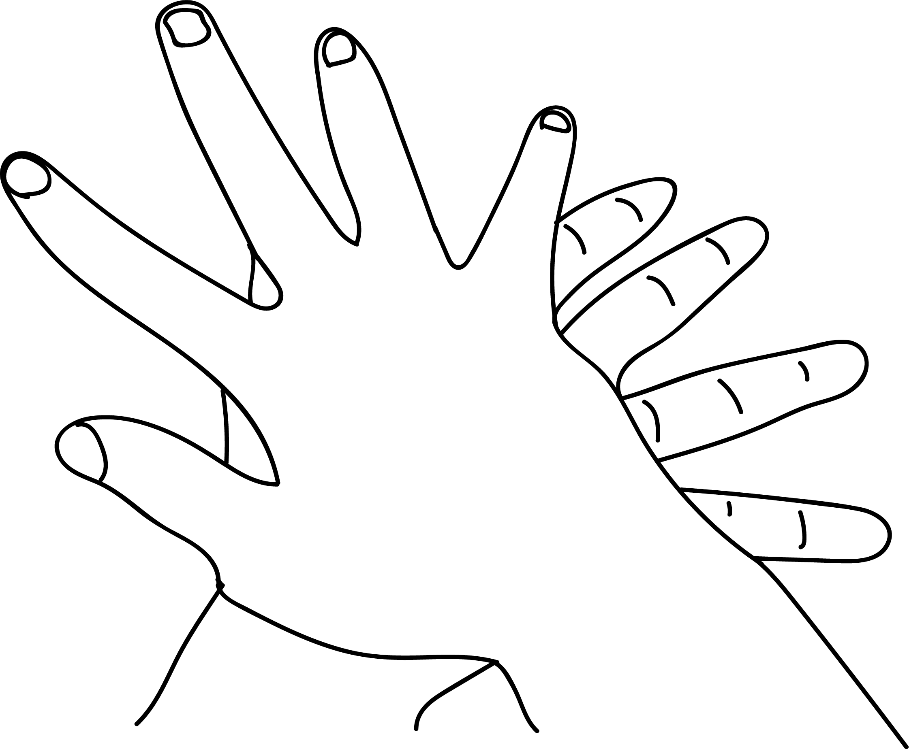

# Chakra Mudra

[TOC]

Lord vishnu is adorned with shankha, chakra, gada and padma.  The sudrashan chakra is a powerful weapon in the hands of lord Vishnu and lord Shrikrishna. Both of them hold it in the right hand. Chakra [Mudra](Mudra.md) is performed during worship and praying for success in any endeavour.

## Formation
Place the right palm on the left palm in such manner that the index finger of the right hand is placed on the thumb of the left hand and small finger of the right hand is placed on the index finger of the left hand. Now press the palms against each other.

## Effects
The index finger - vayu of the right hand is placed on the thumb - agni of the left hand. The small finger, jala, is touching in index finger of the left hand. So, elements agni, vayu and jala become powerful and spread their energy vibrations. pressing the palms against each other activate the pressure points of the heart, kidneys, thyroid gland, pancreas and lungs.

## Benefits
1. The seven chakras get energy and the heart, lungs, pancreas, thyroid and kidneys function powerfully.
1. The aura around the body increases.
1. Placing the thumb (Agni) on the wrist sends energy to the radial, median and ulner nerves and hand becomes powerful.
1. This mudra may be done for 15 minutes a day to increase aura and make the body powerful.

## References

## References

1. **"MUDRAS & HEALTH PERSPECTIVES"** by **"SUMAN.K.CHIPLUNKAR"** page no 98
