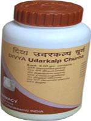

# Divya Udarkalp Churna

[TOC]

Divya Udarkalp Churna is a combination of Ayurvedic herbs that are natural and effective in the natural treatment of constipation. It is an excellent blend of natural herbs that is mainly prepared constipation natural treatment. Divya Udarkalp Churna consists of natural herbal remedies that improves the digestive functions and is a natural treatment of constipation. This is a wonderful blend of natural herbs effective for constipation natural treatment. Divya Udarkalp Churna helps to cure indigestion. Divya Udarkalp Churna is a combination of indigestion remedies that provides nourishment and energy to the body cells and helps in adequate functioning of all the organs of digestive system.
Divya Udarkalp Churna is a mixture of traditional natural herbs and it safe and effective. It does not produce any adverse reactions. Divya Udarkalp Churna includes natural herbs due to which it becomes an appropriate drug for cleansing your system. Divya Udarkalp Churna is easily consumed in the system due to which it becomes an appropriate herbal remedy to cleanse your system and helps to cure bowel problems. It has shown excellent results for bowel problems and heartburn..

## Benefits of Divya Udarkalp Churna
1. Divya Udarkalp Churna is useful for serious bowel problems. Regular consumption of Divya Udarkalp Churna allows eliminating the poisons from your intestinal tract and allows in the proper consumption of the food that allows clearing the bowels normally.
1. Divya Udarkalp Churna allows preventing the stomachache and extreme gas development.
1. Divya Udarkalp Churna also allows curing the swelling of the abdomen and abdominal coating.
1. Divya Udarkalp Churna provides energy to all parts of the body and stimulates the optimum functioning of all the organs related to digestive functions.
1. Divya Udarkalp Churna is cleanses the harmful products from the body naturally and helps in complete digestion of the food.
1. Divya Udarkalp Churna naturally purify your body system and take away all the harmful chemicals naturally without affecting other organs
1. Divya Udarkalp Churna is beneficial for chronic constipation and piles. It helps to cleanse the bowels naturally and gives relief from bloating and fullness of the abdomen

## Therapeutic uses
1. Divya Udarkalp Churna is a wonderful natural indigestion cure. It is combination of natural indigestion remedies that stimulate the functioning of digestive organs.
1. Divya Udarkalp Churna helps in natural treatment of constipation and other digestive disorders.
1. Divya Udarkalp Churna stimulates the natural digestion and absorption of food and gives quick relief from indigestion.

## Direction of use:
1. It is recommended to take 2-5 gms of Divya Udarkalp churna two times a day after meals with lukewarm water or milk.

## How long to take it?
1. Divya Udarkalp Churna is made up of natural herbs that help in indigestion. It is a wonderful remedy for all the digestive disorders. It may be taken regularly for normal functioning of the digestive system. Therefore, there is no recommended time period for which the product has to be taken. It may be taken regularly as it does not produce any side effects for prolonged period.
