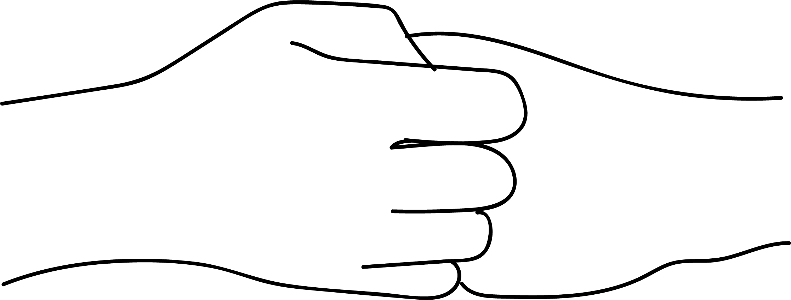

# Ganapa Mudra - Agragami Mudra

[TOC]

**Ganapa mudra** is in honour of Ganapathi, who helps to overcome all obstacles.

## Formation
Hold the left hand palm facing outward in front of the chest with bent fingers. Hook the right hand fingers in the left hand fingers. exhale the pull both the hands in the opposite direction without releasing the grip. Then, inhaling let go the tension. Repeat this six times. Then place both the hands on the sternum. Now change the hand position, with the right palm facing outward. Repeat this 6 times.
Then remain silence for a while.

## Effects
This mudra tenses the muscles of upper arms and chest area. All five elements joining together give power to the whole body.

## Benefits
1. Strengths the shoulders.
1. Activates heart and lungs.
1. Opens the Anahata chakra ans instills courage to face any situation.
1. Ganapa  has respect even for a small mouse. This mudra encourages mutual respect and harmony in the society.

## References

## References

1. **"MUDRAS & HEALTH PERSPECTIVES"** by **"SUMAN.K.CHIPLUNKAR"** page no 93
