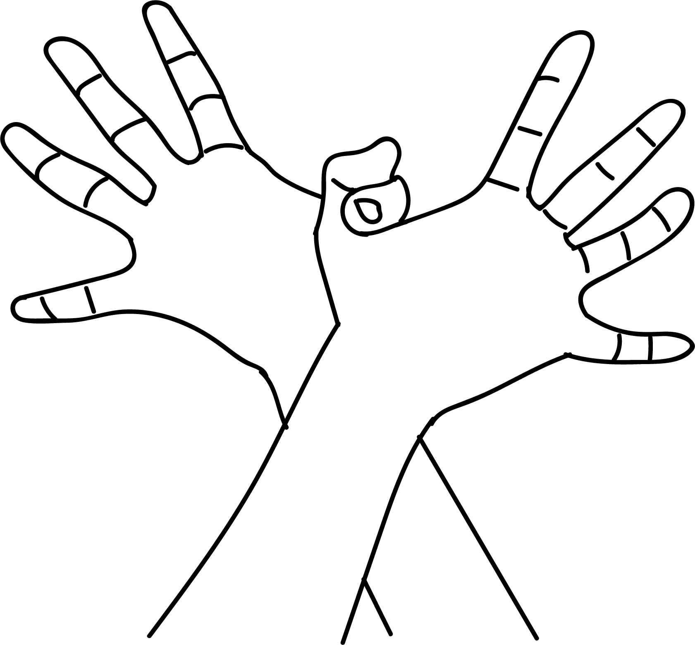

# Garuda Mudra

[TOC]

God Vishnu rides on the Garuda - the Eagle. Garuda is Vishnu's vehile, king of birds and enemy of snakes. This bird has an enormous wing span and tremendous strength in the wings. It flies with the wind effortlessly carried by the wind.  This mudra resembles the bird Eagle.

## Formation
Clasp the thumbs and place the right hand on top of the left hand like namaste. Place this mudra in the pelvic region and inhale/ exhale with long breaths for 10 times. Then place this mudra in the navel region and repeat inhalation / exalation 10 times. Then bring the hands on the sternum and repeat the exercise 10 times. Spread the palms and fingers like the wings of garuda and inhale / exhale 10 times.

## Effects
The fire element becomes powerful as the thumbs are entangled. As this mudra is placed on three regions of the body, all important organs like kidneys, stomach, heart and lings, get energised.
When the hands open like wings, both sides of the body get equal blood circulation.

## Benefits
1. The mudra empowers vital organs of elimination, digestion, respiration and blood circulation.
1. Pain during the menstruation subsides and the problems related to prostate gland are resolved.
1. Stomach pain subsides gets solved.
1. Respiratory problem gets solved.
1. Tiredness and fatigue are removed.
1. Tension is removed.

## References

## References

1. **"MUDRAS & HEALTH PERSPECTIVES"** by **"SUMAN.K.CHIPLUNKAR"** page no 97
