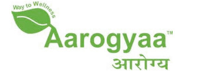

# Kn/ಆರೋಗ್ಯಾ

[TOC]

* Aarogyaa**

| | |
| --- | --- |
| Type | ಖಾಸಗಿ |
| ಪ್ರಮುಖ ವ್ಯಕ್ತಿಗಳು | Aarogyaa Chopra (Business Development Manager) |
| ಉತ್ಪನ್ನಗಳು | ಪೌಷ್ಟಿಕಾಂಶ Care, ಗಿಡಮೂಲಿಕೆ ಉತ್ಪನ್ನಗಳು, Energy and Fitness ಉತ್ಪನ್ನಗಳು, and many more |
| ಜಾಲತಾಣ | http://www.naturaltherapyindia.com/aarogyaa/ |
| ಸ್ಥಾಪನೆ | 2011 |
| ವಿಳಾಸ | Rohini, Sector 13, New Delhi - 110085, Delhi, India |
| Standard Certifications | ISO 9001:2008 & UKCERT & IEC Certified |
| Status | Operational |

**ಆರೋಗ್ಯಾ ** ಭಾರತದ ಉತ್ತರಾಖಂಡ ಮೂಲದ ಆಯುರ್ವೇದ ಉತ್ಪನ್ನಗಳ ತಯಾರಕ ಸಂಸ್ಥೆಯಾಗಿದೆ.

## ನೋಂದಾಯಿಸಿದ ವಿಳಾಸ
* B-263D, Street #3, Majlis Park, New Delhi

## ಉತ್ಪಾದನಾ ಸ್ಥಳಗಳು
* ವಿಳಾಸ 1 : Sector 6A, I.I.E. Sidcul, 76, Integrated Industrial Estate, Setor 8 A, BHEL Township, Uttarakhand 249403.

* ವಿಳಾಸ 2 : B-263D, Street #3, Majlis Park, New Delhi.

## COPP (Certificate of Pharmaceutical ಉತ್ಪನ್ನಗಳು) ಹೊಂದಿದ ಔಷಧಗಳು
## ಉತ್ಪನ್ನಗಳ ಪಟ್ಟಿ
### ಪ್ರಸ್ತುತ ಮಾರುಕಟ್ಟೆಯಲ್ಲಿ ಲಭ್ಯವಿರುವ ಉತ್ಪನ್ನಗಳು
* Pharmaceutical (Ethical) ಉತ್ಪನ್ನಗಳು

* ವೈಯಕ್ತಿಕ ಆರೈಕೆ ಉತ್ಪನ್ನಗಳು

* ಸಾಮಾನ್ಯ ಆಯುರ್ವೇದಿ ಉತ್ಪನ್ನಗಳು

* ಶಾಸ್ತ್ರೀಯ  ಆಯುರ್ವೇದಿ ಉತ್ಪನ್ನಗಳು

* ಮೌಖಿಕ ಆರೈಕೆ ಉತ್ಪನ್ನಗಳು.

### ಸ್ವಾಮ್ಯದ ಉತ್ಪನ್ನಗಳ ಪಟ್ಟಿ
* Pharmaceutical (Ethical) ಉತ್ಪನ್ನಗಳು
* ವೈಯಕ್ತಿಕ ಆರೈಕೆ ಉತ್ಪನ್ನಗಳು
* ಸಾಮಾನ್ಯ ಆಯುರ್ವೇದಿ ಉತ್ಪನ್ನಗಳು
* ಶಾಸ್ತ್ರೀಯ  ಆಯುರ್ವೇದಿ ಉತ್ಪನ್ನಗಳು
* ಮೌಖಿಕ ಆರೈಕೆ ಉತ್ಪನ್ನಗಳು
* ಗಿಡಮೂಲಿಕೆ ಉತ್ಪನ್ನಗಳು
* ಪೌಷ್ಟಿಕಾಂಶದ ಪೂರಕಗಳು
* Fitness Equipment
* ಗಿಡಮೂಲಿಕೆ Oil
* Body Care ಉತ್ಪನ್ನಗಳು
* LadyAnion Night Use Sanitary Napkins

### ಹಿಂದೆ ಲಭ್ಯವಿದ್ದ ಉತ್ಪನ್ನಗಳು
* ಪೌಷ್ಟಿಕಾಂಶ ಉತ್ಪನ್ನಗಳು

* Healthcare ಉತ್ಪನ್ನಗಳು

## ಪರವಾನಗಿ ಮಾಹಿತಿ
### ಉತ್ಪಾದನಾ ಪರವಾನಗಿಗಳು
No : 131658

## ನೋಂದಾಯಿಸಿದ ಟ್ರೇಡ್ ಮಾರ್ಕ್ ಗಳು
* Aarogya

## ಉಲ್ಲೇಖಗಳು

## ಹೊರಗಿನ ಕೊಂಡಿಗಳು
* [Aarogyaa on aarogyaa.net](http://www.aarogyaa.net/)
* [Page naturaltherapyindia.com](http://www.naturaltherapyindia.com/aarogyaa/offical)

## References

1. [details"]("Product)(http://www.arogyaformulations.com/ಉತ್ಪನ್ನಗಳು.aspx#)
