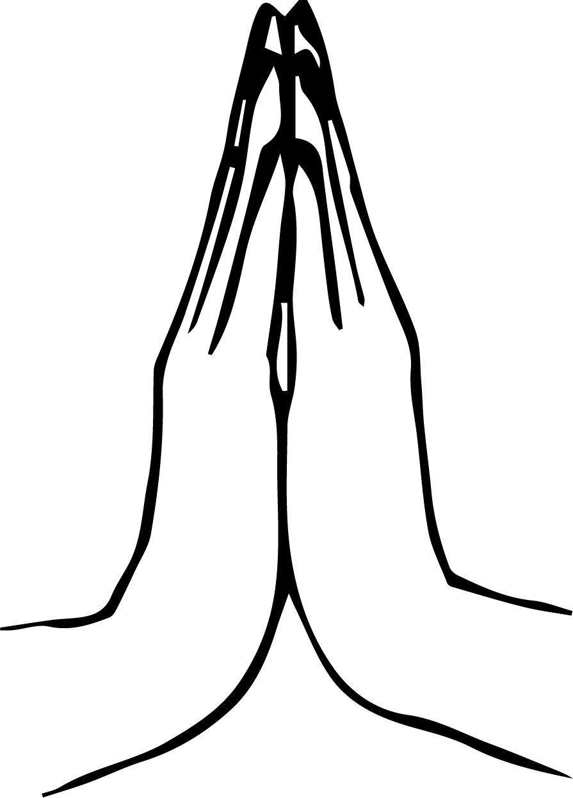

# Kn/ನಮಸ್ತೆ-ಭಾರತೀಯ ಸಂಸ್ಕೃತಿಯ ಸಂಕೇತ

[TOC]

**ನಮಸ್ತೆ* ಯು ಮೂಲಭೂತವಾಗಿ ಭಾರತೀಯವಾಗಿದೆ. ಇದು ಪ್ರಾಚೀನ ಕಾಲದ ಶುಭಾಶಯಗಳ ಸಂಕೇತವಾಗಿದೆ. ನಮಸ್ತೆ ಪದದ ಅಕ್ಷರಶಃ ಅರ್ಥ - **ನಮಃ**- ತಲೆ ಬಾಗುವೆ **ತೇ *' -ನಿಮಗೆ- ನಾನು ನಿನಗೆ ನಮಸ್ಕರಿಸುತ್ತೇನೆ . ನಮಸ್ತೆ ನಮ್ಮಲ್ಲಿ ಪ್ರತಿಯೊಬ್ಬರೊಳಗೆ ದೈವಿಕ ಕಿಡಿ ಇದ್ದು   ಅದು ಹೃದಯಚಕ್ರದಲ್ಲಿ ನೆಲೆಗೊಂಡಿದೆ ಎಂಬ ನಂಬಿಕೆಯನ್ನು ಪ್ರತಿನಿಧಿಸುತ್ತದೆ. ಸಕಲ ಸೃಷ್ಟಿಯೊಳಗಿರುವ ಪರಮಾತ್ಮನನ್ನು ಕಾಣುವ ನಮ್ಮ ಸಂಸ್ಕೃತಿಯ ಸಾರವೇ ಈ ನಮಸ್ಕಾರ. ಆದ್ದರಿಂದ ಈ ಸೂಚಕವನ್ನು ದೇವಾಲಯದಲ್ಲಿ ದೇವತೆಗಳು, ಶಿಕ್ಷಕರು, ಕುಟುಂಬ, ಸ್ನೇಹಿತರು, ಅಪರಿಚಿತರು ಮತ್ತು ಪವಿತ್ರ ನದಿಗಳು ಮತ್ತು ಮರಗಳ ಮುಂದೆ ಸಮನಾಗಿ ನೀಡಲಾಗುತ್ತದೆ.

## ಮಾಡುವ ರೀತಿ
'ನಮಸ್ತೆ' ಮಾಡಲು ನಾವು ಕೈಗಳನ್ನು ಒಟ್ಟಿಗೆ ಸೇರಿಸಿ ಮತ್ತು ಹೃದಯದ ಬಳಿ ಇರಿಸಿ, ಅವುಗಳನ್ನು ಮುಚ್ಚಿ  ತಲೆಯನ್ನು ಬಾಗಿಸುತ್ತೇವೆ. ಹುಬ್ಬುಗಳ ನಡುವೆ ಮೂರನೇ ಕಣ್ಣಿನ ಮುಂದೆ ಕೈಗಳನ್ನು ಒಟ್ಟಿಗೆ ಇರಿಸಿ, ತಲೆಯನ್ನು ಬಾಗಿಸಿ ನಂತರ ಕೈಗಳನ್ನು ಹೃದಯಕ್ಕೆ ತರುವ ಮೂಲಕ ನಮಸ್ತೆ ಮಾಡಬಹುದು. ಇದು ಗೌರವದ ಆಳವಾದ ರೂಪವಾಗಿದೆ. ನಮಸ್ತೆಗೆ ಯಾವುದೇ ಸಂದರ್ಭ ಬೇಕಾಗಿಲ್ಲ. ಇದನ್ನು ಎಲ್ಲಿಯಾದರೂ ಯಾವುದೇ ಸಮಯದಲ್ಲಿ ಮತ್ತು ಯಾವುದೇ ಸ್ಥಳದಲ್ಲಿ ಮಾಡಬಹುದು. ಇದನ್ನು ಪೂಜೆಯಲ್ಲಿ ಪ್ರಮುಖವಾಗಿ ಬಳಸಲಾಗುತ್ತದೆ.

## ಪರಿಣಾಮಗಳು
ನಮಸ್ತೆ ಎಂಬುದು ಅರ್ಥಪೂರ್ಣವಾಗಿರುವ ಮುದ್ರೆಯಾಗಿದೆ. ಒಂದು ಕೈಯಿಂದ ಇನ್ನೊಂದು ಕೈಗೆ ಹರಿಯುವ ಎಲೆಕ್ಟ್ರೋ ಮ್ಯಾಗ್ನೆಟಿಕ್ ಶಕ್ತಿಯು ಬಲವಾಗಿ ಅನುಭವಕ್ಕೆ ಬರುತ್ತದೆ. ದೇಹ ಮತ್ತು ಮನಸ್ಸುಗಳು ಶಕ್ತಿಶಾಲಿಯಾದಂತೆ ಅನುಭವಕ್ಕೆ ಬರುತ್ತದೆ. ನಾವು ಕೇಂದ್ರಭಾಗದಲ್ಲಿ ನಮ್ಮ ಕೈಗಳನ್ನು ಒಟ್ಟಿಗೆ ತಂದಾಗ, ನಾವು ಅಕ್ಷರಶಃ ನಮ್ಮ ಮೆದುಳಿನ ಬಲ ಮತ್ತು ಎಡ ಅರ್ಧಗೋಳಗಳನ್ನು ಸಂಪರ್ಕಕ್ಕೆ ತರುತ್ತೇವೆ. ಇದು ಏಕೀಕರಣದ ಯೋಗ ಪ್ರಕ್ರಿಯೆ. ನಮಸ್ತೆ ಪ್ರಕ್ರಿಯೆಯು ಬಲ ಮತ್ತು ಎಡಭಾಗಗಳನ್ನು, ಪುರುಷ ಮತ್ತು ಸ್ತ್ರೀ ಗುಣಗಳನ್ನು, ತರ್ಕ ಮತ್ತು ಅಂತಃಪ್ರಜ್ಞೆಗಳನ್ನು, ಶಕ್ತಿ ಮತ್ತು ಮೃದುತ್ವಗಳನ್ನು ಒಟ್ಟಾರೆಯಾಗಿ ಒಟ್ಟಿಗೆ ತರುತ್ತದೆ.
1. We feel strong in body and mind as this mudra removes fear and headache, even flexibility in the fingers is improved.
1. Namaste is uplifting. It gives a sense of gratefulness and waiting to receive blessings of good things to come.

## ಪ್ರಯೋಜನಗಳು
1. ಈ ಮುದ್ರೆಯು ನಮ್ಮನ್ನು ಅಹಂಕಾರದ ಬಂಧನಗಳಿಂದ ಮುಕ್ತಗೊಳಿಸಿ ನಮ್ಮನ್ನು ವಿನಮ್ರ ಮತ್ತು ಸಂತಸಕರ ವ್ಯಕ್ತಿಗಳನ್ನಾಗಿ ಮಾಡುತ್ತದೆ.
1. ಈ ಮುದ್ರೆಯು ಭಯ ಮತ್ತು ತಲೆನೋವನ್ನು ಹೋಗಲಾಡಿಸಿ  ದೇಹ ಮತ್ತು ಮನಸ್ಸುಗಳನ್ನು ಬಲಪಡಿಸುತ್ತದೆ, ಬೆರಳುಗಳಲ್ಲಿನ ನಮ್ಯತೆಯು ಸುಧಾರಿಸುತ್ತದೆ.
1. ನಮಸ್ತೆ ಉತ್ತೇಜನಕಾರಿಯಾಗಿದೆ. ಮುಂಬರುವ ಒಳ್ಳೆಯ ಆಗುಹೋಗುಗಳ ಆಶೀರ್ವಾದಗಳನ್ನು ಪಡೆಯುತ್ತ ಇದು ಕೃತಜ್ಞತೆಯ ಭಾವವನ್ನು ನೀಡುತ್ತದೆ.

## ಉಲ್ಲೇಖಗಳು

## References

1. ಸುಮನ್ ಚಿಪಳೂಣ್ಕರ್ ಅವರು ಬರೆದಿರುವ **"MUDRAS & HEALTH PERSPECTIVES"** ಪುಸ್ತಕದ  ಪುಟ ಸಂಖ್ಯೆ 79
