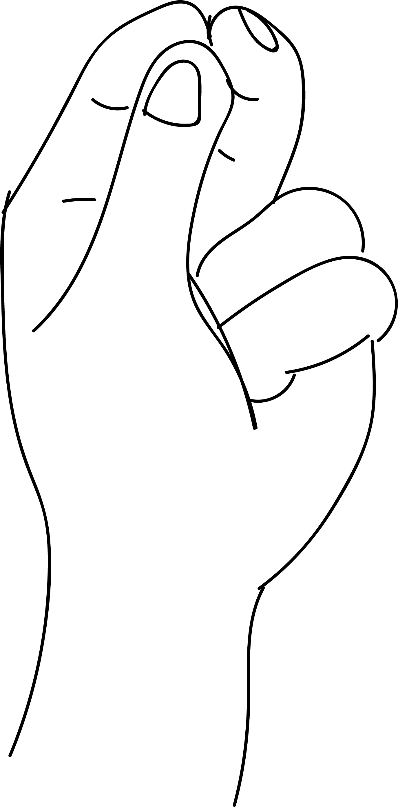

# Kubera Mudra

[TOC]

**Kubera mudra** is dedicated to kubera - the god of wealth. As per Indian mythology kubera is god of north east direction. He is the treasurer of shiva, god of kailasa. Kubera mudra bestows blessings and our projects succeed. One gets wealth. Kubera mudra also bestows courage.

## Formation
Join the index finger tips and middle finger tips to the thumb tips. Place the little finger tips and ring finger tips in the middle of the palm. The intensity with which this mudra is practised is more important than the length of time it is practised.

## Effects
Joining the tips of the middle and index fingers to the tip of the thumb balance the blood pressure. General health is enhanced as the tips of the little and ring finger touch the pressure points of solar plexus, adrinal gland and kidneys.

Astrological aspects of Kubera mudra Experience

Many people already know Kubera mudra as
The “three-finger technique” of Alpha
Formation12
and use it when you search
something special: a free parking lot, an outfit, the right book, the necessary information, etc. Others use it when they want to give more power to their projects. For the future, It is always about goals that people want to achieve or want.

They would like to have filled. When the three fingers are closed, the matter and/or the thought receive an additional power. It is obvious that
Something happens when the fingers of Mars (force), Jupiter.
(Splendor, exuberant joy) and Saturn (fixation on essentials and
through new bridges) join forces. Put this mudra in certain
The application in everyday life is very fun. It also gives us inner peace, trust,
and serenity

## Benefits
* Fulfills a wish or goal that is expressed as follows:
1. Formulate the wish or goal very clearly into words and say it internally three times. Please be sure to press the fingers as you perform this mudra.
1. A wish may be self centred but is fulfilled only if it brings happiness in the surroundings and in the society.
1. This mudra also helps in day to day matters like selecting a book, certain dress or looking for specific information.
1. Puts more force behind plans for the future like buying a car, house, property or finding a lie partner.
1. Inhaling upwards while performing this mudra also helps to decongest sinuses.
1. Visualize the goal or any special wish while performing kunera mudra. The thought has the procreative power.

## References

## References

1. **"MUDRAS & HEALTH PERSPECTIVES"** by **"SUMAN.K.CHIPLUNKAR"** page no 96
