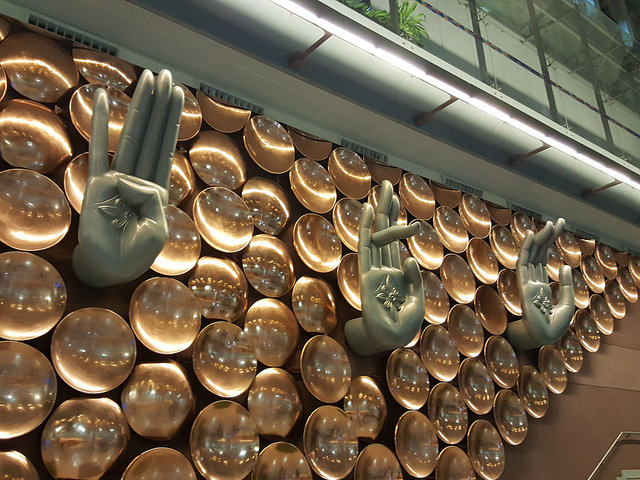

# Meaning of Mudras

[TOC]

A **mudra** (Sanskrit मुद्रा, "seal", "mark", or "gesture") is a symbolic or ritual gesture in Hinduism and Buddhism.While some mudras involve the entire body, most are performed with the hands and fingers.A mudrā is a spiritual gesture and an energetic seal of authenticity employed in the iconography and spiritual practice of Indian religions.

One hundred and eight(108) mudras are used in regular Tantric rituals.

In yoga, mudras are used in conjunction with pranayama (breathing exercises), generally while seated in Padmasana, Sukhasana or Vajrasana pose, to stimulate different parts of the body involved with breathing and to affect the flow of prana in the body.

Mudras are a boon to mankind. The ancient science of mudras is one of the greatest and finest gift of India to the world.  The science of mudras, a part of yoga is based on the fundamental principles of Life, namely:
1. The five Elements :- Vayu(air), Agni(fire), Jala(water) and Prithvi(earth);
1. The five Pranas   :- Prana, Udana, Samana, Apana and Vyana; and
1. The three Dooshas :- Vata, Kapha, Pitta.

The Rishis discovered that the whole creation is composed of the elements mentioned above. They also deduced that the human structure is a miniature (small) form of universe and hence is also composed of the same five elements. therefore they concluded that the secret of good health depends on the balance of elements within the body and the imbalance in these five elements causes diseases of the body and mind.

the mudras are mainly performed as gestures by fingers, hand positions and also in combination with asanas, pranayama, banda and techniques involving eye movements. Mudras help in create and maintain equilibrium in the body elements that result in healthy life.

## Uses of mudras
1. The mudras are comprehensive in nature.
1. Mudras create inner peace and strength.
1. Eliminate fatigue and anxiety.
1. Promotes physical and emotional health.
1. Help relieve stress, depression and anger.
1. Mudras calm the mind, Sharpen the intellect. and
1. Promte love,happiness,prosperity and longevity.

## More information about mudras
* The origin of the term **Mudra** can be traced to *Sanskrit* and has been used in various contexts. It has been used to describe psychic, emotional, devotional and aesthetic attitudes.
* The **Kularnava Tantra** traces the word *Mudra* to the root'mud' meaning - joy and 'dravya' meaning - to draw forth the 'satchitcananda-bliss' which is latent in all of us.
* **Health Yoga Pradipika** and other tantra yogic texts consider mudra to be **Ypganga** a part of yoga.
* in Asanas, senses are primary and prana is secondary. Whereas in Mudras, senses are secondary and prana is primary.
* Originated in India mudras have lived with us thousands of years through gestures performed during **worship** and **Sandhya Vandana**.

## Mudras in Dance Forms
1. Various dance forms are also replete with silent eloquence of mudras.
1. If dance is the language, mudras are its words.

* Some original writings on mudras are found in scriptures like **Shiv Samhita**, **Gherand Samhita**, and **Hatha Yoga Ptradipika**.
* According to the science of Yoga, the attitudes and gestures adopted during mudra practices establish a direct link between the five Sheaths,seven energy centres (the chakras) in the body and the dynamic power, kundalini.

## References
1. Meaning of mudra mentioned in the above content is borrowed from wikipedia. https://en.wikipedia.org/wiki/Mudra
1. The above mentioned other information is added from the book called **"MUDRAS & HEALTH PERSPECTIVES"** by *"SUMAN.K.CHIPLUNKAR"*.
