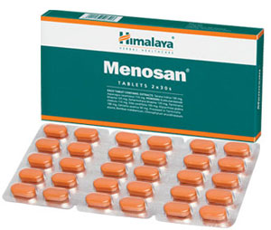

# Menosan

**Menosan** possesses phytoestrogens, which act as natural selective estrogen receptor modulators (SERMs). SERMs selectively inhibit or stimulate estrogen-like action in various tissues. It helps in alleviating climacteric (menopausal) symptoms and ensures a general sense of well-being. The drug is useful in the prevention and management of postmenopausal cardiovascular diseases and osteoporosis as well. Menosan also has antioxidant and antimicrobial properties.

## Key ingredients
**Ashoka Tree** (Ashoka) has potent antimicrobial properties that combat common microorganisms responsible for urinary tract infections (UTIs). Postmenopausal deficiency of estrogen increases the risk of recurrent UTIs. The herb helps to alleviate UTIs and its symptoms.

**Asparagus** (Shatavari) has estrogenic properties, which alleviate symptoms of menopause, including anxiety, depression, mood fluctuations, insomnia, weight gain, irritability and loss of bladder control.

**Licorice** (Yashtimadhu) soothes the mucous membrane of the genital organs and alleviates perimenopausal symptoms including itchiness in the vulva, hot flashes and night sweats.
