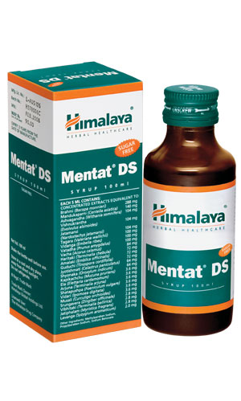

# Mentat DS

**Enhances memory and learning capacity:** The natural ingredients in Mentat DS improve mental quotient, memory span and concentration ability.

**Treats neurological disorders:** Mentat DS reduces the level of tribulin, an endogenous monoamine oxidase inhibitor that is elevated during anxiety. The calming effects of Mentat DS are beneficial in treating insomnia and convulsions.

**As an adjuvant in neurological diseases:** Due to its anticholinesterase (antispasmodic), dopaminergic-neuroprotective (important neurotransmitter in the brain), adaptogenic and antioxidant properties, Mentat DS is useful as an adjuvant in the treatment of Alzhiemer's and Parkinson's disease, epilepsy and post-stroke aphasia (speech disorder).

* Mentat DS syrup is a sugar-free formula recommended for patients suffering from hyperglycemia, diabetes mellitus and also for calorie-conscious individuals.

## Key ingredients
**Thyme-Leaved Gratiola**(Brahmi) maintains cognitive function. Well known for its nootropic (memory enhancer) effect, the herb enhances memory and learning. It is also known to calm restlessness and is used to treat several mental disorders.

**Indian Pennywort** (Madhukaparni) possesses antiepileptic properties and is commonly used as an adjuvant to epileptic drugs. It improves the imbalance of amino acid levels, which is beneficial in treating depression. It also prevents cognitive impairment.

**Winter Cherry** (Ashvagandha) is used as a mood stabilizer in clinical conditions of anxiety and depression. Withanolides, the chemical constituents present in Winter Cherry, possess rejuvenating properties. The herb also reduces oxidative stress, which can cause mental fatigue.
