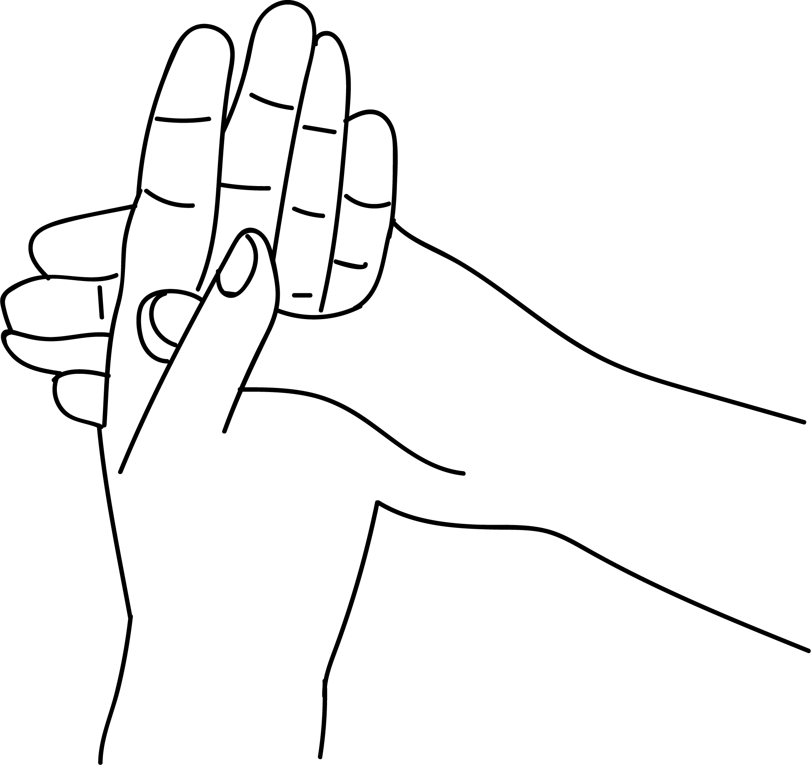

# Naga Mudra

[TOC]

**Naga** the snake god, symbolises supernatural powers, shrewdness and potency. Problems are natural in life. Solutions are easily found by prsactising this mudra. A snake move zig zag and finds its way, similarly by practising this mudra solutions to life's problems are found one way or another.

## Formation
Cross the hand in front of chest and also cross the thumbs keeping the palms one upon the other and place this mudra on the lap. This is called naga mudra.

## Effects
The thumb placed on the palm increases all elements like vayu, akasha, prithvi and jala.  The thumb placed upon the other thumb increases the agni, blazing fire is a powerful element.

## Benefits
1. This mudra kindlesimagination.
1. Agni empowers pelvic region and solves the problems of the womb, prostrate gland and slowness in urination.
1. All five elements are increased hence intelligence and wisdom grow and help in resolving day to day problems.
1. Thinking becomes clear and one can face the world with a fiery  heart.
1. One has to ask questions about a problem to get the proper advice.

## References

## References

1. **"MUDRAS & HEALTH PERSPECTIVES"** by **"SUMAN.K.CHIPLUNKAR"** page no 98
