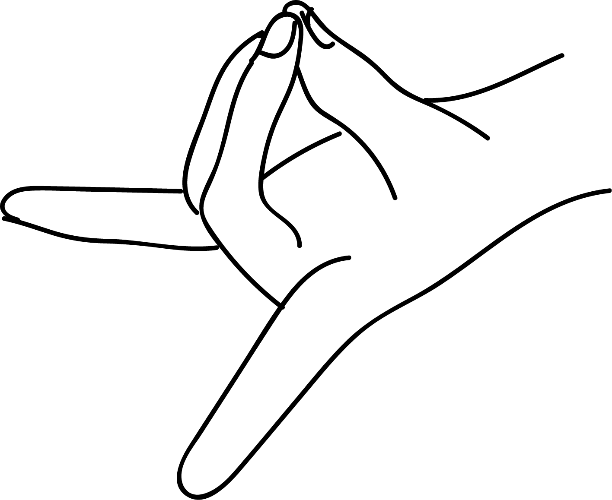

# Pooshana Mudra

[TOC]

**Pooshana** means the god of nourishment and hence this mudra is dedicated to the Sun god. This mudra is formed differently by each hand.

## Formation
### Right hand
Middle finger is on top of the index finger and the index finger touches the tip of the thumb. Other fingers are extended straight.
### Left hand
The ring finger is on top of the middle finger. The thumb and the middle finger are joined together at their tips. Index finger and little finger stay extended.

## Effects
This mudra is called pooshana mudra as it influences the energy currents that are responsible for absorption and utilisation of food, as well as helping with its elimination. This mudra intensifies breathing and helping with its elimination. This mudra intensifies breathing and hepls in the absorption of oxygen and release of carbondioxide from the lungs.

## Benefits
1. This mudra has a relaxing effect on the solar plexus - the area of stomach, liver, spleen and gall bladder.
1. Regulates energies in the automatic nervous system.
1. Mobilises energies of elimination and detoxification.
1. Relieves acute nausea, flatulence, seasickness and the feeling of fulness after meals.
1. Finger positions of the left hand aids in directing energy upwards. Concentration, memory, logic, enthusiasm are positively influenced.
1. If there are chronic complaints about lack of energy then the mudra of the right hand can be modified as fallows:
place the ring finger on top of the little finger while the tip of the little finger is touching the tip of the thumb. This alternate finger position helps in activating energy in the pelvic floor.
1. Excellent effect on general health.

## References

## References

1. **"MUDRAS & HEALTH PERSPECTIVES"** by **"SUMAN.K.CHIPLUNKAR"** page no 95
