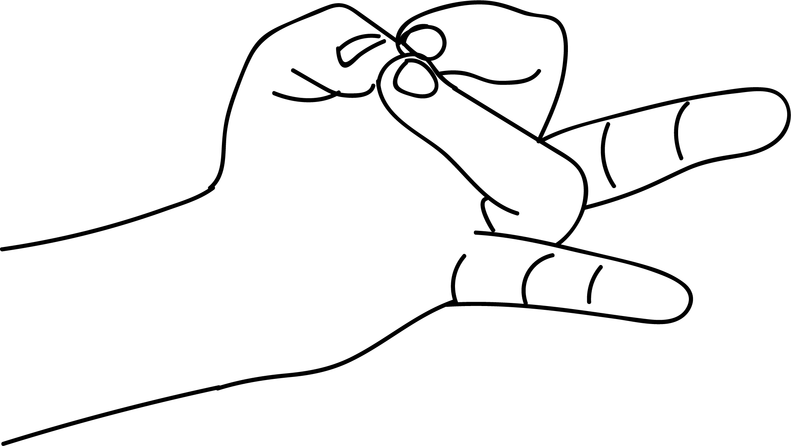

# Rudra Mudra

[TOC]

**Rudra Mudra** is the ruler of solar plexus, the manipura chakra. God rudra is symbol of fire. This mudra activates the manipura chakra.

## Formation
Jion the tips of ring and index fingers to the tip of the thumb.

## Effects
The prithvi element and vayu element get balanced. This mudra affects the glands in the abdomen.

## Benefits
1. Our whole bodymass is made up of prithvi. The centering force is associated with prithvi. Rudra mudra strengths the prithvi element and its organs. Hence stomach, spleen and pancreas function better. This mudra developers heat and energy in the body.
1. When prithvi is strengthened the brain also receives enough energy.
1. If a person feels listless, heavy, weightened down and dizzy, the weakness is relieved and completely eliminated by the practice of this mudra.
1. For energy, practice this mudra for 15 minutes daily.

## References

## References

1. **"MUDRAS & HEALTH PERSPECTIVES"** by **"SUMAN.K.CHIPLUNKAR"** page no 94
