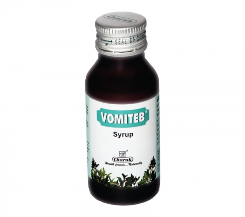

# Vomiteb Syrup

VOMITEB is syrup manufactured by [Charak Pharmaceuticals](Charak_Pharmaceuticals.md) and is said to be a safe and effective herbal antinauseant, antiemetic. It suppresses the vomiting center by insulating the brain from peripheral and chemical stimuli.

Kapur kachari (Hedychium spicatum) and Shunthi (Zingiber officinale) in VOMITEB regulate the gastrointestinal motility thereby preventing gastroesophageal reflux. Ela (Elettaria cardamomum) protects the gastric mucosa. VOMITEB overall reduces the vomiting sensation and discomfort. VOMITEB is said to be safe in nausea and vomiting during pregnancy.
