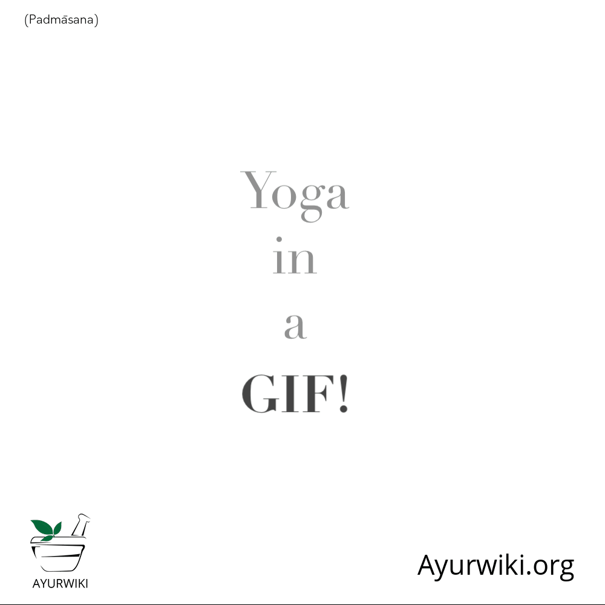

# Yoga in GIF

[TOC]

Click on the desired Asana on the below table of contents and click "Expand" under the section to watch the GIF of respective Asana.

## Anantasana

## Ardha Chandrasana

## Ardha Matsyendrasana

## Surya Namaskara

## Yoga Mudrasana

## Urdhva Mukha Svanasana

## Trianga Mukhaika Pada Paschimottanasana

## Salabhasana

## Salamba sarvangasana

## Parsvottanasana

## Parivrtta Trikonasana

## Padmasana

## Padahasthasana

## Matsyasana

## Marichyasana

## Malaasana-1

## Malaasana-2

## Makarasana

## Gorakshaasana

## Janu Sirsasana

## Chaturanga Dandasana

## Bhujangasana

## Bharadvajasana

## Bhekasana

## Bharadvajasana-2

## Baddha padmasana

## Virabhadrasana I

## Virabhadrasana II

## Virabhadrasana III

