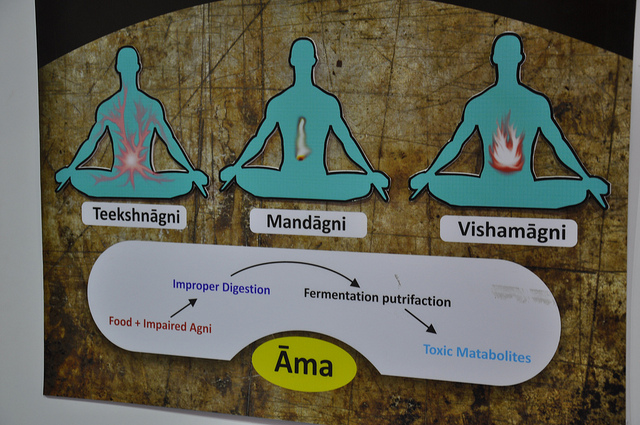

# Agni

[TOC]

**Agni** is the "fire," that drives all digestion and metabolism in the Indian medical practice of Ayurveda. The digestive and absorption process is called Pakwagni (digestive fire).

The pachak (stomach and small intestine) has 13 Jatharagni (digestive enzymes or "fire") that occur in four different states: samagni (normal), Visamagni (abnormal), Tikshanagni (increased) and Mandagni (decreased).

Samanagni is the state of complete balance. All three doshas: vata, pitta and kaphha are in total balance. When Agni is disturbed by Vata, the condition is known as Vishamagni. When Pitta affects Agni, the condition is known Tikshagni. When Kapha affects Agni, the condition is known Mandagni.

The composer of Hareet Samhita writes that condition of Samanagni depends upon whether the doshas (Vata, pitta, and kaphha) are all in normal stage. When Vata, Pitta, Kaphha are unequal, the condition is known as Vishamagni. When Pitta is higher than normal, the condition is known as Teekshagni. When Vata and Kaphha are higher than normal, the condition is known as Mandagni.

## Samagni
The agni Samagni digests and assimilates food properly thus increasing the quality of dhatus (supportive tissues of the body). Persons having Samanagni always are hale and healthy. The body of Samanagni is balanced in Dhatus and Indriya. Because they are balanced, neither Mand, Visham or Teekshana is the object of treatments

## Vishamagni
This type of Agni alternates between digesting food quickly and slowly. When this agni is affected by the Vata Dosha, it creates cholera, diarrhoea, infective diarrhoea, dysentery, vatadi diseases, spleenomegaly, gulm/abdominal tumour, colic, flatulence, wind formation and accumulation, eructations etc. This is narrated by the Hareet in Hareet Samhita.

In Dhanvantari Samhita, Dhanvantari writes that when the Jatharagni (digestive fire) alternates from digesting food completely and from producing symptoms such as colic, eructations, diarrhoea, heaviness in or rumbling in the abdomen, wind in the intestines, or dysentery, Vishamagni is present.

## Tikshnagni
Tikshna means very quick/very sharp/very fast. Agni means digestive power or digestive capacity. Tikshnagni is a state of very quick digestion of food regardless of the type of food. Acharya Sushruta states that when food digests very quickly, this type of agni is known as "Tikshnagni". When the power of digestion is increased from normal to above normal, food digests very quickly and produces hunger or the desire for food. When food digests, the throat, the mouth cavity and the lips become dry with a burning sensation. This condition is known "Bhasmak Roga" according to Ayurveda.

In Hareeta Samhita, food is eaten fully and yet, the person is not satiated by food desiring even more food. If their eyes becomes yellow, there is a burning sensation present and the body's strength is deficient, this indicates Tikshnagni. When Vata and Pitta becomes weak and Pitta becomes strong and acute, the condition is known as Bhasmagni or Bhasmak.

The complications from the Bhasmak Roga are jaundice, anaemia, hepatitis, yellow skin, diarrhoea, tuberculosis, vertigo, hepatomegaly, urine anomalies, colic, unconsciousness, hemophilia, hematomasis, hemorrhage, sour eructations, hyperacidity, burning, pain, inflammation in urination etc. The body is emaciated and weak.

## Mandagni
Mandagni is a Sanskrit word. "Manda" means slow and "agni" means digestive fire or digestive capacity. The meaning of the mandagni is slow digestive power or slow digestion capacity. Those who are having Mandagni eat very little and are unable to digest the smallest amount of food. [Dhanvantari](../traditions/Dhanvantari.md) says that Agni digests the least amount of food in the greatest amount of time. Because food is undigested, this produces heaviness in the abdomen, heaviness in the head, asthma and respiratory problems, bronchitis, cough, excessive salivation from the mouth, nausea and fatigue.

## References

## External Links
* [Agni on ijapr.in](https://ijapr.in/index.php/ijapr/article/view/1052)
* [Agni on Ncbi artcle](https://www.ncbi.nlm.nih.gov/pmc/articles/PMC3221079/)
* [Agni on Easy ayurveda](https://www.easyayurveda.com/2016/04/19/agni-types-functions-concept/)

## References

1. [ayurveda](Kerala)(https://www.keralaayurveda.us/courses/agni-force-behind-digestion-metabolism/)
