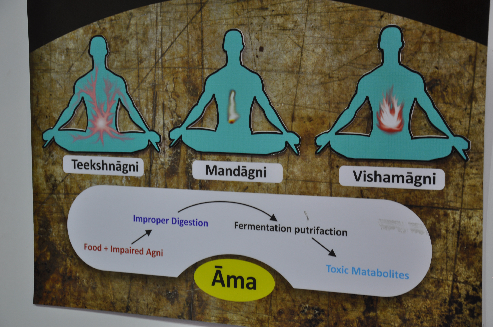

# Ama

[TOC]

In [ayurvedic medicine](ayurvedic_medicine.md) ama is the concept of anything that exists in a state of incomplete transformation. In particular, it is claimed to be a toxic byproduct generated due to improper or incomplete digestion. The concept does not have a direct equivalent in standard medicine.

**Ama** originates from improperly digested toxic particles that clog the channels in your body. Some of these channels are physical and include the intestines, lymphatic system, arteries and veins, capillaries, and genitourinary tract. Others are nonphysical channels called nadis through which your energy flows. Ama toxicity accumulates wherever there is a weakness in the body, and this will result in disease

## Meaning of Ama
Ama is a unique concept devised by a sage who used Ayurveda as a medical science thousands of years ago. As of present no other system is aware of it. Any substance or chemical element that we take in with our food and drink or through breathing needs to be processed inside the body. This process is called digestion.

## Signs & Symptoms of Ama
Generalized signs and symptoms of ama in the body includes:
* Clogging of the channels (may cause symptoms like sinus congestion, lymph congestion, constipation, *fibrocystic changes, etc.)
* Fatigue
* Heaviness
* Abnormal flow of vata (there are many ways this can manifest in the body, but examples include excess upward moving energy causing heartburn or excess downward moving energy causing diarrhea)
* Indigestion
* Stagnation
* Abnormal taste, muted taste, or poor appetite
* Sexual debility
* Mental confusion
* Feeling unclean

## References

## External links
* [Ama on Ijapr article](https://ijapr.in/index.php/ijapr/article/view/568)
* [Ama on Gale academic one file](https://go.gale.com/ps/anonymous?id=GALE%7CA325398910&sid=googleScholar&v=2.1&it=r&linkaccess=abs&issn=09759476&p=AONE&sw=w)

## References

1. [Clicnic Bansko](Ayurveda)(https://www.ayurvedabansko.com/ama-ayurveda/)
2. [by Ayurveda health guides](Referred)(https://www.banyanbotanicals.com/info/ayurvedic-living/living-ayurveda/health-guides/understanding-agni/ama-the-antithesis-of-agni/)
