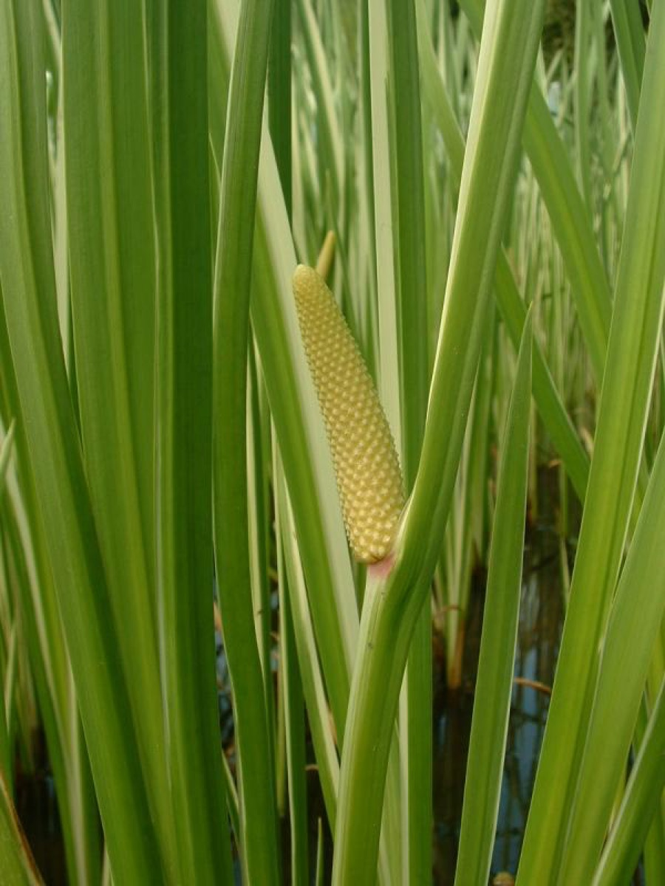

# Acorus calamus - Sweet Flag, Athibaje, Bacc, Akaraveci, Vadaja, Vaembu

[TOC]

**Jatila** is a tall perennial wetland monocot of the Acoraceae family, in the genus Acorus. The scented leaves and more strongly scented rhizomes have traditionally been used medicinally and to make fragrances, and the dried and powdered rhizome has been used as a substitute for [Ginger](Ginger.md), [Sthula tvak](Sthula_tvak.md) and nutmeg. This plant is belongs to Aracea family.
## Uses
Epilepsy, Oedema, Scrotal enlargement, Skin diseases, Headache, Alopecia, Wounds, Diarrhea, Eye diseases, Acid gastritis, Heart problems, Cold, Cough, Joint pain, Paralysis, Earache, Indigestion, Intestinal worms, Urinary blockages

## Parts Used
Rhizome, Roots.

## Chemical Composition
Both triploid and tetraploid A. calamus contain alpha-asarone. Other phytochemicals include beta-asarone, eugeno and Diploids do not contain beta-asaronel

## Common names
| Language | Names |
| --- | --- |
| Kannada | Athibaje, Baje, Baje gida, Bajeberu, Nelama, Vaja, Mastaka, Sugandhina |
| Malayalam | Vaembu, Vashampa |
| Sanskrit | Bacha, Bhadra, Bhutanashini, Vacha, Ugra, Golami, Shadagrantha, Tamasevini |
| Tamil | Akaraveci, Akkitam, Vashambu |
| Telugu | Vadaja, Vasa |
| Hindi | Bacc, Bach, Ghoda, Gor Bach |
| English | Sweet Flag |

## Habit
Herb

## Identification
### Leaf
Simple, Ensiform, The leaves are erect and flat and sword-like, bright green, rising fan-like from a pinkish base although some bases may range from white to red in color

### Flower
Spadix, Yellowish-green, 6 petal, The tepals can be a light brown in color, are very small with squarish tips

### Fruit
Berry, Green, angular, 3-celled, fleshy, containing 1-3 oblong seeds

### Other features
## List of Ayurvedic medicine in which the herb is used
* [Kolakulathadi churna](Kolakulathadi_churna.md)
* [Manasamitra vatakam](Manasamitra_vatakam.md)
* [Brahmi vati](Brahmi_vati.md)
* [Chandrodaya varti](Chandrodaya_varti.md)

## Where to get the saplings
## Mode of Propagation
Rhizomes.

## How to plant/cultivate
Grows best in tropical/subtropical conditions. Field is prepared similar to paddy, with waterlogging and farmyard manure and the rhizomes are planted.

Semi-aquatic plant with aromatic rhizomes, suited for hot humid tropical/subtropical regions. Grows in marshy areas and well-irrigated soil with adequate moisture. Propagated through **rhizome pieces** of 2-3 inches with well-developed buds. Plow field 4 times, apply 10 tonnes FYM per hectare. Plant at 30 x 30 cm spacing at 5 cm depth in June-July. Water regularly to maintain moisture but avoid waterlogging. Weed at 30 days after planting. No significant pest or disease problems. Harvest after **10-12 months**. Cut leaves, dig up rhizomes, clean and sun-dry. Yield: approximately 2,500 kg fresh rhizome per acre. Economics: Rs. 60-70/kg; net profit Rs. 90,000 per hectare.

## Commonly seen growing in areas
North temperate hemisphere, Tropical asia, Himalayas.

## Photo Gallery

.jpg)

## References

## External Links
* [Sweet Flag Agrotechnology](http://www.techno-preneur.net/technology/project-profiles/food/sweet.html)
* [Acorus Calamus-Primary Information Services](http://www.primaryinfo.com/acorus-calamus.htm)

## References

1. [Chemistry](https://en.wikipedia.org/wiki/Acorus_calamus)
2. [description](Leaves)(http://www.friendsofthewildflowergarden.org/pages/plants/sweetflag.html)
3. [preparations](Ayurvedic)(https://easyayurveda.com/2015/01/06/vacha-acorus-calamus-uses-research-side-effects-remedy/)
4. [details](Cultivation)(http://nopr.niscair.res.in/bitstream/123456789/9381/1/NPR%203%281%29%2019-21.pdf)
5. **Gurudeva, Magadi R. *Karnatakada Aushadhiya Sasyagalu*. Divyachandra Prakashana, Bengaluru, 2017, p. 233.**
   1. Rubbing the rhizome with a small amount of food and applying it on the chest area of children, repeating this treatment 2-3 times, helps reduce cold and cough. 2. Burning the rhizome and applying the smoke over sore areas helps relieve inflammatory swelling. 3. Consuming Baje rhizome along with g. Baje rhizome 10 grams decoction for 40 days for epilepsy; 300 mg powder with 5-10 grams supporting ingredients for cough; rubbed on children's chest for cold relief.
6. **Pandey, Gyanendra (translator). *Vrksayurveda of Surapala*. Chowkhamba Sanskrit Series Office, Varanasi, 2010, pp. 82, 90.**
   Used in insect treatments for plants and in the elaborate kapittha (wood apple) seed-purification process. Roots of vaca along with dhatri, abhaya, and other plant roots are boiled in milk as part of the kapittha seed treatment that transforms the tree into a climber form.
   > *As cited in: Vrksayurveda of Surapala, Verses 242-244; Sections 17, 19*
7. **Ningombam, Sanjeev Kumar and Hazarika, Rituparna. "Ancient Remedies: Exploring the Traditional Medicine Systems of Northeast Indian Tribes." *The International Journal of Bharatiya Knowledge System, Vol. 1, pp. 67-78*, 2024, p. 71.**
   Valued in Northeast Indian tribal medicine for its sedative, analgesic, and antispasmodic properties. Employed to treat digestive disorders, fever, and respiratory conditions.

8. **[KAMPA - ಔಷಧಿ ಸಸ್ಯಗಳ ಕೃಷಿ ಕೈಪಿಡಿ (Medicinal Plants Cultivation Handbook)](../resources/books/KAMPA_Medicinal_Plants_Cultivation_Handbook.md)**. Karnataka Medicinal Plants Authority (KAMPA), Bengaluru, 2024, pp. 59-61.
   Cultivation details including soil requirements, propagation methods, planting, irrigation, harvest timing, yield estimates, and economics.
