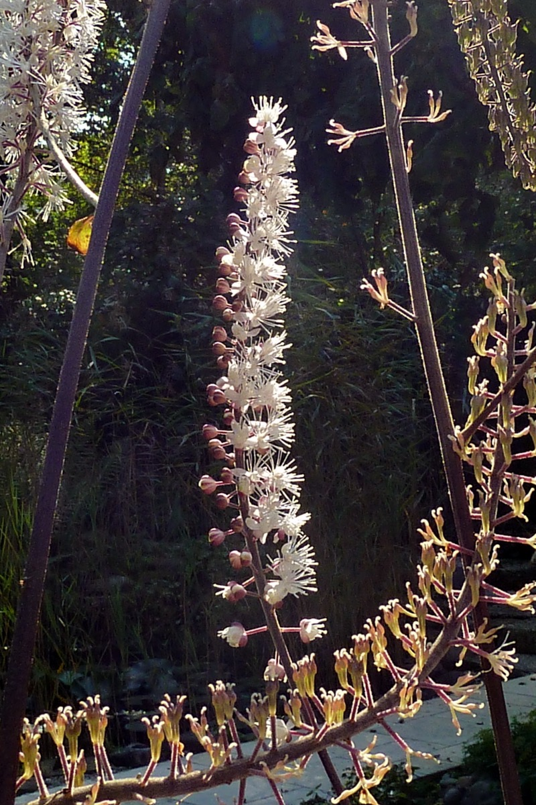

# Actaea racemosa - Black cohosh

[TOC]

**Black Cohosh** has been used by Native Americans for more than **two hundred years**, after they discovered the root of the plant helped relieve **menstrual cramps** and **symptoms of menopause**.

## Uses
Kidney problems, Malaria, Rheumatoid arthritis, Joint inflammation, Sore throat, Menstrual cramps, Menopause.

## Parts Used
Dried Roots, Leaves, Flowers.

## Chemical Composition
Black cohosh contains cimicifugin (macrotin) which has estrogenic effects.  Also found in assay are acetein (antihypertensive effects) and ferulic/isoferulic acids (anti-inflammatory effects).  The following components can also be found:  isoflavones, salicyclic acid, tannins, resins, starch, and sugars

## Common names
| Language | Names |
| --- | --- |
| English | Black snake root, Bugbane |

## Properties
Reference: Dravya - Substance, Rasa - Taste, Guna - Qualities, Veerya - Potency, Vipaka - Post-digesion effect, Karma - Pharmacological activity, Prabhava - Therepeutics.
### Dravya
### Rasa
### Guna
### Veerya
### Vipaka
### Karma
### Prabhava
## Habit
Procumbent herb

## Identification
### Leaf
large, Alternate, Pinnate, The leaves are with deeply-cut segments

### Flower
Unisexual, 14-18cm long, Yellow, Circular, Each bears one large flower the disk being yellow and the rays white, tinged with purple beneath.

### Fruit
Syncarp (sorosis), subglobose or ellipsoid with long echinate processes, orange when ripe, seeds many, ovoid.

### Other features
## List of Ayurvedic medicine in which the herb is used
## Where to get the saplings
## Mode of Propagation
Seeds, Cuttings.

## How to plant/cultivate
Aracemosa grows in dependably moist, fairly heavy soil. It bears tall tapering racemes of white midsummer flowers on wiry black-purple stems, whose mildly unpleasant, medicinal smell at close range gives it the common name "Bugbane"

## Commonly seen growing in areas
At dry locations, At hedges, Forest clearings.
.

## Photo Gallery

## References

## External Links
* [Black Cohosh: Uses, Benefits, and Side Effects](https://www.healthline.com/health/food-nutrition/black-cohosh#2)
* [Relieve Menopause Symptoms & More with Black Cohosh](https://draxe.com/black-cohosh/)
* [Black Cohosh Herb Uses and Medicinal Properties](https://altnature.com/gallery/blackcohosh.htm)
* [Overview Information of racemosa inflorescence](https://www.webmd.com/vitamins/ai/ingredientmono-857/black-cohosh)

## References

1. [Composition](Chemical)(http://www.chiro.org/nutrition/ABSTRACTS/What_is_Black_Cohosh.shtml)
2. [Description](Plant)(https://www.bimbima.com/ayurveda/medicinal-use-of-akarkara-spilanthes-acmella/1383/)
3. [Cultivation](https://en.wikipedia.org/wiki/Actaea_racemosa)
