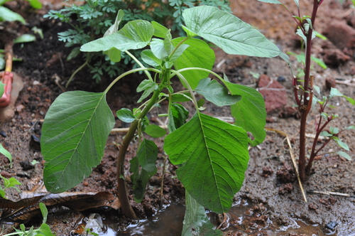

# Amaranthus viridis - Amaranth, Green pigweed

[TOC]

**Amaranthus** is a cosmopolitan genus of annual or short-lived perennial plant. Some amaranth species are cultivated as leaf vegetables, pseudocereals and ornamental plants. Most of the species from Amaranthus are summer annual weeds and are commonly referred to as pigweed.
## Uses
Cancer, Hair loss, Eyesight problem, Cardiovascular disease, Anaemia, Perspiration problems, Cholesterol, Indigestion.

### Food
Green pigweed can be used in food. Young shoots and leaves are cooked as vegetable.

## Parts Used
Leaves, Seeds.

## Chemical Composition
Principal constituents of this plant are saponins. It is rich in minerals and contains sterols and fatty acids in the seeds. The stem and leaves contain oxalic acid

## Common names
| Language | Names |
| --- | --- |
| Kannada | Mulluharive soppu |
| Malayalam | Kattumullenkeera |
| Sanskrit | Tanduliuyah |
| Tamil | Mullukkeerai |
| Telugu | Mullatotakura |
| Hindi | Kanta chaulai |
| English | Needle burr |

## Properties
Reference: Dravya - Substance, Rasa - Taste, Guna - Qualities, Veerya - Potency, Vipaka - Post-digesion effect, Karma - Pharmacological activity, Prabhava - Therepeutics.
### Dravya
### Rasa
### Guna
### Veerya
### Vipaka
### Karma
### Prabhava
### Nutritional components
Green pigweed contains the Following nutritional components like Vitamin-A, B12, C, D, K, Niacin (B3), Ribofl avin, Thiamine (B1), Calcium, Iron, Magnesium, Manganese, Phosphorus, Potassium, Sodium, Zinc

## Habit
A slender Herb

## Identification
### Leaf
Simple, Deltoid, Leaf arrangement is alternate, leaf base is truncate and leaf margins are entire.

### Flower
Terminal and axillary spikes, 2-4cm long, Green/brown, 10-18, Flowering peaks in December-April and flower are terminal panicles

### Fruit
Achene, Fruits are like An utricle, indehiscent, sub compressed, rugose, brownish

### Other features
## List of Ayurvedic medicine in which the herb is used
* [Vishatinduka Taila](../medicines/Vishatinduka_Taila.md) as *root juice extract*

## Where to get the saplings
## Mode of Propagation
Seeds, Cuttings.

## How to plant/cultivate
Seeds germinate readily. Prefers a well-drained fertile soil in a sunny position. Requires a hot sheltered position if it is to do well. Plants should not be given inorganic fertilizers, see notes above on toxicity. Green pigweed's availability period is September to December

## Commonly seen growing in areas
Tropical area.

## Photo Gallery

## References

## External Links
* [Amaranthus viridis on Useful Tropical Plants](http://tropical.theferns.info/viewtropical.php?id=Amaranthus+viridis)
* [Amaranthus viridis on publish.plantnet-project](http://publish.plantnet-project.org/project/riceweeds_en/collection/collection/information/details/AMAVI)
* [Amaranthus viridis on florafaunaweb.nparks.](https://florafaunaweb.nparks.gov.sg/special-pages/plant-detail.aspx?id=5812)
* [Amaranthus viridis L on wikwio portal](http://portal.wikwio.org/species/show/23)

## References

1. [Constituents](Chemical)(http://www.mpbd.info/plants/amaranthus-viridis.php)
2. [Morphology](https://indiabiodiversity.org/species/show/32945)
3. [details](Cultivation)(https://www.pfaf.org/user/plant.aspx?LatinName=Amaranthus+viridis)
4. Forest food for Northern region of western ghat pdf by Dr. Mandar N. Datar and Dr. Anuradha S. Upadhye, MACS - Agharkar Research Institute, Pune
