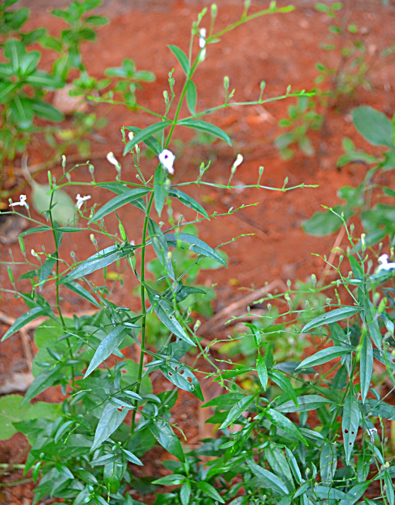
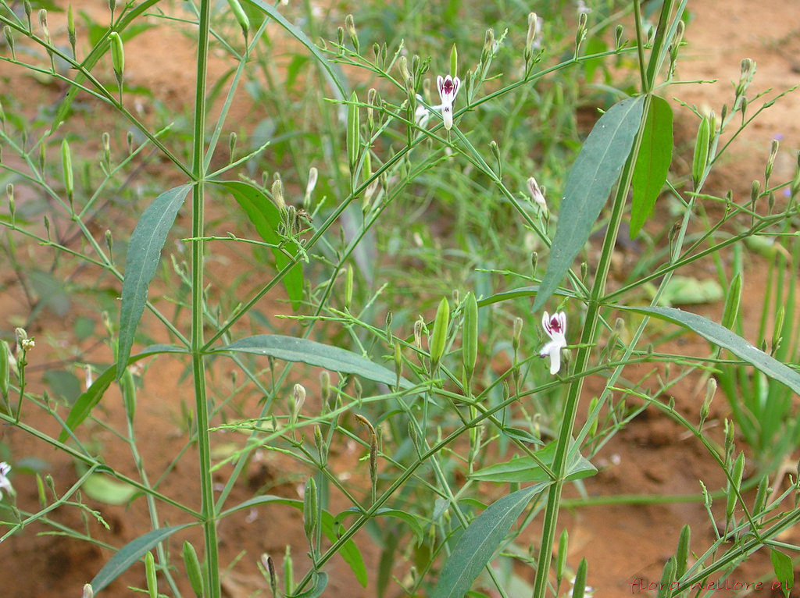
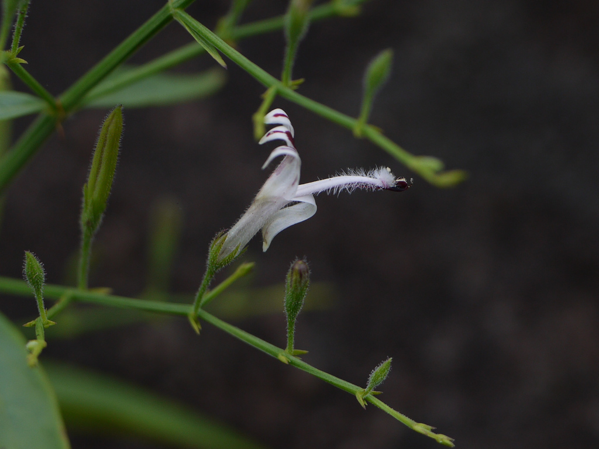
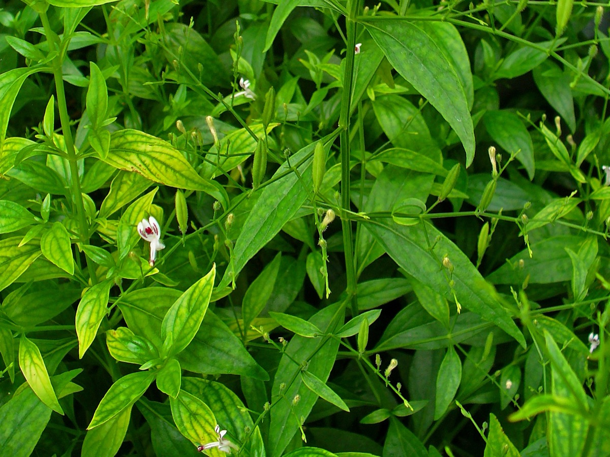
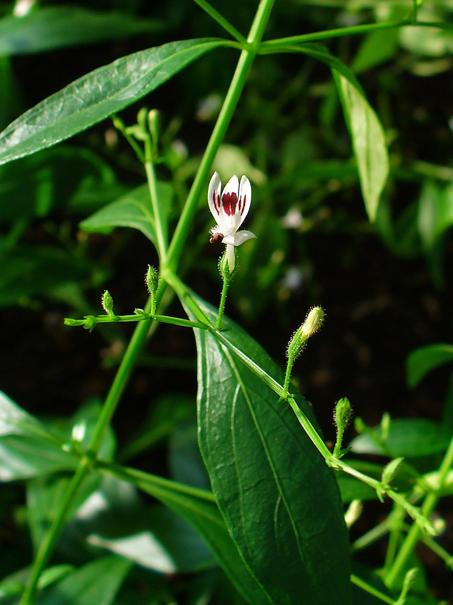

# Andrographis paniculata - Kalmegh

[TOC]

_in_Narshapur_forest,_AP_W2_IMG_0867.jpg)

**Andrographis paniculata** is an annual herbaceous plant in the family Acanthaceae, native to India and Sri Lanka.It is widely cultivated in Southern and Southeastern Asia, where it has been traditionally used to treat infections and some diseases.

## Uses
Cancer, HIV, Cough, Cold, Sinusitis, Body pain, Liver problems, Leprosy, Cholera

## Parts Used
Leaves, Whole herb.

## Chemical Composition
Dihydroneobaicalein, andrographidine, andrographidine, andrographidine, dihydroxy, dimethoxyflavone, beta-D-glucopyranoside, three diterpenoids, andrograpanin, neoandrographolide ,andrographolide, two phenylpropanoids, trans-cinnamic acid and methoxycinnamaldehyde

## Common names
| Language | Names |
| --- | --- |
| Kannada | Nelaberu, kaala megha |
| Malayalam | Nelavepu, Kiriyattu |
| Sanskrit | Kalmegha, Bhunimba |
| Tamil | Nilavembu |
| Telugu | Nilavembu |
| Hindi | Kirayat, Kalpanath |
| English | kariyat |

## Properties
Reference: Dravya - Substance, Rasa - Taste, Guna - Qualities, Veerya - Potency, Vipaka - Post-digesion effect, Karma - Pharmacological activity, Prabhava - Therepeutics.
### Dravya
### Rasa
Tikta (Bitter)
### Guna
Laghu (Light), Ruksha (Dry)
### Veerya
Ushna (Hot)
### Vipaka
Katu (Pungent)
### Karma
Kapa, Pitta
### Prabhava
## Habit
Herb

## Identification
### Leaf
Simple, Opposite, 9 x 1.5 cm, elliptic, acuminate at apex, base acute, decussate, glabrous.

### Flower
Bisexual, 2-4cm long, White and purple, 5-20, Panicle terminal and upper axillary, glandular-hairy; flowers many, distant. Calyx lobes 3 mm long, linear, hairy, connate at base, Corolla 14 mm long, pink or white with purple dots, tube ventricose, hairy, upper lip entire, midlobe of lower lip broader than laterals, acute, glandular-hairy. Ovary puberulous, style hairy.

### Fruit
Capsule, 20-30 x 3 mm, oblong, acute, hairy; retinacula spoon shaped, eeds 8, glabrous

### Other features
## List of Ayurvedic medicine in which the herb is used
* [Gopichandanadi gulika](Gopichandanadi_gulika.md)

## Where to get the saplings
## Mode of Propagation
Seeds, Cuttings.

## How to plant/cultivate
It can be easily raised through seed and vegetative methods. But in commercial cultivation, propagation through seed is easy and economical. In India, it is cultivated as rainy season (Kharif) crop. Any soil having fair amount of organic matter is suitable for commercial cultivation of this crop. About 400 gms. seed are sufficient for one hectare

## Commonly seen growing in areas
Village groves, Roadsides, Waste places.

## Photo Gallery

_(6256601039).jpg)

## References

## External Links
* [Andrographis – Health Benefits and Side Effects](https://www.herbal-supplement-resource.com/andrographis-herb.html)
* [Harnessing the medicinal properties of Andrographis paniculata](https://www.ncbi.nlm.nih.gov/pmc/articles/PMC4032030/)
* [Medicinal Use Of Kalmegh](https://www.bimbima.com/ayurveda/medicinal-use-of-kalmegh-andrographis-paniculata/1483/)
* [A Review of its Traditional Uses, Phytochemistry and Pharmacology](https://www.omicsonline.org/open-access/andrographis-paniculata-a-review-of-its-traditional-uses-phytochemistry-and-pharmacology-2167-0412.1000169.php?aid=33645)

## References

1. [Constituents](Chemical)(https://www.ncbi.nlm.nih.gov/pubmed/21626787)
2. [description](Botanical)(http://keralaplants.in/)
3. [Cultivation](http://vikaspedia.in/agriculture/crop-production/package-of-practices/medicinal-and-aromatic-plants/andrographis-paniculata)
