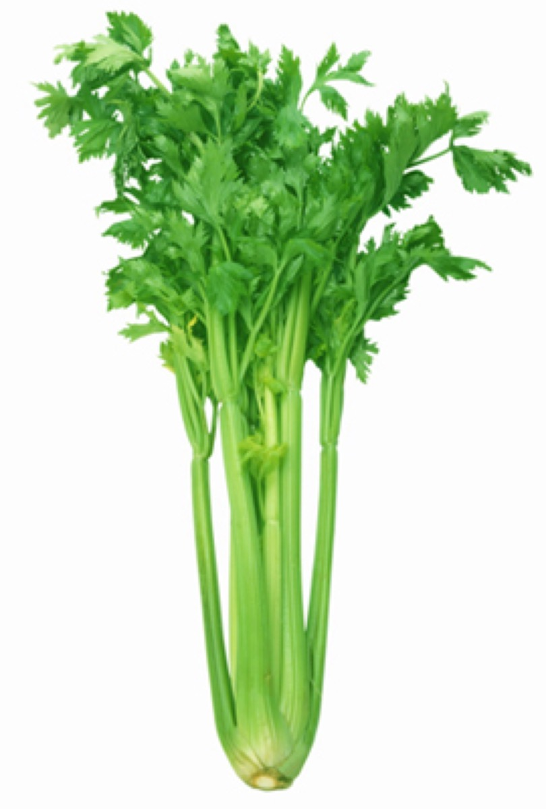

# Apium graveolens - Ugragandhika, Celery

[TOC]

**Apium graveolens var** is a marshland plant in the family Apiaceae that has been cultivated as a vegetable since antiquity. Celery has a long fibrous stalk tapering into leaves.

## Uses
Blood pressure, Indigestion, Uterus, Inflammatory, Hysteria, High blood pressure, Rheumatism, Diarrhea, Kidney complaints.

## Parts Used
Leaves, Seeds.

## Chemical Composition
Celery yields an essential oil (3%), major constituent being d-limonene (50%) and phathalides and beta-selinene; coumarins, furanocoumarins (bergapten); flavonoids (apiin and apigenin).

## Common names
| Language | Names |
| --- | --- |
| Sanskrit | Ugragandhika, Vastamoda, Hayagandha |
| Hindi | Bari ajmod, Ajmod |
| English | Celery, Wild Celery |

## Properties
Reference: Dravya - Substance, Rasa - Taste, Guna - Qualities, Veerya - Potency, Vipaka - Post-digesion effect, Karma - Pharmacological activity, Prabhava - Therepeutics.
### Dravya
### Rasa
Katu (Pungent), Tikta (Bitter)
### Guna
Laghu (Light), Ruksha (Dry)
### Veerya
Ushna (Heating)
### Vipaka
Katu (Pungent)
### Karma
### Prabhava
## Habit
Biennial herb

## Identification
### Leaf
Simple, Celery leaves are frequently used in cooking to add a mild spicy flavor to foods, similar to, but milder than black pepper

### Flower
Unisexual, 1-3cm long, Yellow, 5, Flowers Season is June - August

### Fruit
Rounded, 4-10cm long, With hooked hairs, Single

### Other features
## List of Ayurvedic medicine in which the herb is used
## Where to get the saplings
## Mode of Propagation
Seeds.

## How to plant/cultivate
Prefers a rich light moist soil with some shade in summer

## Commonly seen growing in areas
Wild in Europe, Mediterranean region, Himalayas.

## Photo Gallery

.jpg)

## References

## External Links
* [Celery cultivation details](https://www.botanical-online.com/english/celery-cultivation.htm)
* [Celery on nichols garden nursary](https://www.nicholsgardennursery.com/store/avactis-images/u/Celery.pdf)
* [Celery-growing ways](https://www.growveg.com/guides/growing-celery-two-ways/)

## References

1. [Pharmacology](http://gbpihedenvis.nic.in/PDFs/Glossary_Medicinal_Plants_Springer.pdf)
2. [description](Plant)(https://en.wikipedia.org/wiki/Celery)
3. [details](Cultivation)(https://www.pfaf.org/User/Plant.aspx?LatinName=Apium+graveolens+secalinum)
