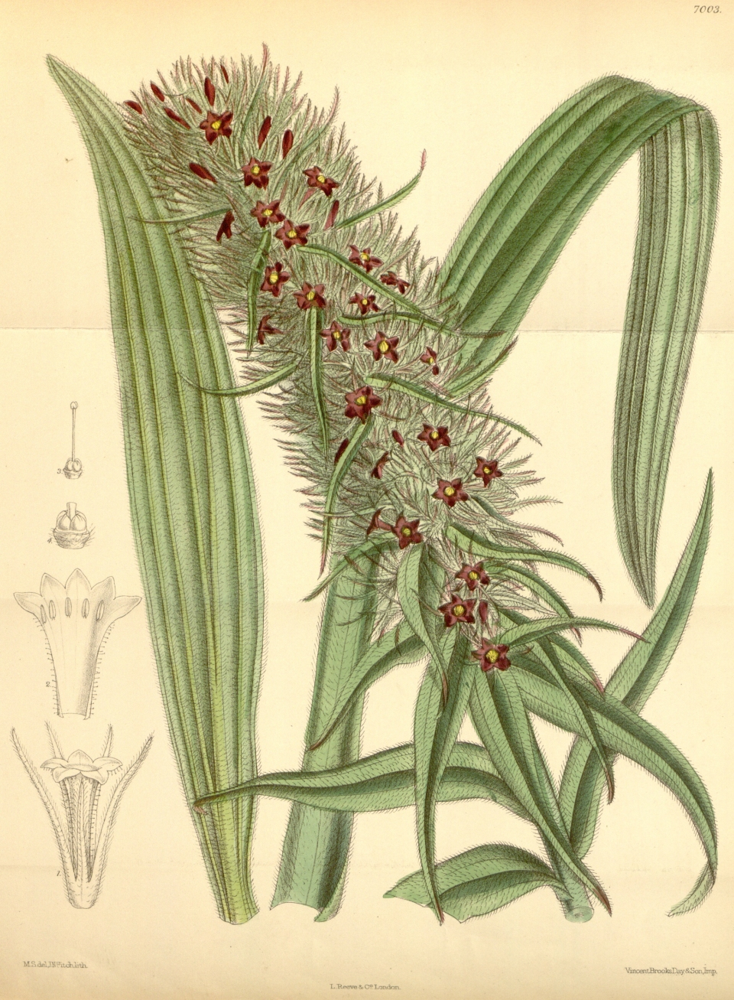

# Arnebia benthami

[TOC]

**Himalayan Arnebia** is a distinctive hairy perennial plant.
## Uses
Cardiac, Febrifuge, Diseases of tongue, Diseases of throat.

## Parts Used
, stem, leaves, Root.

## Chemical Composition

## Common names
## Properties
Reference: Dravya - Substance, Rasa - Taste, Guna - Qualities, Veerya - Potency, Vipaka - Post-digesion effect, Karma - Pharmacological activity, Prabhava - Therepeutics.
### Dravya
### Rasa
### Guna
### Veerya
### Vipaka
### Karma
### Prabhava
## Habit
## Identification
### Leaf

### Flower
### Fruit
### Other features
## List of Ayurvedic medicine in which the herb is used
## Where to get the saplings
## Mode of Propagation
Seeds

## How to plant/cultivate

## Commonly seen growing in areas
, , , , .

## Photo Gallery

## References

## External Links
* [ ]
* [ ]
* [ ]

## References

1. ["chemistry"]
2. ["morphology"]
3. [ "Cultivation"]
