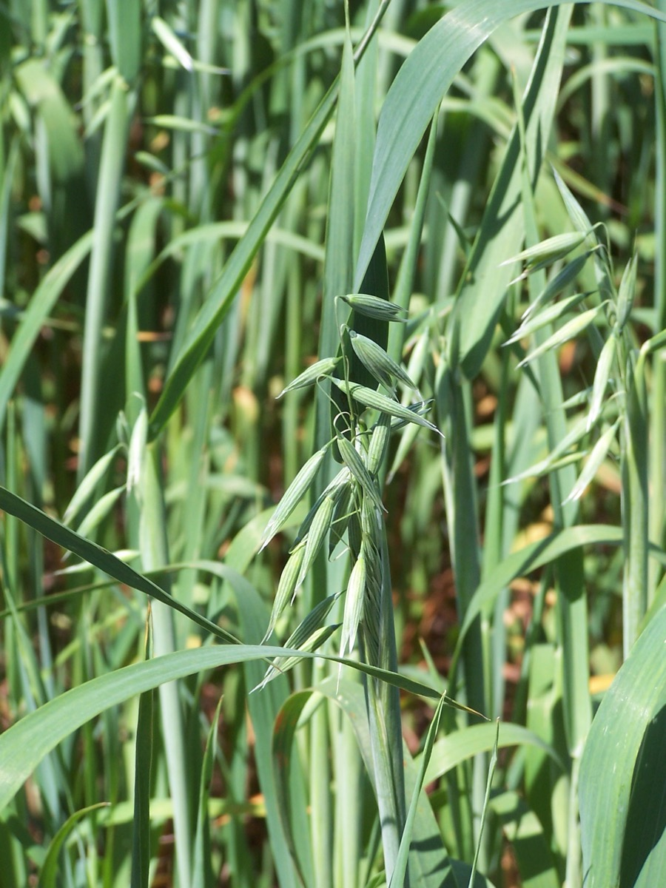

# Avena sativa - Oat

[TOC]

**Avena sativa** sometimes called the common oat. It is a species of cereal grain grown for its seed. While oats are suitable for human consumption as oatmeal and rolled oats, one of the most common uses is as livestock feed.

## Uses
Lower blood pressure, Bad cholesterol, Insomnia, Stress, Anxiety, Blood sugar, Aphrodisiac, Rashes, Sunburn.

## Parts Used
Seeds, Dried stem, Leaf.

## Chemical Composition
Per 100 g, the mature seed is reported to contain 374 calories, 11.0 g H20, 13.1 g protein, 6.1 g fat, 67.4 g total carbohydrate, 5.8 g fiber, 2.4 g ash, 59 mg Ca, 425 mg P, 4.6 mg Fe, 10 mg Na, 0.35 mg thiamine, 0.09 mg riboflavin, and 2.2 mg niacin. Generically, oat grains, with 78.7–95.2% DM (mean of 1650 cases = 89.1), contain on a zero moisture basis

## Common names
| Language | Names |
| --- | --- |
| English | Common Oat |

## Properties
Reference: Dravya - Substance, Rasa - Taste, Guna - Qualities, Veerya - Potency, Vipaka - Post-digesion effect, Karma - Pharmacological activity, Prabhava - Therepeutics.
### Dravya
### Rasa
### Guna
### Veerya
### Vipaka
### Karma
### Prabhava
## Habit
Culms erect

## Identification
### Leaf
Simple, Cauline, Ligule an eciliate membrane; 3-6 mm long. Leaf-blades 14-40 cm long 5-15 mm wide and Leaf-blade surface scaberulous

### Flower
Unisexual, 2-4cm long, Yellow, 5-20, Ovary pubescent all over and Flowers Season is June - August

### Fruit
Caryopsis, Caryopsis with adherent pericarp, hairy all over. Hilum linear, Hairy all over, Few seeds

### Other features
## List of Ayurvedic medicine in which the herb is used
## Where to get the saplings
## Mode of Propagation
Seeds.

## How to plant/cultivate
Oats are an easily grown crop that succeeds in any moderately fertile soil in full sun

## Commonly seen growing in areas
Cultivated Beds, Dry wasteland, Meadows, Cultivated ground

## Photo Gallery

## References

## External Links
* [Botanical Information of Oat Straw or Avena sativa](https://www.mdidea.com/products/new/new03201.html)
* [Avena sativa  on encyclopedea of life](http://eol.org/pages/1114783/details)
* [Avena sativa  on gobotony discover plants](https://gobotany.newenglandwild.org/species/avena/sativa/)
* [Avena sativa on illinois wild flowers.info/](http://www.illinoiswildflowers.info/grasses/plants/oats.html)

## References

1. [Chemistry](https://hort.purdue.edu/newcrop/duke_energy/Avena_sativa.html)
2. [description](Plant)(http://powo.science.kew.org/taxon/urn:lsid:ipni.org:names:391732-1)
3. [details](Cultivation)(https://www.pfaf.org/user/Plant.aspx?LatinName=Avena+sativa)
