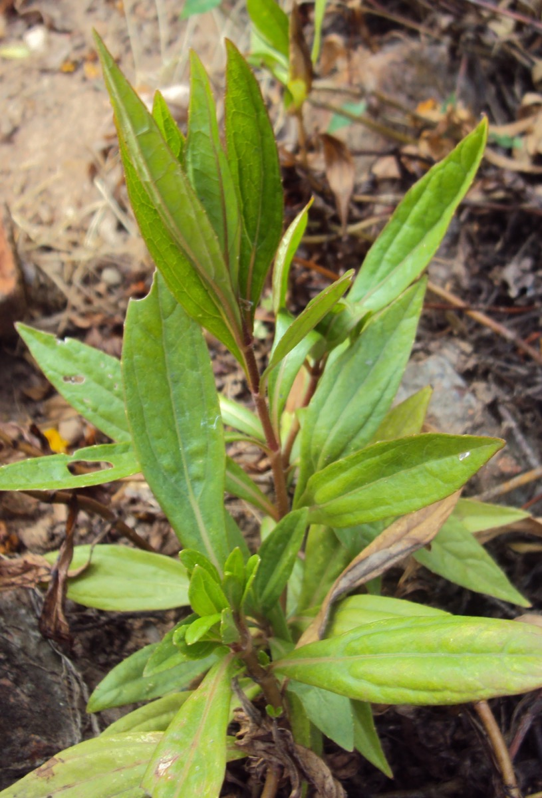

# Ayapana triplinervis - Vishalyakarni

[TOC]

**Eupatorium triplinerve** is a tropical American shrub in the Asteraceae family. This plant has long slender leaves which are often used to make a stimulating medicine. The herb is stimulant, tonic in small doses and laxative when taken in quantity.

## Uses
Piles, Poisoning, Skin diseases, Nausea, Vomiting, Colitis, Chronic fevers, Enlarged abdomen, Jaundice

## Parts Used
Leaves, Stem

## Chemical Composition
The coumarins, ayapanin and ayapin, stigmasterol, esculetin methylene ether, vitamin C and carotene

## Common names
| Language | Names |
| --- | --- |
| Malayalam | Aiyappana, Mrithasanjeevani |
| Sanskrit | Vishalyakarni, Ayaparnah |
| Tamil | Ayappani |
| Telugu | Gurivinda or Guriginja |
| Hindi | Ayapan, Ayaparna |
| English | Ayapana tea |

## Properties
Reference: Dravya - Substance, Rasa - Taste, Guna - Qualities, Veerya - Potency, Vipaka - Post-digesion effect, Karma - Pharmacological activity, Prabhava - Therepeutics.
### Dravya
### Rasa
Tikta (Bitter), Kashaya (Astringent)
### Guna
Laghu (Light), Ruksha (Dry)
### Veerya
Ushna (Hot)
### Vipaka
Katu (Pungent)
### Karma
Pitta
### Prabhava
## Habit
Sub shrub

## Identification
### Leaf
Opposite, Smooth, Opposite, narrowly elliptic or lanceolate and 5 to 8 centimeters long

### Flower
Unisexual, 6 to 13 millimeters, Pink, Bearing about 20 pink flowers, Pappus is about 3 millimeters long

### Fruit
Fruit are achenes, Thinly septate, pilose, wrinkled, Seeds upto 5, Fruiting throughout the year

### Other features
## List of Ayurvedic medicine in which the herb is used
## Where to get the saplings
## Mode of Propagation
Seeds, Cuttings

## How to plant/cultivate
The more common species of Aconitum are generally those cultivated in gardens, especially hybrids. They typically thrive in well-drained evenly moist garden soils like the related hellebores and delphiniums, and can grow in the shade of trees.

## Commonly seen growing in areas
Tropical area, Secondary forest, Moist locations

## Photo Gallery

_(8182108856).jpg)

## References

## External Links
* [Eupatorium triplinerve on planet ayueveda](http://www.planetayurveda.com/library/ayapan-eupatorium-triplinerve)
* [Ayapana (Eupatorium triplinerve) Herb Information and Medicinal Uses](https://www.bimbima.com/ayurveda/ayapana-eupatorium-triplinerve-herb-information-and-medicinal-uses/327/)
* [Eupatorium triplinerve-charecteristics](http://ayapana.blogspot.in/)
* [Triplinervis on useful trophical plants](http://tropical.theferns.info/viewtropical.php?id=Ayapana+triplinervis)

## References

1. [constituents](Chemical)(https://easyayurveda.com/2016/11/10/ayapana-eupatorium-triplinervis/)
2. [Morphology](https://indiabiodiversity.org/species/show/265395)
