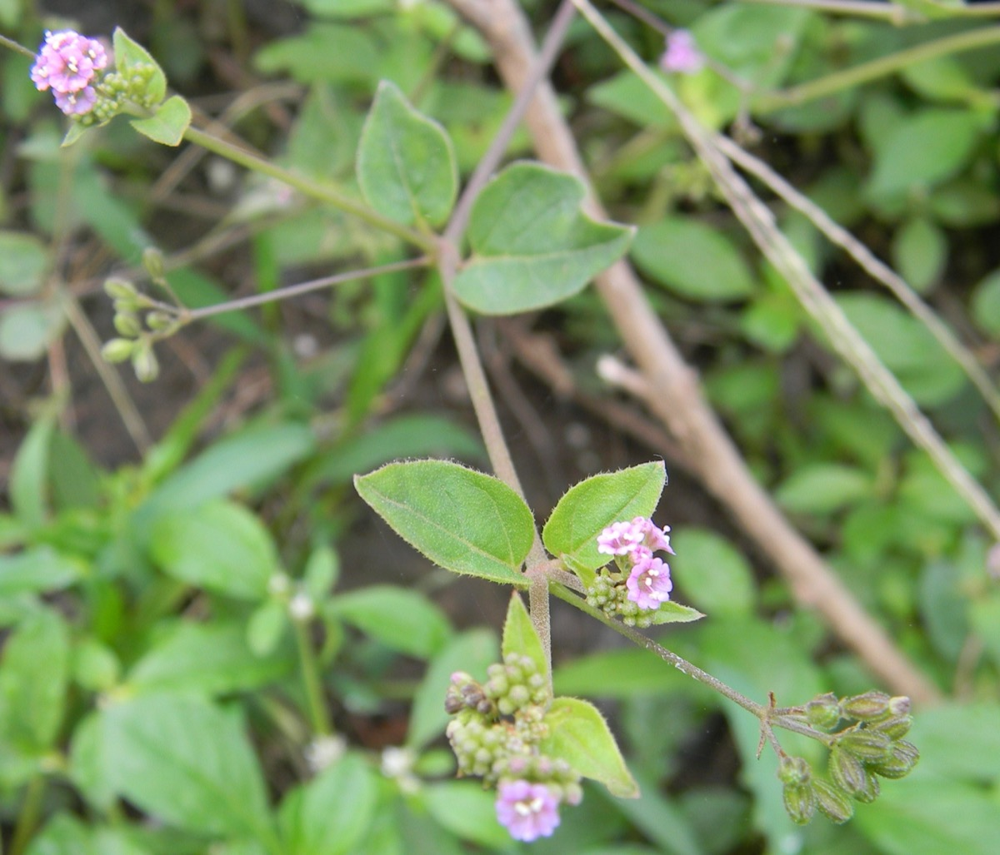

# Boerhavia diffusa - Punarnava

[TOC]

**Punarnava** is a species of flowering plant in the four o'clock family which is commonly known as punarnava. It is taken in herbal medicine for pain relief and other uses. The leaves of punarnava are often used as a green vegetable in many parts of India. It's family is Nyctaginaceae.
## Uses
Obesity, Dropsy, Blood pressure, Gastric disturbances, Asthma, Jaundice, Anascara, Anaemia, Internal inflammation, Indurated liver

## Parts Used
Roots, Seeds, Leaves

## Chemical Composition
Major components are sitosterol, Esters of sitosterol, Punarnavine, Boerhaavia acid, Boeravinone, Palmitic acid and many other compounds are present in this plant.

## Common names
| Language | Names |
| --- | --- |
| Kannada | Gonajali, Kommegida |
| Malayalam | Talutama, Tamilama |
| Sanskrit | Punarnavah, Raktakanda |
| Tamil | Caranai, Caranai ver |
| Telugu | Ambati madu, Atikamamidi |
| Hindi | Varshbhu |
| English | Red spiderling |

## Properties
Reference: Dravya - Substance, Rasa - Taste, Guna - Qualities, Veerya - Potency, Vipaka - Post-digesion effect, Karma - Pharmacological activity, Prabhava - Therepeutics.
### Dravya
### Rasa
Tikta (Bitter), Kashaya (Astringent), Madhura (Sweet)
### Guna
Laghu (Light), Ruksha (Dry)
### Veerya
Ushna (Hot)
### Vipaka
Katu (Pungent)
### Karma
Pitta, Kapha
### Prabhava
## Habit
Perennial plant

## Identification
### Leaf
Simple, Ovate-cordiform, Leaf Arrangement is Opposite

### Flower
Unisexual, Pink, 5-20, In terminal or axillary panicles of umbellate or capitate clusters

### Fruit
Club-shaped anthocarp, 7–10 mm (0.28–0.4 in.) long pome, Fruiting throughout the year, With hooked hairs

### Other features
## List of Ayurvedic medicine in which the herb is used
* [Punarnavaadi mandura](../medicines/Punarnavaadi_mandura.md)

## Where to get the saplings
## Mode of Propagation
Seeds, Cuttings.

## How to plant/cultivate
Boerhavia diffusa is widespread through much of the tropics and the subtropics and has also become naturalized in parts of the temperate zone Prefers a sunny position and a well-drained soil.

## Season to grow
April-May

## Required Ecosystem/Climate
It cannot grow in the shade. It prefers dry or moist soil and can tolerate drought.

## Kind of soil needed
Light (sandy) and medium (loamy) soils and prefers well-drained soil.

## Commonly seen growing in areas
Open places near the sea, Dry river valleys, Along roadsides, Warm river valleys.

## Photo Gallery

## References

## External Links
* [Summary of Boerhaavia diffusa](https://examine.com/supplements/boerhaavia-diffusa/)
* [Benefits, dose, side effects](https://easyayurveda.com/2014/11/17/punarnava-boerhavia-diffusa-benefits-dose-side-effects/)
* [Boerhavia diffusa on porta4U record display.org](https://www.prota4u.org/database/protav8.asp?g=pe&p=Boerhavia+diffusa+L.)

## References

1. [constituents](Chemical)(http://www.phytojournal.com/vol1Issue1/Issue_may_2012/5.pdf)
2. [Morphology](https://indiabiodiversity.org/species/show/32997)
3. Karnataka Aushadhiya Sasyagalu By Dr.Maagadi R Gurudeva, Page no:07
4. [Details](Cultivation)(http://tropical.theferns.info/viewtropical.php?id=Boerhavia+diffusa)
5. [Ecosystem/Climate](Required)(https://pfaf.org/User/Plant.aspx?LatinName=Boerhavia+diffusa)
