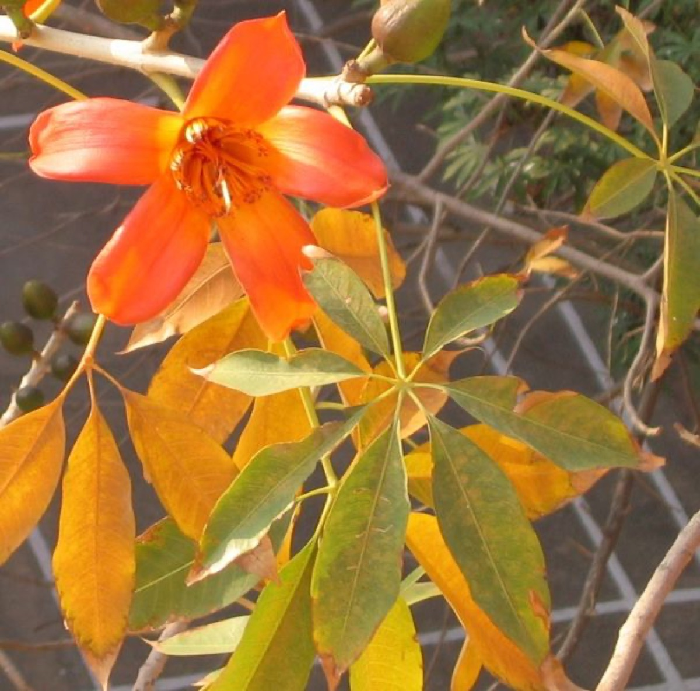

# Bombax ceiba - Kutasalmali

[TOC]

**Bombax ceiba** is a medicinal tree and is also referred as silent doctor. It is found in India, Malaysia, Sri lanka, Hong kong, Australia and Africa. Every part of this tree is used to treat various ailments.
## Uses
Semen problems, Leucorrhoea, Over bleeding in menstruation, Acne, Skin blemish, Pigmentation, Wounds, Cold, Sore throats, Cough

### Food
Bombax ceiba can be used in food. Young roots are roasted over fi re and eaten. Flower buds and fruits are cooked as vegetable, petals used in
preparation of jam.

## Parts Used
Flower, Leaf, Root, Bark

## Chemical Composition
Stem and root bark contains lupeol, β-sitosterol, naphthoquinone compound, phenolic substances, a lactone, 4 sesquiterpenes. Root yields triacontanol, β- sitosterol.

## Common names
| Language | Names |
| --- | --- |
| Kannada | Marahatti, Kempu booruga |
| Malayalam | Unnamurika |
| Sanskrit | Shalmali, Semul, Simul |
| Tamil | Sittan, Sanmali |
| Telugu | Buruga |
| Hindi | Shalmali |
| English | Silk Cotton Tree, Kapok Tree |

## Properties
Reference: Dravya - Substance, Rasa - Taste, Guna - Qualities, Veerya - Potency, Vipaka - Post-digesion effect, Karma - Pharmacological activity, Prabhava - Therepeutics.
### Dravya
### Rasa
Kashaya (Astringent)
### Guna
Laghu (Light), Snigda (haevy)
### Veerya
Sheeta (cold)
### Vipaka
Madhura (Sweet)
### Karma
### Prabhava
### Nutritional components
Kutasalmali contains the Following nutritional components like Vitamin-A, C and E; Calcium, Iron, Magnesium, Potassium, Phosphorus, Sodium

## Habit
Deciduous tree

## Identification
### Leaf
Simple, Digitate, Leaf Shape is Oblong-lanceolate or elliptic and Leaf Arrangement is Alternate -spiral

### Flower
Unisexual, 2-4cm long, Yellow, 5-20, Solitary, paired or clustered; blood red. Flowering from April-March

### Fruit
Oblong capsule, 7–10 mm, Fruiting April onwards, A loculicidal, oblong capsule, 5-valved, Many

### Other features
## List of Ayurvedic medicine in which the herb is used
[Shalmali ghrita](Shalmali_ghrita.md), [Chandanasava](../medicines/Chandanasava.md), [Himasagara tailam](../medicines/Himasagara_tailam.md), [Vigorex](../medicines/Vigorex.md), [Gangadhara Churna](../medicines/Gangadhara_Churna.md), [Pushyanuga Churna](../medicines/Pushyanuga_Churna.md), [Narasimha Lehya](../medicines/Narasimha_Lehya.md), [Palasugandi Lehya](../medicines/Palasugandi_Lehya.md), [Abhayarishta](Abhayarishta.md), [Ushiraasava](Ushiraasava.md), [Jeevani](Jeevani.md), [Abhayalepa](../medicines/Abhayalepa.md)

## Where to get the saplings
## Mode of Propagation
Seeds, Cuttings.

## Cultivation Details
Seed - sown fresh, without pre-treatment, they have a high germination rate. Some reports suggest germination rates can be improved by pre-soaking the seeds for 12 hours prior to sowing. Bombax ceiba is available through February to June.

## Season to grow
Summer

## Required Ecosystem/Climate
It cannot grow in the shade. It prefers dry or moist soil.

## Kind of soil needed
Light (sandy), medium (loamy) and heavy (clay) soils and prefers well-drained soil. Suitable pH: neutral and basic (alkaline) soils and can grow in very alkaline soils.

## Commonly seen growing in areas
Hot region, At elevations below 1,400 metres, Humid lowland deciduous forests, Dry river valleys.

## Photo Gallery

-_Young_tree_in_Kolkata_W_IMG_9737.jpg)

_trunk_of_an_old_tree_in_Kolkata_W_IMG_4122.jpg)

_(2318485941).jpg)

## References

## External Links
* [Bombax on flowers of india](http://www.flowersofindia.net/catalog/slides/Silk%20Cotton%20Tree.html)
* [Bombax Ceiba – One Tree, A Universe By Raman Kulkarni](http://www.sanctuaryasia.com/photography/photofeature/9775-bombax-ceiba--one-tree-a-universe-by-raman-kulkarni.html)
* [Bombax-uses, Homeremedies, Medicines](https://easyayurveda.com/2012/10/03/shalmali-silk-cotton-tree-ayurveda-use-formulations-home-remedies/)
* [Medicinal Use Of Semal Or Silk Cotton Tree](https://www.bimbima.com/mens-health/medicinal-use-of-semal-or-silk-cotton-tree/1480/)

## References

1. [constituents](Chemical)(http://www.mpbd.info/plants/bombax-ceiba.php)
2. [preparations](Ayurvedic)(https://easyayurveda.com/2012/10/03/shalmali-silk-cotton-tree-ayurveda-use-formulations-home-remedies/)
3. [Morphology](https://indiabiodiversity.org/species/show/31106)
4. [Details](Cultivation)(https://pfaf.org/user/Plant.aspx?LatinName=Bombax+ceiba)
5. [of soil needed](Kind)(https://pfaf.org/user/Plant.aspx?LatinName=Bombax+ceiba)
6. Karnataka Medicinal Plants Volume - 2” by Dr.M. R. Gurudeva, Page No.234, Published by Divyachandra Prakashana, #45, Paapannana Tota, 1st Main road, Basaveshwara Nagara, Bengaluru.
7. "Forest food for Northern region of Western Ghats" by Dr. Mandar N. Datar and Dr. Anuradha S. Upadhye, Page No.30, Published by Maharashtra Association for the Cultivation of Science (MACS) Agharkar Research Institute, Gopal Ganesh Agarkar Road, Pune
