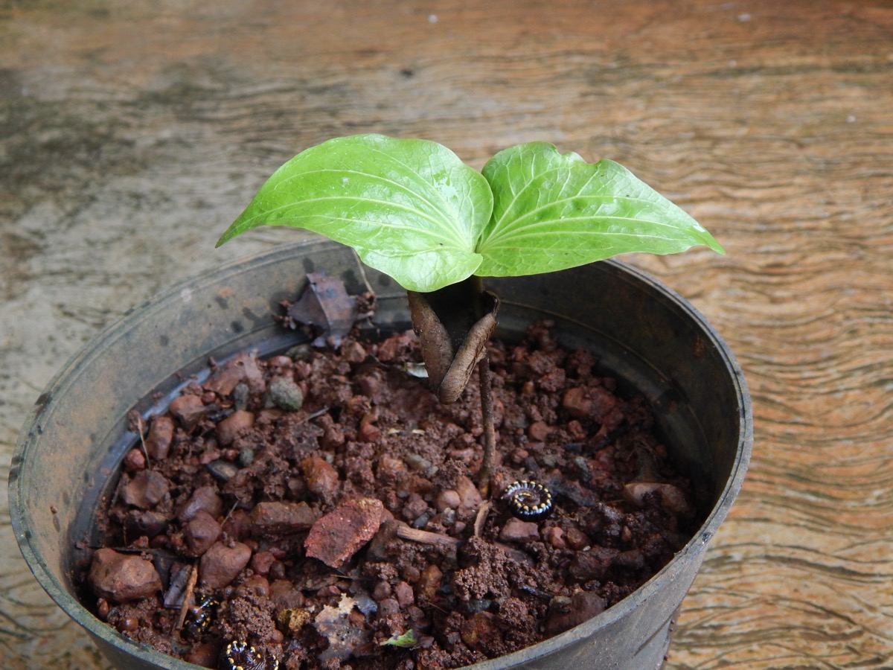

# Brosimum guianense - Kochila

[TOC]

The strychnine tree  (Strychnos nux-vomica L. ), also known as strychnine tree, nux vomica, poison nut, semen strychnos and quaker buttons, is a deciduous tree native to India, and southeast Asia. It is a medium-sized tree in the family Loganiaceae that grows in open habitats. Its leaves are ovate and 2–3.5 inches (5.1–8.9 cm) in size.

It is a major source of the highly poisonous, intensely bitter alkaloids strychnine and brucine, derived from the seeds inside the tree's round, green to orange fruit.The seeds contain approximately 1.5% strychnine, and the dried blossoms contain 1.0%. However, the tree's bark also contains brucine and other poisonous compounds.

Nervous, Paralysis, healing wound.

Strychnos is promoted within alternative medicine as a treatment for many conditions, but the claims are not supported by medical evidence.

## Common name
* **English** - Snake-wood
* **Kannada** - ಹೆಮುಷ್ಟಿ, Hemmushti
* **Hindi** - Kucchla

## References

## References

1. [Wikipedia](https://en.wikipedia.org/wiki/Strychnos_nux-vomica)
