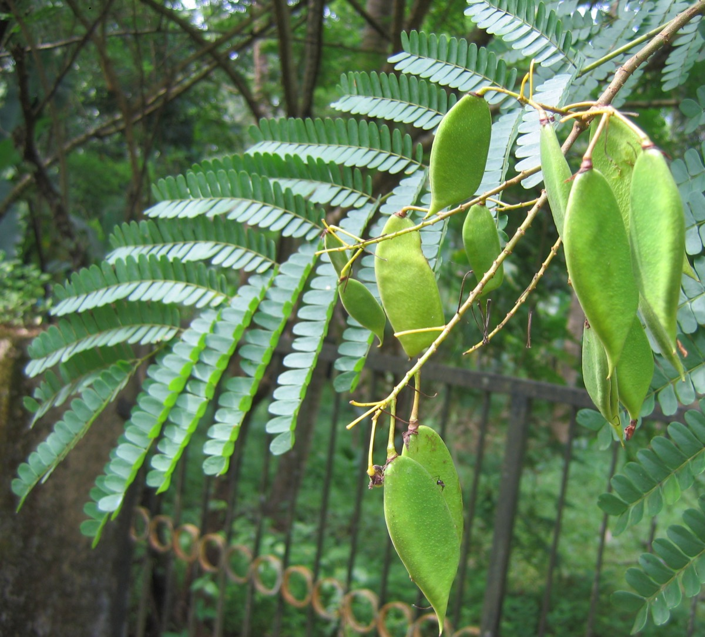

# Caesalpinia sappan - Pathanga

[TOC]

**Sappan Wood** is a small thorny tree. It is having 15-25 cm in trunk diameter with a few prickly branches. Biancaea sappan is a prickly, shrubby tree that can grow up to 20 metres tall, but is usually smaller.
## Uses
Wounds, Tuberculosis, Dysentery, Curing liver disorders, Skin eruptions, Pimples, Diarrhea.

## Parts Used
Dried folaige, Whole herb.

## Chemical Composition
tectorigenin, sappanone, 3-deoxysappanone, sappanchalcone, 3-deoxysappanchalcone

## Common names
| Language | Names |
| --- | --- |
| Kannada | Sappange |
| Malayalam | Chappannam, Sappannam |
| Sanskrit | Patrangah, Patangah |
| Tamil | Sappamgu, Patamgam |
| Telugu | Bakaruchakka |
| Hindi | Patamg, Bakam |
| English | Sappan Wood, Brazil wood |

## Properties
Reference: Dravya - Substance, Rasa - Taste, Guna - Qualities, Veerya - Potency, Vipaka - Post-digesion effect, Karma - Pharmacological activity, Prabhava - Therepeutics.
### Dravya
### Rasa
Tikta (Bitter), Kashaya (Astringent), Madhura (Sweet)
### Guna
Ruksha (Dry)
### Veerya
Sheeta (cold)
### Vipaka
Katu (Pungent)
### Karma
Kapha, pitta
### Prabhava
## Habit
Tree

## Identification
### Leaf
Simple, Double-compound, Alternately arranged, 20-45 cm long, 10-20 cm broad, with 8-16 pairs of up to 20 cm long side-stalks. Side-stalks are prickles at the base and with 10-20 pairs of oblong

### Flower
Unisexual, 2-3 cm long, Yellow, 5-20, Flowers Season is June - Augustand Stamens are waxy-white, filaments densely woolly at the base

### Fruit
Woody pods, The heartwood which is used in medicine is light yellow when freshly cut, but it quickly changes to red, Compressed with a hard recurved short beak, 3-4 seeds

### Other features
## List of Ayurvedic medicine in which the herb is used
* [Vishatinduka Taila](../medicines/Vishatinduka_Taila.md) as *root juice extract*

## Where to get the saplings
## Mode of Propagation
Seeds, Cuttings.

## How to plant/cultivate
Sappanwood succeeds in semi-arid to moist tropical regions

## Commonly seen growing in areas
Secondary forest, Near roadsides, Forest-edges, Limestone hills.

## Photo Gallery

.jpg)

## References

## External Links
* [Caesalpinia sappan on envis centre on medicinal plants](http://envis.frlht.org/plantdetails/720d7502e581a303c06359b8b1966470/58bd2e8442a2a5051298f936975ca8cd)
* [Caesalpinia sappan Information, Uses and Warnings](https://www.bimbima.com/herbs/sappan-wood/3850/)
* [On Chemical Constituents Of Caesalpinia Sappan L.](https://www.globethesis.com/?t=2214330374458217Study)
* [Phenolic Compounds from Caesalpinia sappan Heartwood](https://pubs.acs.org/doi/abs/10.1021/np3003673)

## References

1. [Chemistry"](https://www.cabdirect.org/cabdirect/abstract/20103344002)
2. [description](Flowers)(https://www.flowersofindia.net/catalog/slides/Sappan%20Wood.html)
3. [Details](Cultivation)(http://tropical.theferns.info/viewtropical.php?id=Biancaea+sappan&redir=Caesalpinia+sappan)
