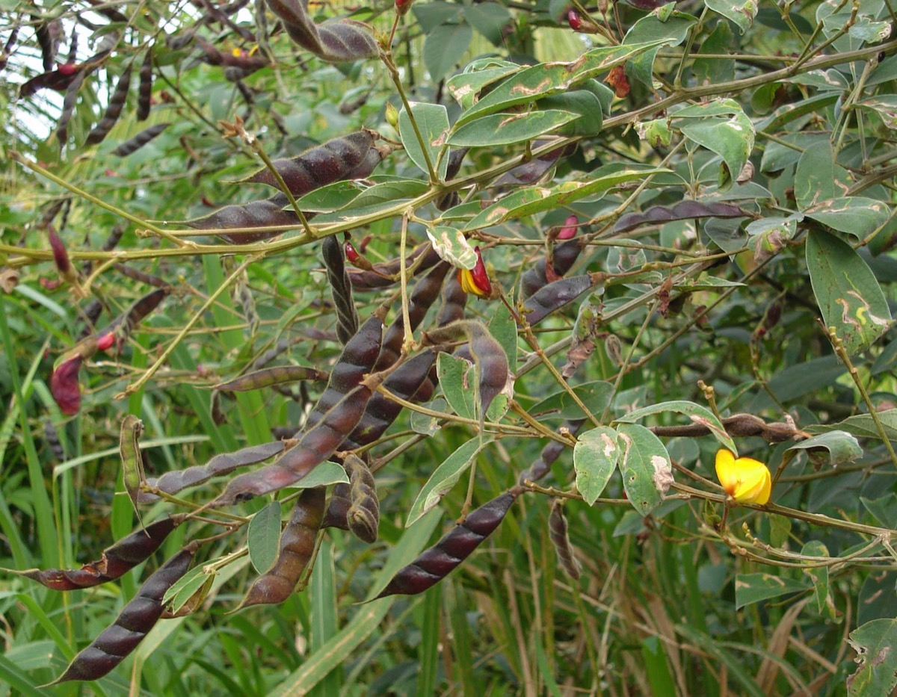
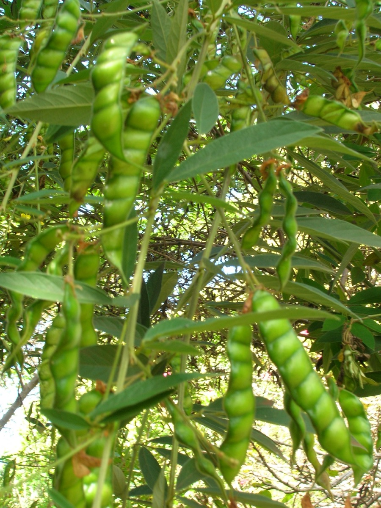
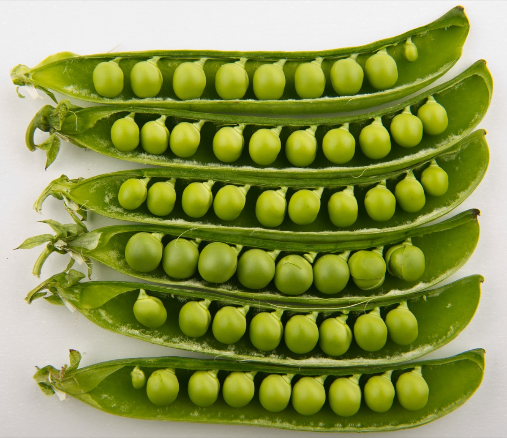
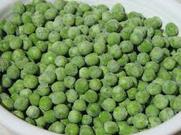
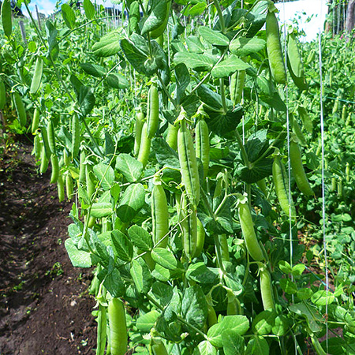

# Cajanus cajan - Adhaki, Pegion pea

[TOC]

The **Cajanus cajan** is a perennial legume from the Fabaceae family. Since its domestication in India at least 3,500 years ago, its seeds have become a common food in Asia, Africa, and Latin America.
## Uses
Jaundice, Stomachache, Diabetes, Purifying blood, Piles, Tongue sores, Gum inflammation, Spongy gums, Bedsores, Wounds, Malaria.

## Parts Used
Seed, Leaf.

## Chemical Composition
Chemical constituent investigations have indicated that Cajanus cajan leaves are rich in flavonoids and stilbenes.

## Common names
| Language | Names |
| --- | --- |
| Kannada | ತೊಗರಿ ಬೆಳೆ Togari bele, ತೊಗರಿ ಕಾಳು Togari kalu |
| Malayalam | Thuvara, Tuvara |
| Sanskrit | Tuvari, Adhaki |
| Tamil | Tovarai, Thovary |
| Telugu | Kandulu, Kadulu |
| Hindi | Arahad, Arahar |
| English | Pigeon Pea, Red Gram |

## Habit
A small erect shrub

## Identification
### Leaf
Simple, Trifoliolate,lanceolate, Leafs are 2.5-13.5 cm long to 1-5.5 cm wide. The leaflets are green above and a silvery grey-green beneath and are covered on their lower surfaces in small yellow glands.

### Flower
Unisexual, 14cm long, Yellow, papilionaceous, Typical of species belonging to the Leguminosae subfamily Papilionoideae. Flowering from August to November

### Fruit
Straight or sickle, 2-13 cm long x 0.5-1.5 cm, The seeds are 4-9 mm x 3-8 mm and can be white, brown, purplish, black or mottled., Many seeds, Fruiting from August to December

### Other features
## List of Ayurvedic medicine in which the herb is used
* [Vishatinduka Taila](../medicines/Vishatinduka_Taila.md) as *root juice extract*

## Where to get the saplings
## Mode of Propagation
Seeds, Cuttung.

## How to plant/cultivate
Seed germinate in about 2 weeks.

## Commonly seen growing in areas
Semi-arid tropics, Humid areas, Cold-free zones.

## Photo Gallery

## References

## External Links
* [Pigeon pea on Agropedia](http://agropedia.iitk.ac.in/content/diseases-pigeon-pea)
* [Pigeon pea on PlantVillage](https://plantvillage.org/topics/pigeon-pea/infos)
* [Cajanus cajun - purdue.edu](https://www.hort.purdue.edu/newcrop/duke_energy/Cajanus_cajun.html)
* [Cajanus cajun on Feedipedia](https://www.feedipedia.org/node/22444)

## References

1. [composition](Chemical)(http://gbpihedenvis.nic.in/PDFs/Glossary_Medicinal_Plants_Springer.pdf)
2. [Kewscience](http://powo.science.kew.org/taxon/urn:lsid:ipni.org:names:1152177-2)
3. [names](Common)(https://sites.google.com/site/indiannamesofplants/via-species/c/cajanus-cajan)
4. [university](Purdue)(https://www.hort.purdue.edu/newcrop/duke_energy/Cajanus_cajun.html)
5. ”Karnataka Medicinal Plants Volume-3” by Dr.M. R. Gurudeva, Page No.545, Published by Divyachandra Prakashana, #6/7, Kaalika Soudha, Balepete cross, Bengaluru
