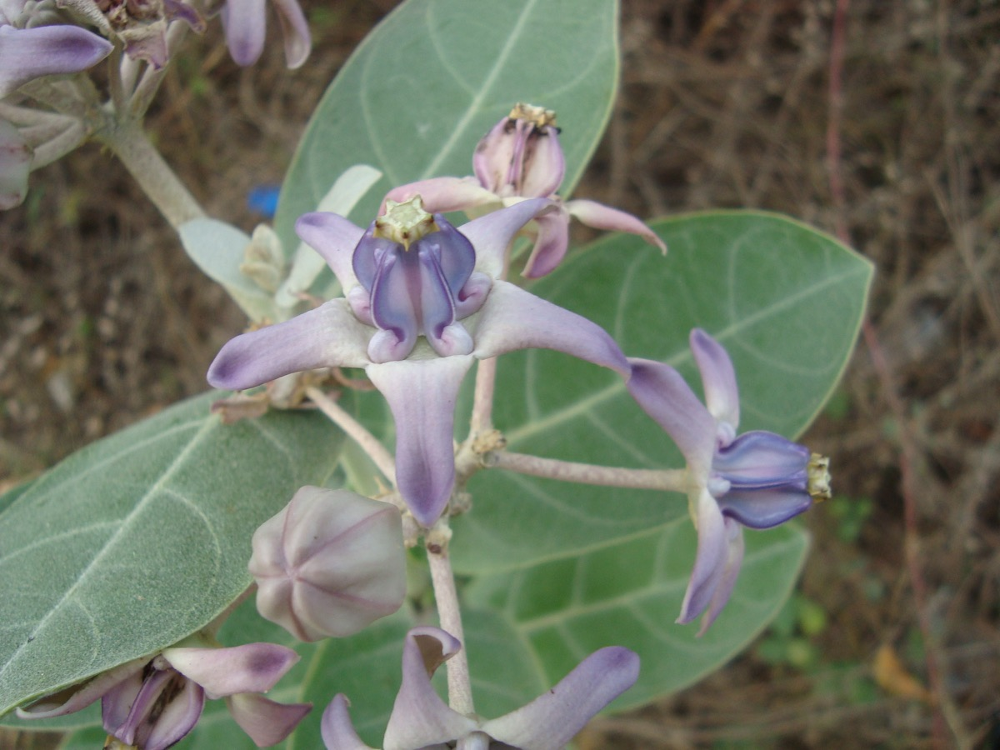

# Calotropis gigantea - Arka plant

[TOC]

**Calotropis procera** is a large shrub growing to 4m tall. It has clusters of waxy flowers that are either white or lavender in color. This plant is belongs to Aslepiacea family.
## Uses
Rheumatism, Painful joints, Skin blemishes, Leucoderma, Vitiligo, Piles, Pain in ears

## Parts Used
Roots, Bark, Flowers, Leaves, Latex.

## Chemical Composition
The milky sap contains a complex mix of chemicals, some of which are steroidal heart poisons known as "cardiac aglycones".

## Common names
| Language | Names |
| --- | --- |
| Sanskrit | Bhaanu, Ravi, Tapana, Arka |
| English | Aakado |
| Gujarati | Aakado |
| Hindi | Aak, Akavana, Madar |
| Kannada | Ekka, Ekkadagida, Ekkegida |
| KS | Vasa |
| Malayalam | Erikku |
| Marathi | Rui |
| Punjabi | Ak |
| Tamil | Erukku, Vellerukku |
| Telugu | Jilledu |

## Properties
Reference: Dravya - Substance, Rasa - Taste, Guna - Qualities, Veerya - Potency, Vipaka - Post-digesion effect, Karma - Pharmacological activity, Prabhava - Therepeutics.
### Dravya
### Rasa
Tikta (Bitter), Katu (Pungent)
### Guna
Laghu (Light), Sara, Snigdha
### Veerya
Ushna (Hot)
### Vipaka
Katu (Pungent)
### Karma
Vatahara, Kaphahara, Bhedana, [Deepana](Deepana.md), Kshamighna

### Prabhava
## Habit
Large shrub

## Identification
### Leaf
Simple, Opposite, Elliptic-ovate to obovate,  greyish-green in colour and have entire margins, relatively thick (5-30 cm long and 4-15 cm wide) with a cordate leaf base. Secondary veins 5-7 pairs

### Flower
Borne in clusters, 15-25 mm across, White or Purplish, Five, Flowering occurs mostly during winter

### Fruit
Large, 6-12 cm long and 3-7 cm wide, These fruit have thick and spongy skins which split open at maturity, Flattened seeds

### Other features
## List of Ayurvedic medicine in which the herb is used
* [Vishatinduka Taila](../medicines/Vishatinduka_Taila.md) as *root juice extract*

## Where to get the saplings
## Mode of Propagation
Seeds, Cuttings,  Layering.

## How to plant/cultivate
Succeeds in the drier tropics. Most commonly found in areas of the tropics with a specific dry season, at elevations up to 1,000 metres.

## Commonly seen growing in areas
Tropical area, Indian subcontinent.

## Photo Gallery

## References

## External Links
* [Calotropis procera Ait on national innovation foundation=](http://nif.org.in/CALOTROPIS-PROCERA)
* [Calotropis procera Ait on global plants](https://plants.jstor.org/stable/10.5555/al.ap.upwta.1_478)
* [Pharmacognostic standardization of leaves of Calotropis procera (Ait.)](https://www.ncbi.nlm.nih.gov/pmc/articles/PMC2876921/)
* [CALOTROPIS PROCERA (Ait.) R.Br. Arka, an important drug of Ayurveda](http://www.science20.com/humboldt_fellow_and_science/blog/calotropis_procera_ait_rbr_arka_important_drug_ayurveda)

## References

1. Kappatagudda - A Repertoire of Medicinal Plants of Gadag pdf, Page no - 91
2. [Details](Cultivation)(http://tropical.theferns.info/viewtropical.php?id=Calotropis+gigantea)
3. [uses of Madar](Medicinal)(https://www.bimbima.com/herbs/medicinal-uses-of-madar-or-arka/688/)
4. [Composition](Chemical)(https://www.researchgate.net/publication/241039494_Chemical_composition_of_Calotropis_gigantea)
5. Karnataka Aushadhiya Sasyagalu By Dr.Maagadi R Gurudeva, Page no:245
