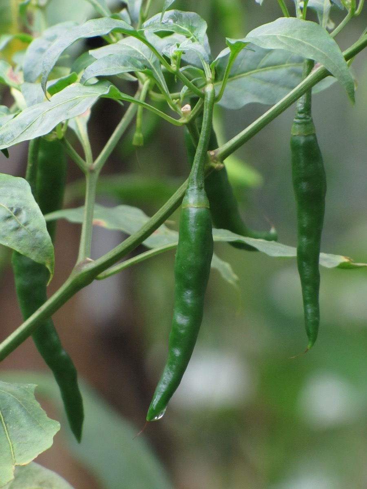

# Capsicum annuum - Katphala

[TOC]

**Capsicum** is a popular species cultivated world wide. Despite being a single species, the capsicum annum has many forms, with a variety of names, even in the same language.
## Uses
Cold, Fever, Asthma, Digestive problems, Skin eruptions, Sprains, Unbroken chilblains, Neuralgia, Pleurisy

## Parts Used
Flowers, Fruits, Leaves.

## Chemical Composition
Capsaicin, a red colouring matter, oleic, palmitic and stearic acids

## Common names
| Language | Names |
| --- | --- |
| Hindi | Shimla mirch |
| English | Capsicum, Sweet Pepper |

## Properties
Reference: Dravya - Substance, Rasa - Taste, Guna - Qualities, Veerya - Potency, Vipaka - Post-digesion effect, Karma - Pharmacological activity, Prabhava - Therepeutics.
### Dravya
### Rasa
Katu
### Guna
Laghu, Ruksha
### Veerya
Ushna
### Vipaka
Katu
### Karma
Kapvata shamaka, Pitta vardhaka
### Prabhava
## Habit
Stout herb

## Identification
### Leaf
Simple, Alternate, Elliptical to lanceolate, with smooth margins (entire)

### Flower
Unisexual, Around 1.5 cm, Yellow, 5, The small flowers  are borne singly or, rarely, in pairs in the axils

### Fruit
Berries pod, 7–10 mm (0.28–0.4 in.) long pome, Ripening to green, yellow, orange, red, or purple, But with no sutures—that vary considerably in size and shape, Many

### Other features
## List of Ayurvedic medicine in which the herb is used
* [Vishatinduka Taila](../medicines/Vishatinduka_Taila.md) as *root juice extract*

## Where to get the saplings
## Mode of Propagation
Seeds.

## How to plant/cultivate
Capsicums (Capsicum annuum) and chillies (Capsicum frutescens) are cultivated as annual vegetables while the edible parts are botanically fruit.

## Commonly seen growing in areas
Landscape in vegetable gardens, Landscape as cultivated

## Photo Gallery

## References

## External Links
* [Hottest chillis around the world](https://www.worldofchillies.com/Chilli-plant-varieties/Chilli-plant-varieties-Capsicum/Chilli-plants-Capsicum-Annuum.html)
* [Charecteristics of chillis](https://plants.ces.ncsu.edu/plants/all/capsicum-annuum-longum-group/)
* [CHEMICAL  COMPOSITION  OF  THE  PEPPER  FRUIT EXTRACTS  OF  HOT  CULTIVARS](https://www.researchgate.net/publication/228489079_Chemical_composition_of_the_pepper_fruit_extracts_of_hot_cultivars_Capsicum_annuum_L)
* [Chillis on Missouri botonical garden](http://www.missouribotanicalgarden.org/PlantFinder/PlantFinderDetails.aspx?kempercode=a685)

## References

1. [and Constituents of Capsicum](Phytochemicals)(https://www.mdidea.com/products/new/new00504.html)
2. [summary of chillis](Brief)(http://eol.org/pages/581098/overview)
3. [capsicums and chillies](Growing)(https://www.agric.wa.gov.au/capsicums-and-chillies/growing-capsicums-and-chillies)
