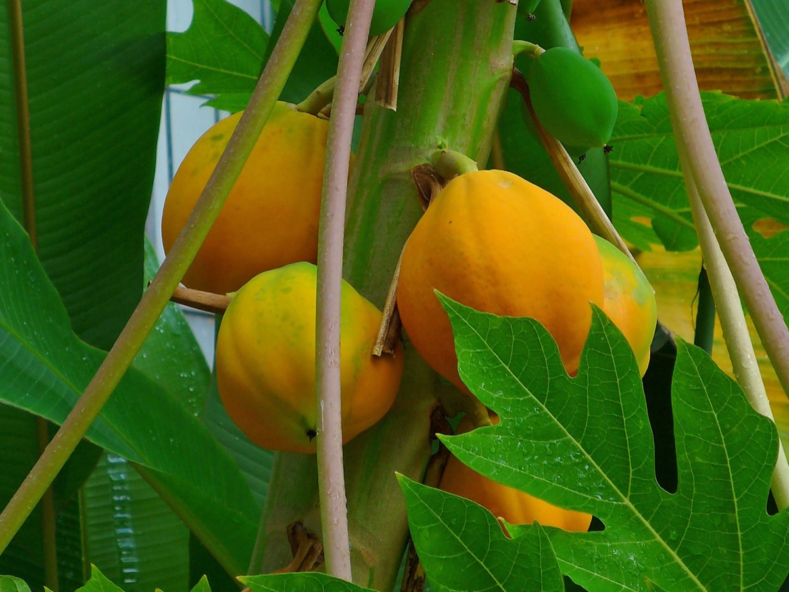

# Carica papaya - Madhukarkati

[TOC]

**Papaya** is a large tree-like plant, with a single stem growing from 5 to 10 m (16 to 33 ft) tall, with spirally arranged leaves confined to the top of the trunk.
## Uses
Digestive disorders, Healing wounds, Diabetes, Hypertension, High blood pressure, Malaria, Ulcer, Boils, Wounds

## Parts Used
Fruits, Leaves, Seeds, Flowers.

## Chemical Composition
The green fruit is reported to contain 26 calories, 92.1 g H2O, 1.0 g protein, 0.1 g fat, 6.2 g total carbohydrate, 0.9 g fiber, 0.6 g ash, 38 mg Ca, 20 mg P, 0.3 mg Fe, 7 mg Na, 215 mg K, 15 ug beta-carotene equivalent. Latex contain enzymes—papain and chymopapain and alkaloids carpaine and pseudocarpaine

## Common names
| Language | Names |
| --- | --- |
| Kannada | Pappaya hannu |
| Sanskrit | Erand karkati |
| Tamil | Pappali |
| Hindi | Papita |
| English | Pawpaw, Papaya |

## Properties
Reference: Dravya - Substance, Rasa - Taste, Guna - Qualities, Veerya - Potency, Vipaka - Post-digesion effect, Karma - Pharmacological activity, Prabhava - Therepeutics.
### Dravya
### Rasa
Katu, Tikta
### Guna
Laghu, Ruksa, Tikshna
### Veerya
Ushna
### Vipaka
### Karma
Kaphavatahara, Hridya
### Prabhava
## Habit
Herb

## Identification
### Leaf
Simple, 2 ½ ft wide, Stems appear as a trunk, are hollow, light green to tan brown, up to 8″ in diameter, and bear prominent leaf scars.

### Flower
Bisexual, 2-6cm long, White, 5-10, Flowers are solitary or small cymes of 3 individuals

### Fruit
Oval, Fruits weigh from 0.5 up to 20 lbs, Fruit are borne axillary on the main stem, Usually singly but sometimes in small clusters, Many

### Other features
## List of Ayurvedic medicine in which the herb is used
## Where to get the saplings
## Mode of Propagation
Seeds, Cuttings.

## How to plant/cultivate
Seeds germinate readily. Papaya succeeds in tropical and subtropical areas, where it can be found between 32°N and S. It produces best at elevations below 900 metres, though it can also succeed as high as 2,100 metres near the equator

## Commonly seen growing in areas
Lower rainfall, Island, Cooler temperature.

## Photo Gallery

.jpg)

## References

## External Links
* [Papaya on missori botonical garden](http://www.missouribotanicalgarden.org/PlantFinder/PlantFinderDetails.aspx?kempercode=d374)
* [Papaya on encyclopedea of life](http://eol.org/pages/585682/details)
* [General crop information](http://www.extento.hawaii.edu/kbase/crop/crops/i_papa.htm)
* [Papaya description pdf](http://www.worldagroforestry.org/treedb/AFTPDFS/Carica_papaya.PDF)

## References

1. [Chemistry](http://gbpihedenvis.nic.in/PDFs/Glossary_Medicinal_Plants_Springer.pdf)
2. [description](Botonical)(http://www.fruit-crops.com/papaya-carica-papaya/)
3. [details](Cultivation)(http://tropical.theferns.info/viewtropical.php?id=Carica+papaya)
