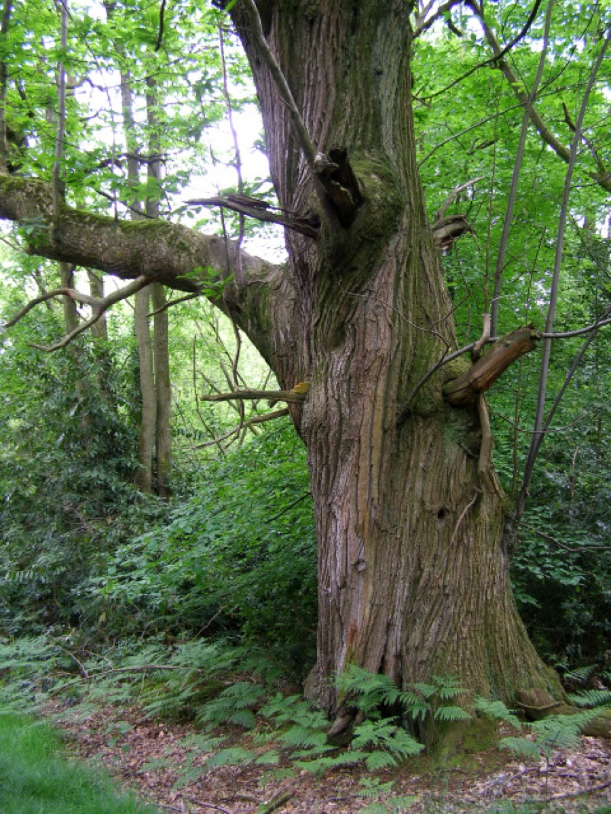

# Castanea sativa - Sweet chestnut

[TOC]

**Castanea sativa** is a species of Flowering plant in the family **Fagaceae**. It is  native to Europe and Asia Minor. It is widely cultivated throughout the temperate world.
## Uses
Bleeding, Fever, Ague, Cough, Rheumatism, Joint pain, Diarrhea, Sore throats

## Parts Used
Seeds, Bark.

## Chemical Composition
They contained (g/100g dry matter basis) total carbohydrates.

## Common names
| Language | Names |
| --- | --- |
| English | Sweet chestnu |

## Properties
Reference: Dravya - Substance, Rasa - Taste, Guna - Qualities, Veerya - Potency, Vipaka - Post-digesion effect, Karma - Pharmacological activity, Prabhava - Therepeutics.
### Dravya
### Rasa
### Guna
### Veerya
### Vipaka
### Karma
### Prabhava
## Habit
Tree

## Identification
### Leaf
Simple, There is one leaf per node along the stem and the edge of the leaf blade has teeth

### Flower
Bisexual, 2-4cm long, Brown, 5, These catkins are 10 to 20 cm long and appear in late June to July

### Fruit
General, The fruit is dry but does not split open when ripe, The bark of an adult plant is ridged or plated

### Other features
## List of Ayurvedic medicine in which the herb is used
## Where to get the saplings
## Mode of Propagation
Seeds, Cuttings.

## How to plant/cultivate
Seed - where possible sow the seed as soon as it is ripe in a cold frame or in a seed bed outdoors. The seed must be protected from mice and squirrels.

## Commonly seen growing in areas
Mountain area, Temperate region.

## Photo Gallery

, Belgium](images/Châtaigner_(Castanea_sativa)_JPG01.jpg)

_1.jpg)

## References

## External Links
* [Castanea sativa on plants of the world online](http://powo.science.kew.org/taxon/urn:lsid:ipni.org:names:295349-1)
* [Castanea sativa on missouri botonical garden](http://www.missouribotanicalgarden.org/PlantFinder/PlantFinderDetails.aspx?taxonid=280759&isprofile=0&%3B)
* [Chemical composition and functional properties of native chestnut starch](https://www.sciencedirect.com/science/article/pii/S0144861712012830)

## References

1. [composition of Castanea sativa ](Chemical)(http://www.scielo.br/scielo.php?script=sci_arttext&pid=S1516-89132006000300001)
2. [Charecteristics](https://gobotany.newenglandwild.org/species/castanea/sativa/)
3. [details](Cultivation)(https://pfaf.org/user/plant.aspx?LatinName=Castanea+sativa)
