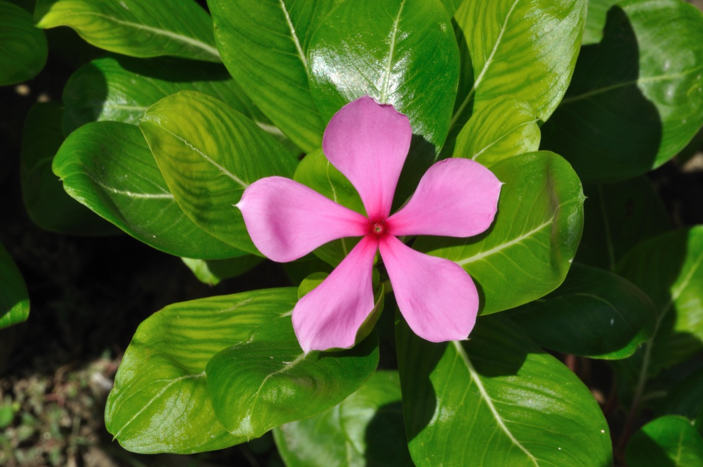

# Catharanthus roseus - Sada Bahar

[TOC]

**Catharanthus roseus** is a genus of flowering plant in the family Apocynaceae. It is native and endemic to Madagascar, but grown elsewhere as an ornamental and medicinal plant, It is a source of the drugs vincristine and vinblastine, used to treat cancer.
## Uses
Blood pressure, Lung cancer, Leukaemia, Dysentery, Diarrhoea, Hodgkin’s lymphoma, Diarrhea, Bleeding hemorrhoids

## Parts Used
Leaf, Root

## Chemical Composition
Indole, Indoline alkaloids, Ajmalicine, Lochnerine, Serpentine.

## Common names
| Language | Names |
| --- | --- |
| Kannada | Vishakanigalu, Kaasi kanigalu, Smashaana mallige |
| Sanskrit | Sadapushpi |
| Malayalam | Shavam Naari |
| Hindi | Sadabahar |
| Tamil | Nityakalyani |
| Telugu | Billaganneru |
| English | Periwinkle, Madagascar periwinkle |

## Properties
Reference: Dravya - Substance, Rasa - Taste, Guna - Qualities, Veerya - Potency, Vipaka - Post-digesion effect, Karma - Pharmacological activity, Prabhava - Therepeutics.
### Dravya
### Rasa
Tikta (Bitter), Kashaya (Astringent)
### Guna
Laghu (Light), Ruksha (Dry), Tikshna (Sharp)
### Veerya
Ushna (Hot)
### Vipaka
Katu (Pungent)
### Karma
Kapha, Vata
### Prabhava
## Habit
Ornamental herb

## Identification
### Leaf
Simple, Opposite, The leaves are lobed or unlobed but not separated into leaflets

### Flower
Unisexual, 2-4cm long, Pink to red, white, 5, Flowering throughout the year

### Fruit
General, 10–50 mm, The fruit is dry and splits open when ripe, -, -, Fruiting throughout the year

### Other features
## List of Ayurvedic medicine in which the herb is used
## Where to get the saplings
## Mode of Propagation
Seeds, Cuttings.

## How to plant/cultivate
Vinca or Periwinkle will grow in range of light conditions, from full sun to shade. They will do well in average soils.

## Commonly seen growing in areas
Ornamental plant in gardens, Under trees and bushes, Parks and cemeteries.

## Photo Gallery

## References

## External Links
* [Vinca drug components accumulate exclusively in leaf exudates of Madagascar periwinkle](http://www.pnas.org/content/107/34/15287)
* [Vinca on science direct](https://www.sciencedirect.com/topics/agricultural-and-biological-sciences/catharanthus-roseus)
* [Vinca on flowersofindia.net](http://www.flowersofindia.net/catalog/slides/Periwinkle.html)
* [Vinca on naturalhomeremedies.com](http://naturalhomeremedies.co/Periwinkle-health-benefits-and-home-remedies.html)

## References

1. [constituents](Chemical)(http://www.yourarticlelibrary.com/biology/alkaloid/vinca-sources-macroscopical-character-and-uses-with-diagram/49664)
2. [desription](Plant)(https://gobotany.newenglandwild.org/species/vinca/major/)
3. [to Grow Vinca](How)(http://www.gardenersnet.com/flower/vincaperiwinkle.htm)
4. Karnataka Medicinal Plants Volume - 2” by Dr.M. R. Gurudeva, Page No.197, Published by Divyachandra Prakashana, #45, Paapannana Tota, 1st Main road, Basaveshwara Nagara, Bengaluru.
