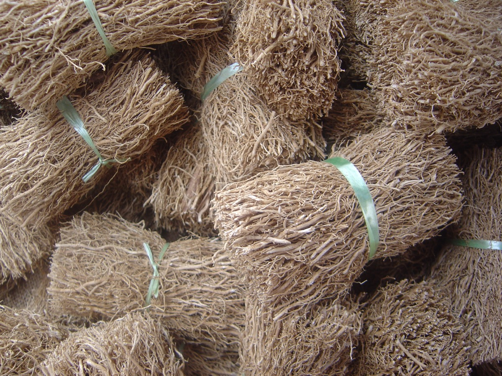

# Chrysopogon zizanioides - Vetiver

[TOC]

**Vetiver** is a perennial bunchgrass of the Poaceae family. It is native to India. In western and northern India it is popularly known as khus.
## Uses
Nerve problems, Stress, Emotional traumas, Lice, Repelling insects, Insomnia, Muscle pain, Joint pain, Sore throats

## Parts Used
Leaves.

## Chemical Composition
Benzoic acid, the molecular formula is C6H5COOH, is a colorless crystalline solid and a simple aromatic carboxylic acid

## Common names
| Language | Names |
| --- | --- |
| Kannada | Lavancha |
| Malayalam | Ramaccham, Ramachehamver |
| Sanskrit | Abhaya, Amrinata |
| Tamil | Lamichamver, Vattiver |
| Telugu | Ayurugaddiveru, Kuruveeru |
| Hindi | Balah |
| English | Vetiver |

## Properties
Reference: Dravya - Substance, Rasa - Taste, Guna - Qualities, Veerya - Potency, Vipaka - Post-digesion effect, Karma - Pharmacological activity, Prabhava - Therepeutics.
### Dravya
### Rasa
Tikta (Bitter), Kashaya (Astringent)
### Guna
Laghu (Light), Ruksha (Dry), Tikshna (Sharp)
### Veerya
Ushna (Hot)
### Vipaka
Katu (Pungent)
### Karma
Kapha, Vata
### Prabhava
## Habit
Herb

## Identification
### Leaf
Simple, The thin leaves and stems are erect and rigid

### Flower
Unisexual, 2-4cm long, Purple, 1, The plant bears small brown-purple flowers in long spikes

### Fruit
7–10 mm, Clearly grooved lengthwise, Lowest hooked hairs aligned towards crown, -, -

### Other features
## List of Ayurvedic medicine in which the herb is used
* [Ushiraasava](Ushiraasava.md), [Chandanasava](../medicines/Chandanasava.md), [Shadanga paniya](Shadanga_paniya.md), [Gopanganad kashayam](Gopanganad_kashayam.md), [Nisosiradi oil](Nisosiradi_oil.md)

## Where to get the saplings
## Mode of Propagation
Seeds, Cuttings.

## How to plant/cultivate
Conical ridges, 30-38 cm high and 48 cm apart are made at the summit and the slips planted 23 cm apart on the summit.

## Commonly seen growing in areas
Tall grasslands, Meadows, Borders of forests and fields.

## Photo Gallery

## References

## External Links
* [Vetiver on britannica.com](https://www.britannica.com/plant/vetiver)
* [Vetiver on vetiver.org](http://www.vetiver.org/g/the_plant.htm)
* [Vetiver on greenharvest.com](http://greenharvest.com.au/Plants/Information/Vetiver.html)
* [Vetiver on vetivernetinternational.blogspot](https://vetivernetinternational.blogspot.com/2012/03/vernacular-names-of-vetiver.html)

## References

1. [Constituents](Chemical)(https://www.herbsia.com/2017/11/vetiveria-zizanioides-chemical.html)
2. [description](Plant)(https://www.britannica.com/plant/vetiver)
3. [preparations](Ayurvedic)(https://www.britannica.com/plant/vetiver)
4. [Planting](http://agriinfo.in/default.aspx?page=topic&superid=2&topicid=1403)
