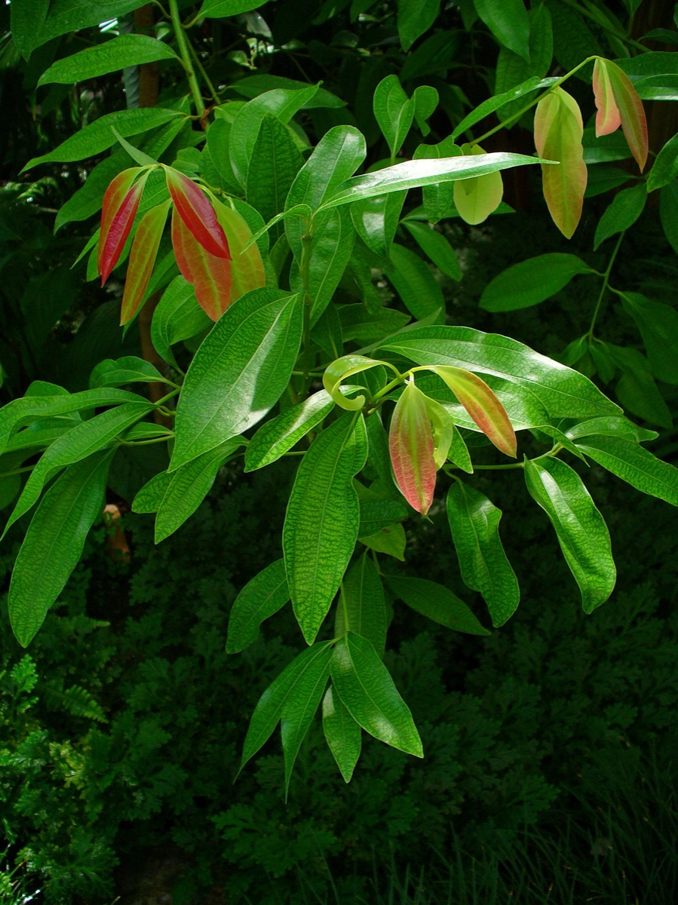

# Cinnamomum verum - Darusita

[TOC]

**Darusita** is a small evergreen tree 10–15 meters tall. It is native to Sri Lanka and South India. The bark is widely used as a spice due to its distinct odour. In India it is also known as "Daalchini".
## Uses
Diabetes, Cholesterol, Cold, Common cold, Skin eruptions, Flu, Pimples, Headaches.

## Parts Used
Leaves, Bark.

## Chemical Composition
The presence of a wide range of essential oils, such as trans-cinnamaldehyde, cinnamyl acetate, eugenol, L-borneol

## Common names
| Language | Names |
| --- | --- |
| Kannada | ದಾಲ್ಚಿನಿ Dalchini, ಕನ್ ಕುಟ್ಲು Kan kutlu, |
| Malayalam | Carua, Elavangam |
| Sanskrit | Darusita, tvak |
| Tamil | Cannalavangapattai, Ilavangam |
| Telugu | Daalchinni chakke, Lavangamu |
| Hindi | Dalcini, Darucini |
| English | Cinnamon |
| Marathi | Dalchini |

## Properties
Reference: Dravya - Substance, Rasa - Taste, Guna - Qualities, Veerya - Potency, Vipaka - Post-digesion effect, Karma - Pharmacological activity, Prabhava - Therepeutics.
### Dravya
### Rasa
Tikta (Bitter), Katu (Pungent), Madhura (Sweet)
### Guna
Laghu (Light), Ruksha (Dry), Tikshna (Sharp)
### Veerya
Ushna (Hot)
### Vipaka
Katu (Pungent)
### Karma
Vata, Kapha
### Prabhava
## Habit
Herb

## Identification
### Leaf
Simple, Foliage Color is Light Green, Dark Green, Pink and Foliage Texture is Medium and Foliage Sheen is Glossy

### Flower
Unisexual, 2-4cm long, White, Light Yellow, 1, Flower Interest is Insignificant and these are the Fragrant Flowers

### Fruit
Rounded, Black, Fruit is edible, Fruites are fragment, single

### Other features
## List of Ayurvedic medicine in which the herb is used
## Where to get the saplings
## Mode of Propagation
Seeds, Cuttings.

## How to plant/cultivate
Cinnamon can be found at elevations up to 2,000 metres, but for commercial harvesting does best at low altitudes below 500 metres

## Commonly seen growing in areas
Ocean islands, Seychelles, Lowland tropical forests.

## Photo Gallery
.jpg)
.jpg)
.jpg)
.jpg)

## References

## External Links
* [Cinnamomum verum on daves garden](https://davesgarden.com/guides/pf/go/70370/#b)
* [Cinnamomum verum on medical health guide](http://www.medicalhealthguide.com/herb/cinnamon.htm)
* [Cinnamon – Side Effects and Benefits](https://www.herbal-supplement-resource.com/cinnamon-herb.html)
* [Medicinal Uses of Cinnamon Reviewed](https://www.herbco.com/t-Medicinal-Uses-of-Cinnamon.aspx)

## References

1. [Constituents](Chemical)(https://www.hindawi.com/journals/ecam/2014/642942/)
2. [Characteristics](http://www.learn2grow.com/plants/cinnamomum-verum/)
3. [details](Cultivation)(https://www.pfaf.org/USER/Plant.aspx?LatinName=Cinnamomum+verum)
4. [names](Common)(https://sites.google.com/site/indiannamesofplants/via-names/kannada/kan-kutlu-kan-kutlu)
