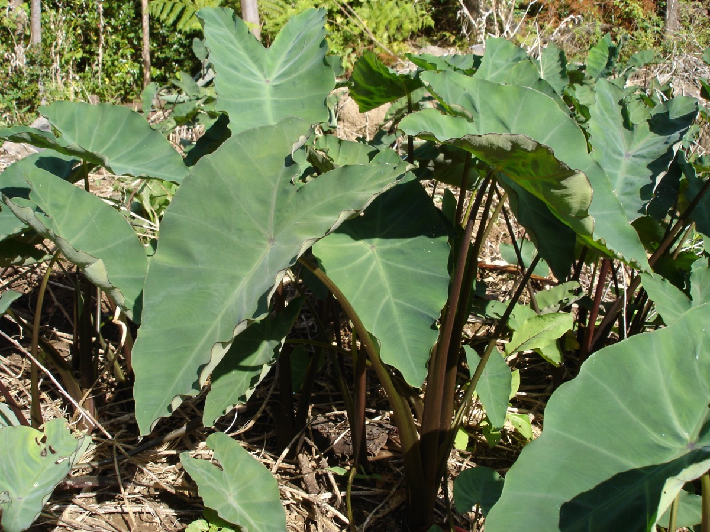

# Colocasia esculenta - Aaluki, Green Taro

[TOC]

**Aaluki** or **Taro**  commonly refers to the plant Colocasia esculenta. The most widely cultivated species of several plants in the Araceae family which are used as vegetables for their corm, leaves, and petioles.
## Uses
Ear ache , Otorrhoea, Internal hemorrhages, Inflamed glands, Buboes, Asthma, Piles, Diarrhea

## Parts Used
Leaves, Stem, All parts

## Chemical Composition
The bioactive constituents and antioxidant activities of raw, fried and decoctions of cocoyam (Colocasia esculenta) tubers were investigated.

## Common names
| Language | Names |
| --- | --- |
| Kannada | ಕೇಸವೆ Kesave |
| Malayalam | Chempu, Chempakizhanna |
| Sanskrit | Dalasarini |
| Tamil | Sempu, shamakkilangu |
| Telugu | Chamadumpa, Chamagadda |
| Punjabi | Gagli |
| Gujarati | Alavi |
| Hindi | Arvi, Ashukachu |
| English | Taro, cocoyam, Green taro |
| Marathi | Alvancha kanda |

## Properties
Reference: Dravya - Substance, Rasa - Taste, Guna - Qualities, Veerya - Potency, Vipaka - Post-digesion effect, Karma - Pharmacological activity, Prabhava - Therepeutics.
### Dravya
### Rasa
### Guna
### Veerya
### Vipaka
### Karma
### Prabhava
## Habit
Evergreen Perennial

## Identification
### Leaf
Simple, Non-Palm Foliage (Cordate), Foliar Venation is Pinnate / Net and Foliar Margin is Entire - Wavy / Undulate

### Flower
Unisexual, 4-10cm long, Yellow / Golden, 5-10, Flower Grouping is Cluster / Inflorescence and Inflorescence Type is Spathe & Spadix. Flowering from September to October

### Fruit
Round, Clearly grooved lengthwise, Lowest hooked hairs aligned towards crown, With hooked hairs, Fruiting from September to October

### Other features
## List of Ayurvedic medicine in which the herb is used
* [Vishatinduka Taila](../medicines/Vishatinduka_Taila.md) as *root juice extract*

## Where to get the saplings
## Mode of Propagation
Seeds.

## How to plant/cultivate
Taro is a plant of the moist to humid tropics, where it can be grown at elevations up to 2,700 metres.

## Commonly seen growing in areas
Trophical areas, Humid region.

## Photo Gallery

.jpg)

## References

## External Links
* [Colocasia esculenta: A potent indigenous plant](http://www.ijnpnd.com/article.asp?issn=2231-0738;year=2011;volume=1;issue=2;spage=90;epage=96;aulast=Prajapati)
* [Chemical Constituents of Colocasia esculenta leaves](http://www.catrinajournal.com/paper_info/id/218)
* [Crude extract from taro (Colocasia esculenta) as a natural source of bioactive proteins](https://www.sciencedirect.com/science/article/pii/S1756464615003722)
* [Colocasia esculent on Center for Aquatic and Invasive Plants](https://plants.ifas.ufl.edu/plant-directory/colocasia-esculenta/)

## References

1. [constituents](Bioactive)(https://link.springer.com/article/10.1007/s13749-015-0033-x)
2. [Mmorphology](https://florafaunaweb.nparks.gov.sg/special-pages/plant-detail.aspx?id=1835)
3. [names](Common)(https://sites.google.com/site/indiannamesofplants/via-species/c/colocasia-esculenta)
4. [Details](Cultivation)(http://tropical.theferns.info/viewtropical.php?id=colocasia+esculenta)
5. **Gurudeva, Magadi R. *Karnatakada Aushadhiya Sasyagalu (Vol. 2)*. Divyachandra Prakashana, Bengaluru, 2016, p. 213.**
   The tuber and leaf petiole are used to treat alopecia (hair loss) by applying warmed leaf preparations on affected areas for 1-2 months. The corm is used as a remedy for piles (hemorrhoids) and the leaf juice is applied to stop bleeding. The plant has cholesterol-lowering properties when consumed as. Leaf paste heated and applied for alopecia for 1-2 months; corm decoction taken internally for digestive disorders; leaves consumed as vegetable for nutritional benefits.