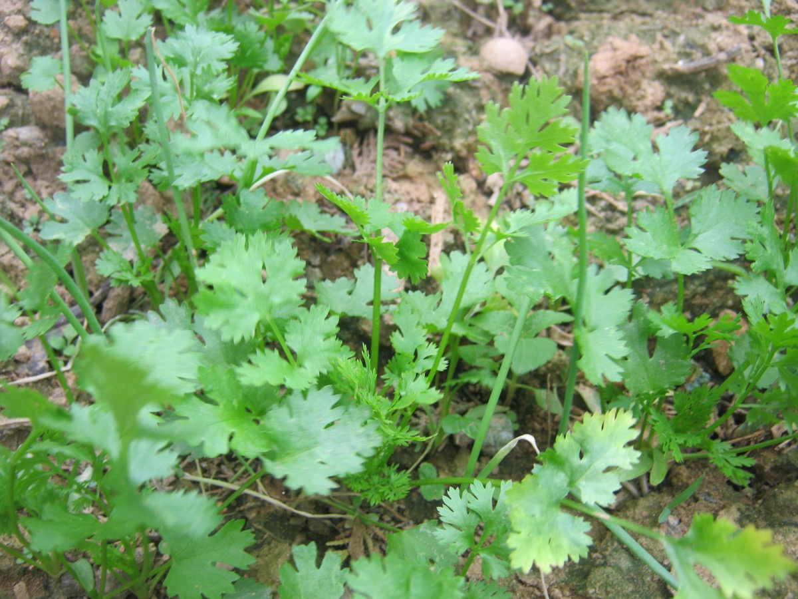

# Coriandrum sativum - Dhanyaka

[TOC]

**Coriandrum sativum** is aromatic annual plant of the parsley family Apiaceae. It has slender stems with two types of lobed leaves and can grow up 90 cm or 3 feet tall.

## Uses
Skin disorders, Eczema, Dryness, Fungal infections, Heart attacks, Artherosclerosis, Strokes, Diarrhea, Blood pressure.

## Parts Used
Seeds, Leaves.

## Chemical Composition
Coriander contains 0.5–1% volatile oil, consisting mainly of delta-linalool (55–74%), alpha-pinene and terpinine. It also contains flavonoids, coumarins, phthalides and phenolic acids (including caffeic and chlorogenic). Aqueous extract of the roasted seeds contains large amounts of acetylcholine and its precursor choline.

## Common names
| Language | Names |
| --- | --- |
| Kannada | Havija, Kotambari |
| Malayalam | Kotta-malli, Kottam-palari |
| Sanskrit | Vedhaka, Veshana, Vitunnaka, Dhanyaka |
| Tamil | Kotthu malli, Arainili, Aritaravanci, Avarika, Cottamillie |
| Telugu | Danyalu, Dhaniyaalu, Dhanyalu |
| Hindi | Dhaniya |
| English | Coriander |

## Properties
Reference: Dravya - Substance, Rasa - Taste, Guna - Qualities, Veerya - Potency, Vipaka - Post-digesion effect, Karma - Pharmacological activity, Prabhava - Therepeutics.
### Dravya
### Rasa
Madhura (Sweet)
### Guna
Laghu (Light), Snigda(unctuous)
### Veerya
Ushna (Hot), Sheet (Cold)
### Vipaka
Madhura (Sweet)
### Karma
Kapha, Vata

### Prabhava
## Habit
Herb

## Identification
### Leaf
Simple, Compound, Leaf arrangement is alternate and there is one leaf per node along the stem

### Flower
Unisexual, 2-4cm long, Pink to red, 5-20, There are two or more ways to evenly divide the flower and there is only one way to evenly divide the flower

### Fruit
General, Length is 2–6 mm, Fruit type is the fruit is dry but does not split open when ripe, With hooked hairs

### Other features
## List of Ayurvedic medicine in which the herb is used
* [Bilvādileha](../medicines/Bilvādileha.md)
* [Chandraprabha vati](../medicines/Chandraprabha_vati.md)
* [Brahmi vati](Brahmi_vati.md)
* [Kalyanagulam](Kalyanagulam.md)
* [Kankayan vati](Kankayan_vati.md)

## Where to get the saplings
## Mode of Propagation
Seeds.

## How to plant/cultivate
Grow in fertile, well drained soil in full sun where seeds are to be gathered. For leaf production partial shade is more productive

## Commonly seen growing in areas
Mediterranian region, meadows.

## Photo Gallery

## References

## External Links
* [Botanical description of Coriandrum sativum in science direct](https://www.sciencedirect.com/topics/agricultural-and-biological-sciences/coriandrum-sativum)
* [Coriandrum sativum on always ayurveda](http://www.alwaysayurveda.com/coriandrum-sativum/)
* [Coriander – Health Benefits and Side Effects](https://www.herbal-supplement-resource.com/coriander-herbs.html)
* [Coriandrum sativum on flowers fo india](http://www.flowersofindia.net/catalog/slides/Coriander.html)

## References

1. [composition](Chemical)(http://gbpihedenvis.nic.in/PDFs/Glossary_Medicinal_Plants_Springer.pdf)
2. [Characteristics](https://gobotany.newenglandwild.org/species/coriandrum/sativum/)
3. [to grow](How)(https://www.rhs.org.uk/Plants/4371/i-Coriandrum-sativum-i/Details)
4. [preparations](Ayurvedic)(https://easyayurveda.com/2013/03/04/coriander-seed-and-leaves-health-benefits-complete-ayurveda-details/)
