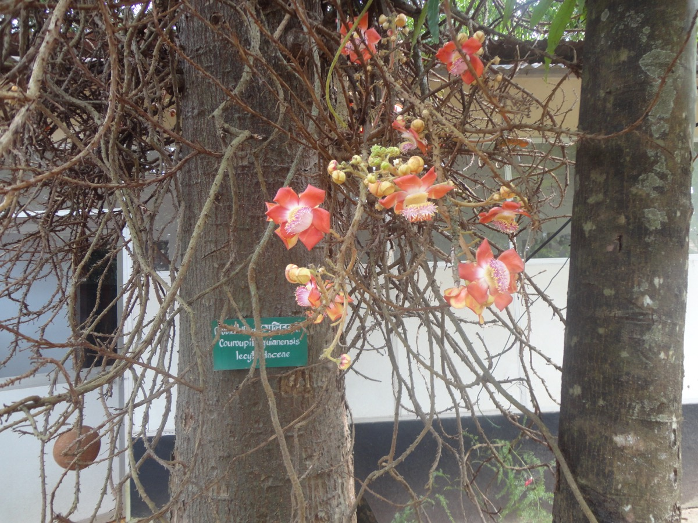

# Couroupita guianensis - Nagakesara

[TOC]

**Nagalingam** is a deciduous tree in the family Lecythidaceae. Which contains the Brazil nut and Paradise nut Lecythis zabucajo. It is native to the rainforests of Central and South America.
## Uses
Stomach aches, Cold, Skin diseases, Malaria, Wounds, Toothache, Hypertension, Tumors, Inflammation.

## Parts Used
Fruits.

## Chemical Composition
Presence of alkaloids, flavonoids, glycosides, phlobatannins, steroids, tannins and terpenoids.

## Common names
| Language | Names |
| --- | --- |
| Kannada | ಲಿಂಗದ ಹೂವಿನಮರ Lingada hoovinamara, ನಾಗಲಿಂಗ ಪುಷ್ಪ ಮರ Nagalinga pushpa mara |
| Malayalam | Nagalingam |
| Tamil | Naagalingam |
| Telugu | Nagalingam |
| Gujarati | Shivalingi |
| Hindi | Nagalinga, Tope gola |
| English | Cannonball tree |

## Properties
Reference: Dravya - Substance, Rasa - Taste, Guna - Qualities, Veerya - Potency, Vipaka - Post-digesion effect, Karma - Pharmacological activity, Prabhava - Therepeutics.
### Dravya
### Rasa
### Guna
### Veerya
### Vipaka
### Karma
### Prabhava
## Habit
Deciduous tree

## Identification
### Leaf
Simple, Alternate, Leaves are up to 20 centimeters long, entire to slightly serrate and hairy on the veins beneath

### Flower
Unisexual, 2-8 long, Reddish, 5, Flowers are fragrant, with stamens borne on an overarching androphore

### Fruit
Large, 15 to 24 centimeters, Reddish-brown globose, 200 to 300

### Other features
## List of Ayurvedic medicine in which the herb is used
* [Vishatinduka Taila](../medicines/Vishatinduka_Taila.md) as *root juice extract*

## Where to get the saplings
## Mode of Propagation
Seeds, Cuttings.

## How to plant/cultivate
Plants are very susceptible to frost

## Commonly seen growing in areas
Tropical area, Terrestrial.

## Photo Gallery
_young_leaves_in_Hyderabad,_AP_W_IMG_6606.jpg)

.JPG)

## References

## External Links
* [Couroupita guianensis on missouri botonical garden](http://www.missouribotanicalgarden.org/PlantFinder/PlantFinderDetails.aspx?taxonid=281687)
* [Biological Activities and Medicinal Properties of Couroupita guianensis](https://urpjournals.com/tocjnls/24_13v3i4_4.pdf)
* [Phytochemical analysis of fruit pulp of Couroupita guianensis Aubl](http://www.phytojournal.com/archives/2018/vol7issue2/PartM/7-1-427-377.pdf)

## References

1. [OF PHYTOCHEMICALS](CHARACTERIZATION)(https://innovareacademics.in/journals/index.php/ijpps/article/view/5979)
2. [Botony](http://www.stuartxchange.org/CannonBallTree)
3. [names](Common)(https://sites.google.com/site/indiannamesofplants/via-species/c/couroupita-guianensis)
4. [Details](Cultivation)(http://tropical.theferns.info/viewtropical.php?id=Couroupita+guianensis)
