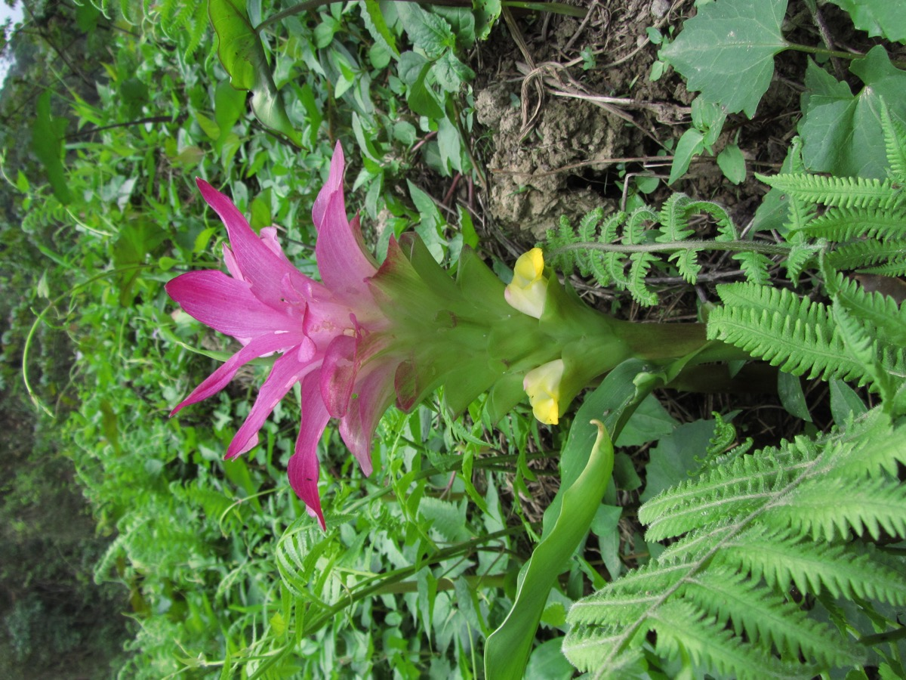

# Curcuma aromatica - Wild turmeric, Aranyaharidra

[TOC]

**Curcuma aromatica** is a member of the Curcuma genus belonging to the family Zingiberaceae. Botanically close to Curcuma australasica, wild turmeric has been widely used as a cosmetic herbal in South Asia and nearby regions.
## Uses
Arthritis, Heartburn, Joint pain, Stomachache, Ulcerative colitis, Bypass surgery, Diarrhea, Intestinal gas, Loss of appetite, Jaundice, Liver problems, Helicobacter pylori, Stomach ulcers, Irritable bowel syndrome, Gallbladder disorders, High cholesterol, Lichen planus, Fatigue, Headaches

## Parts Used
Rhizome, Oil.

## Chemical Composition
Rhizome yields essential oil, containing curdione and curcumol, colouring matter, cucurmin, resin, mucilage, albumionoids, starch, gum and sugar

## Common names
| Language | Names |
| --- | --- |
| Kannada | Kasthuri arishina |
| Malayalam | Kasthoori manjal, dantmanjal |
| Sanskrit | Aranyaharidra |
| Tamil | Kasturimanjal |
| Telugu | Kasthuri pasupa |
| Hindi | Jangli haldi |
| English | Wild turmeric, Aromatic turmeric |

## Properties
Reference: Dravya - Substance, Rasa - Taste, Guna - Qualities, Veerya - Potency, Vipaka - Post-digesion effect, Karma - Pharmacological activity, Prabhava - Therepeutics.
### Dravya
### Rasa
Tikta (Bitter), Katu (Pungent)
### Guna
Laghu (Light), Ruksha (Dry)
### Veerya
Ushna (Hot)
### Vipaka
Katu (Pungent)
### Karma
### Prabhava
## Habit
Shrub

## Identification
### Leaf
Large, Oblong, Up to 1 m long, dark green on upper surface, pale green beneath. Each leafy shoot (pseudostem) bearing 8–12 leaves

### Flower
Unisexual, 10–15 cm long, Yellow-white, Flowers are sterile and do not produce viable seed

### Fruit
oblong pod, Thinly septate, pilose, wrinkled, Small, ovoid, brown. Not viable

### Other features
## List of Ayurvedic medicine in which the herb is used
## Where to get the saplings
## Mode of Propagation
Seeds.

## How to plant/cultivate
Turmeric is a low-growing tropical herbaceous plant, which forms many long thin rhizomes

## Commonly seen growing in areas
Tropical area, Subtropical area.

## Photo Gallery

.jpg)

## References

## External Links
* [Curcuma aromatica on useful trophical plants](http://tropical.theferns.info/viewtropical.php?id=Curcuma+aromatica)
* [Curcuma aromatica on flowers of india](http://www.flowersofindia.net/catalog/slides/Wild%20Turmeric.html)
* [Curcuma aromatica uses, benefits, sideeffects](https://herbpathy.com/Uses-and-Benefits-of-Wild-Turmeric-Cid1079)
* [Wild Turmeric – Kasthuri Manjal – An aromatic medicinal cosmetic](http://healthyliving.natureloc.com/wild-turmeric-kasthuri-manjal-an-aromatic-medicinal-cosmetic/)
* [Natural home remedy of Wild Turmeric](http://naturalhomeremedies.co/Clonga.html)

## References

1. [Constituents](Chemical)(http://www.mpbd.info/plants/curcuma-aromatica.php)
2. [uses](Turmeric)(https://www.webmd.com/vitamins-supplements/ingredientmono-662-turmeric.aspx?activeingredientid=662&activeingredientname=turmeric)
3. [Cultivation](http://powo.science.kew.org/taxon/urn:lsid:ipni.org:names:796451-1)
