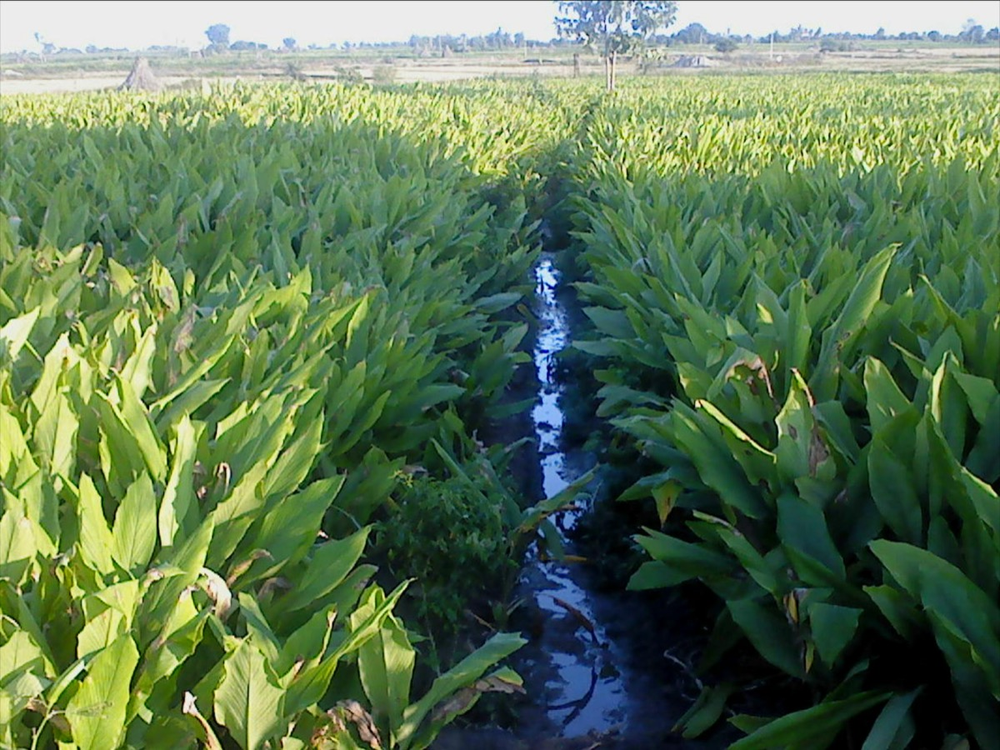

# Curcuma longa - Haridra

[TOC]

**Turmeric** is a rhizomatous herbaceous perennial plant of the ginger family Zingiberaceae. It is native to southern Asia, requiring temperatures between 20 and 30 °C and a considerable amount of annual rainfall to thrive.
## Uses
Psoriasis, Warts, Alzheimer’s disease, Parkinson’s disease, Ulcerative colitis, Arthritis.

## Parts Used
Rizhomes.

## Chemical Composition
The rhizomes contain curcuminoids, curcumin, cyclocurcumin, bisdemethoxycurcumin

## Common names
| Language | Names |
| --- | --- |
| Kannada | Arishina, Arisina |
| Malayalam | Manjal |
| Sanskrit | Haridra |
| Tamil | Manjal |
| Telugu | Haridra |
| Hindi | Haldi |
| English | Turmeric |

## Properties
Reference: Dravya - Substance, Rasa - Taste, Guna - Qualities, Veerya - Potency, Vipaka - Post-digesion effect, Karma - Pharmacological activity, Prabhava - Therepeutics.
### Dravya
### Rasa
Tikta (Bitter), Kashaya (Astringent)
### Guna
Laghu (Light), Ruksha (Dry)
### Veerya
Ushna (Hot)
### Vipaka
Katu (Pungent)
### Karma
Kapha, Vata
### Prabhava
## Habit
Herb

## Identification
### Leaf
Simple, Alternate, The leaves are divided into 3-6 toothed leaflets, with smaller leaflets in between

### Flower
Unisexual, 2-4cm long, Yellow, pink or orange, 5, Flowering may occur early in the growing season

### Fruit
Simple, 7–10 mm, Fruiting time is June and July, many

### Other features
## List of Ayurvedic medicine in which the herb is used
* [Haridra khanda](Haridra_khanda.md)
* [Khadiradi vati](Khadiradi_vati.md)
* [Nisa Kathakadi kashayam](Nisa_Kathakadi_kashayam.md)
* [Nishamalakai churna](Nishamalakai_churna.md)

## Where to get the saplings
## Mode of Propagation
Seeds.

## How to plant/cultivate
While preparing the nursery for turmeric production, at the same time we cultivate a green manure crop (Daincha) inthe main field

## Commonly seen growing in areas
Tropical area, Southeast asia, Southern australia.

## Photo Gallery

_Im_IMG_2441.jpg)
_W_IMG_2440.jpg)
_W2_IMG_2440.jpg)
.png)

## References

## External Links
* [Growing, Harvesting, and Manufacturing Curcumin](http://www.curcuminforhealth.com/growing-harvesting-and-manufacturing/)
* [Turmeric Uses and Benefits as a Medicinal Herb](https://www.herbal-supplement-resource.com/turmeric-benefits.html)
* [Curcuma longa on ginsneg.com](https://en.mr-ginseng.com/turmeric/)

## References

1. [constituents](Chemical)(http://www.thepharmajournal.com/vol4Issue1/Issue_Mar_2015/4-1-18.1.pdf)
2. [Morphology](Curcuma)(https://www.plantdelights.com/blogs/articles/curcuma-longa-turmeric-plant-zedoaria-ginger)
3. [preparations](Ayurvedic)(https://easyayurveda.com/2013/10/23/turmeric-curcuma-longa-benefits-usage-dose-side-effects/)
4. [Cultivation](http://practicalplants.org/wiki/Agrimonia_eupatoria)
