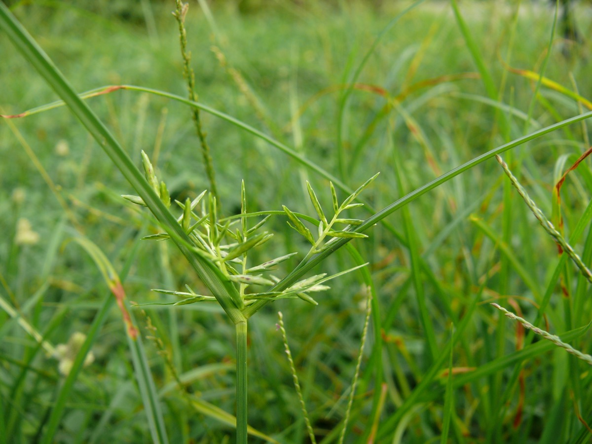
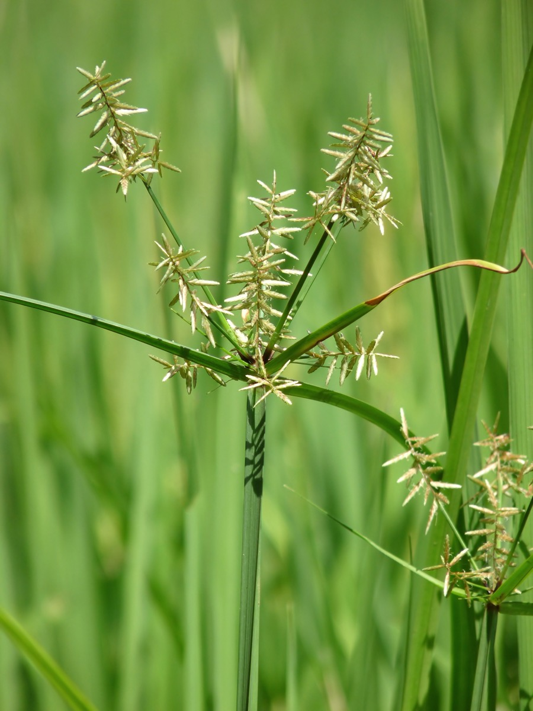

# Cyperus rotundus - Mustaka

[TOC]

**Cyperus rotundus** is a perennial plant that may reach a height of up to 140 cm. It prefers dry conditions, but will tolerate moist soils, and often grows in wastelands and in crop fields.
## Uses
Leprosy, Excess thirst, Fever, Liver disorders, Blood diseases, Biliousness, Dysentery, Itching.

## Parts Used
Roots, Seeds.

## Chemical Composition
Alpha-cyperone (11.0%), myrtenol (7.9%), caryophyllene oxide (5.4%) and beta-pinene (5.3%) were major compounds in the oil of sample A. The main constituents of the oil of sample B were beta-pinene (11.3%), alpha-pinene (10.8%), alpha-cyperone (7.9%), myrtenol (7.1%) and alpha-selinene (6.6%)

## Common names
| Language | Names |
| --- | --- |
| Kannada | Abdahullu, Koranari-gadde |
| Malayalam | Karimuttan |
| Sanskrit | Abhrabheda, Ambhodhara |
| Tamil | Korai, Korai kilangu |
| Telugu | Bhadratungamuste |
| Hindi | Baranagarmotha |
| English | Common nut sedge |

## Properties
Reference: Dravya - Substance, Rasa - Taste, Guna - Qualities, Veerya - Potency, Vipaka - Post-digesion effect, Karma - Pharmacological activity, Prabhava - Therepeutics.
### Dravya
### Rasa
Tikta (Bitter), Kashaya (Astringent), Katu (Pungent)
### Guna
Laghu (Light), Ruksha (Dry)
### Veerya
Sheeta (cold)
### Vipaka
Katu (Pungent
### Karma
Kapha, Pitta
### Prabhava
## Habit
Perennial plant

## Identification
### Leaf
Simple, Aternate, Leaves sprout in ranks of three from the base of the plant

### Flower
Bisexual, 2-4cm long, Yellow, 5-8, Flowers Season is June - August

### Fruit
Three-angled achene, 7–10 mm, The root system of a young plant initially forms white, fleshy rhizomes, Fleshy rhizomes, many

### Other features
## List of Ayurvedic medicine in which the herb is used
[Bilvādileha](../medicines/Bilvādileha.md), [Musta karanjadi kashayam](Musta_karanjadi_kashayam.md), [Mustharishtam](Mustharishtam.md), [Navaka guggulu](Navaka_guggulu.md), [Panchatiktarishta](Panchatiktarishta.md), [Lohaasava](Lohaasava.md)

## Where to get the saplings
## Mode of Propagation
Seeds.

## How to plant/cultivate
Prefers a moist sandy loam and a sunny position

## Commonly seen growing in areas
Roadsides, Sandy fields, Cultivated ground, Damp places.

## Photo Gallery
.jpg)

## References

## External Links
* [Cyperus rotundus on crop sciences](https://www.cropscience.bayer.com/en/crop-compendium/pests-diseases-weeds/weeds/cyperus-rotundus)
* [Cyperus rotundus on GLOBAL INVASIVE SPECIES DATABASE ](http://www.iucngisd.org/gisd/species.php?sc=1448)
* [Cyperus rotundus on useful trophical plants](http://tropical.theferns.info/viewtropical.php?id=Cyperus+rotundus)
* [Musta on extension.org](http://articles.extension.org/pages/66868/weed-profile:-yellow-nutsedge-cyperus-esculentus-and-purple-nutsedge-c-rotundus)

## References

1. [composition](Chemical)(https://www.ncbi.nlm.nih.gov/pubmed/19701133)
2. [preparations](Ayurvedic)(https://easyayurveda.com/2015/01/07/musta-cyperus-rotundus-uses-research-side-effects/)
3. [description](Leaves)(https://www.flowersofindia.net/catalog/slides/Common%20Nut%20Sedge.html)
4. [details](Cultivation)(https://www.pfaf.org/user/Plant.aspx?LatinName=Cyperus+rotundus)
5. Karnataka Aushadhiya Sasyagalu By Dr.Maagadi R Gurudeva, Page no:101
