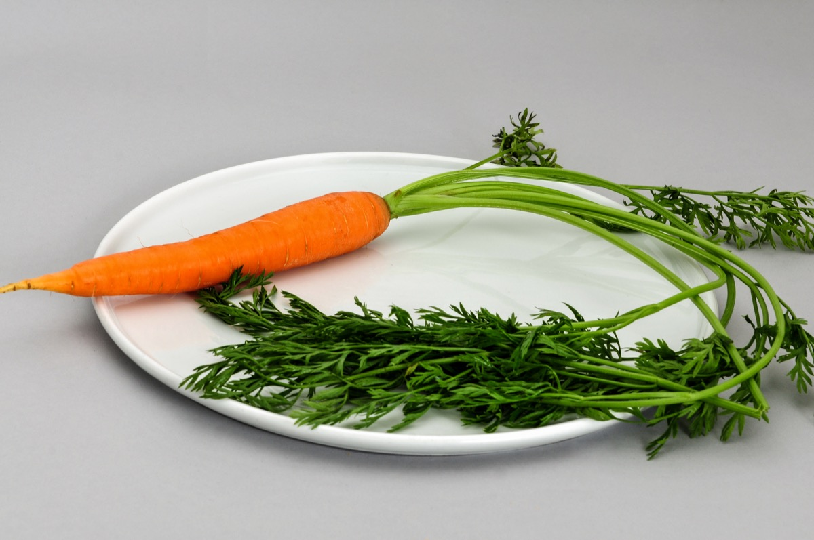

# Daucus carota - Garjarah

[TOC]

The **Daucus carota** is a root vegetable usually orange in colour. Carrots are a domesticated form of the wild carrot Daucus carota. It is native to Europe and southwestern Asia. The plant probably originated in Persia and was originally cultivated for its leaves and seeds.
## Uses
Wounds, Cuts, Snakebites, Curing liver disorders, Skin eruptions, Blotches, Pimples, Diarrhea, Sore throats

## Parts Used
Dried folaige, Whole herb.

## Chemical Composition
β-carotene, phenols and phosphorus contents were greater in local cultivars. A significant positive correlation between β-carotene

## Common names
| Language | Names |
| --- | --- |
| Kannada | Gajjari |
| Sanskrit | Garjarah |
| English | Carrot |

## Properties
Reference: Dravya - Substance, Rasa - Taste, Guna - Qualities, Veerya - Potency, Vipaka - Post-digesion effect, Karma - Pharmacological activity, Prabhava - Therepeutics.
### Dravya
### Rasa
Tikta (Bitter), Madhura (Sweet)
### Guna
Laghu (Light), Tikshna (Sharp)
### Veerya
Ushna (Hot)
### Vipaka
Madhura (Sweet)
### Karma
Kapha, Vata
### Prabhava
## Habit
Herb

## Identification
### Leaf
Simple, Alternate, Leaflets are lobed and bright greyish green in colou

### Flower
Unisexual, 4-7 mm in size, white, 5-20, Flowers are small flowers with deep purple florets in the centre

### Fruit
Oval, 2–4 mm length, Fruits are schizocarps, Reddish in colour and brittle when dry, Nil

### Other features
## List of Ayurvedic medicine in which the herb is used
* [Vishatinduka Taila](../medicines/Vishatinduka_Taila.md) as *root juice extract*

## Where to get the saplings
## Mode of Propagation
Seeds, Cuttings.

## How to plant/cultivate
To produce the best crop possible, double-dig your planting area or build up a raised bed

## Commonly seen growing in areas
Tall grasslands, Meadows, Borders of forests and fields.

## Photo Gallery

.jpg)

## References

## External Links
* [Carrots – How to Planting, Growing and Harvesting Carrots](http://homegardeners.in/carrots/)
* [Safety & Uses for Carrot Tops](http://www.carrotmuseum.co.uk/carrotops.html)
* [How to Prune Carrots](http://homeguides.sfgate.com/prune-carrots-38305.html)
* [Morphology and Classification Plant Carrots](http://bloganda23.blogspot.in/2013/12/morphology-and-classification-plant.html)

## References

1. [constituents](Chemical)(https://link.springer.com/article/10.1007%2FBF01099047)
2. [TO PLANT](HOW)(https://www.rodalesorganiclife.com/garden/how-to-grow-carrots)
