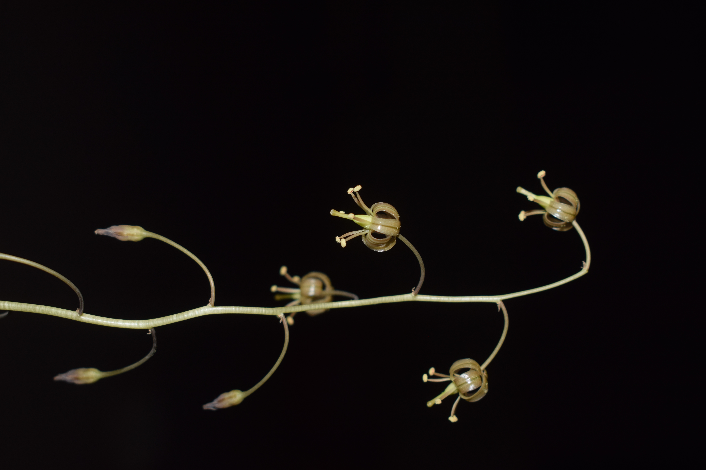

# Drimia indica - Kolakanda

[TOC]

**Kolakanda** is a bulbous perennial plant with delicate maroonish pendant flowers that bloom from leafless bulbs during the summer. The strap shaped leaves appear in the rainy season. The bulb is eaten by locals. Kolakanda is found throughout India in stony or gravelly substrate.
## Uses
Skin diseases, Cold, Cough, Difficulty in micturition, Cardiac problems, Intestinal worms

### Food
Kolakanda can be used in Food. Tubers are eaten raw or cooked as vegetable. Tender leaves are cooked as vegetable.

## Parts Used
Rhizome

## Chemical Composition
## Common names
| Language | Names |
| --- | --- |
| Kannada | ಬಿಳಿ ಈರುಳ್ಳಿ Bili eerulli, ಕಾಡು ಬೆಳ್ಳುಳ್ಳಿ Kaadu bellulli |
| Malayalam | Kaattulli, Kaanthenga |
| Sanskrit | Asmantaka, Kolakanda |
| Tamil | Ciruvenkayam, Kaattu vengayam |
| Telugu | Adavithellagadda, Kaazagadda, Nakka-vulli-gadda |
| Hindi | Ban piaz, Jangli piaz, Janglikanda |
| English | Indian squill, Sea onion, White squill |

## Properties
Reference: Dravya - Substance, Rasa - Taste, Guna - Qualities, Veerya - Potency, Vipaka - Post-digesion effect, Karma - Pharmacological activity, Prabhava - Therepeutics.
### Dravya
### Rasa
Tikta (Bitter), Katu (Pungent)
### Guna
Laghu (Light), , Teekshna (Strong)
### Veerya
Ushna (Hot)
### Vipaka
### Karma
Vata
### Prabhava
### Nutritional components
Cleome viscosa Contains the Following nutritional components like -  Vitamin-A, B and C; Cardiac glycosides; Flavonoids- Quercetin, Kaempferol, Sinistrinn; Calcium oxalate; Glycosides - scillaren-A and scillaren-B; Calcium, Copper, Iron, Magnesium, Manganese, Potassium, Phosphorus, Sulphur, Zinc.

## Habit
Herb

## Identification
### Leaf
Simple, Rosette, Bulbous, scapigerous herbs; bulbs tunicated, 3.5-6 x 2.5-6.5 cm, globose-conical. Leaves radical with sheathing base, 13-25 x 0.6-2.5 cm, linear, lanceolate or lorate.

### Flower
Bisexual, Scape, Purplish brown, 6, Scapes 17-45 cm tall, erect, purpish brown, 4-15-flowered.

### Fruit
A capsule, 10-20 x 5-10 mm, Brownish yellow, Seeds 4-10 in each cell, 4-7 x 3-4 mm, winged.

### Other features
## List of Ayurvedic medicine in which the herb is used
## Where to get the saplings
## Mode of Propagation
Seeds, Bulbs.

## Cultivation Details
Drimia indica is available through February-May.

### Season to grow
### Soil type
### Propagation
## Commonly seen growing in areas
Tropical area

## Photo Gallery

## References

## External Links
* [Drimia indica on theferns.info](http://tropical.theferns.info/viewtropical.php?id=Drimia+indica)
* [Drimia indica on sciencedirect.com](https://www.sciencedirect.com/science/article/pii/S0254627217300365)

## References

1. [Uses](https://easyayurveda.com/2017/08/13/indian-squill-urginea-indica/)
2. [DESCRIPTION](BOTANIC)(http://keralaplants.in/)
3. [names](Vernacular)(https://sites.google.com/site/indiannamesofplants/via-species/d/drimia-indica)
4. "Forest food for Northern region of Western Ghats" by Dr. Mandar N. Datar and Dr. Anuradha S. Upadhye, Page No.71, Published by Maharashtra Association for the Cultivation of Science (MACS) Agharkar Research Institute, Gopal Ganesh Agarkar Road, Pune
