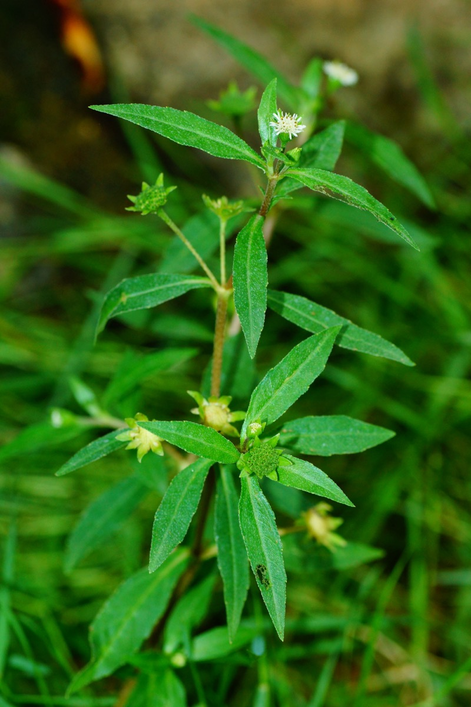

# Eclipta prostrata - Bhrngaraja

[TOC]

**Eclipta prostrata** is a species of plant in the sunflower family. It is widespread across much of the world. It is widely distributed throughout **India**, **Nepal**. This plant is belongs to Asteraceae family.
## Uses
Loss of appetite, Asthma, Productive cough, Hyperlipidemia, Mild hypertension, Intestinal worm, Jaundice, Piles, Abdominal pain, Hairfall, Preature greying of hair, Lucoderma.

## Parts Used
Young shoots, Leaves.

## Chemical Composition
Wedelolactone, Luteolin, Apigenin, Triterpenoids – Eclalbatin, alpha-amyrin, oleanolic acid, ursolic acid, Flavonoids – apigenin and luteolin, Wedelolactone,Echinocystic acid glycosides, β-Sitosterol, Daucosterol.

## Common names
| Language | Names |
| --- | --- |
| Kannada | Ajagara |
| Malayalam | Kannunni |
| Sanskrit | Bhrngaraja |
| Tamil | Karisilanganni, Kavanthakara |
| Telugu | Galagara |
| Hindi | Bhrngaraj, Kesharaj |
| English | False Daisy, Trailing eclipta |

## Properties
Reference: Dravya - Substance, Rasa - Taste, Guna - Qualities, Veerya - Potency, Vipaka - Post-digesion effect, Karma - Pharmacological activity, Prabhava - Therepeutics.
### Dravya
### Rasa
Tikta (Bitter), Katu (Pungent)
### Guna
Laghu (Light), Ruksha (Dry)
### Veerya
Ushna (Hot)
### Vipaka
Katu (Pungent)
### Karma
### Prabhava
## Habit
Annual plant

## Identification
### Leaf
Simple, Lanceolate, Leaf Apex is Acute, Leaf Base is Cuneate and Leaf Margin is Serrate-dentate..

### Flower
Bisexual, 2.5 cm long, White, 5-20, In axillary or terminal 1-3 capitula; white. Flowering from December-May

### Fruit
Oblong achene, An oblong achene, 3-quetrous, hairy above. Fruiting January onwards

### Other features
## List of Ayurvedic medicine in which the herb is used
* [Bhringamalakadi taila](Bhringamalakadi_taila.md)
* [Bhringarajasavam](Bhringarajasavam.md)
* [Manjishtadi kwath](Manjishtadi_kwath.md)

## Where to get the saplings
## Mode of Propagation
Seeds, Cuttings

## How to plant/cultivate
Can be raised both from seed as well as stem cuttings. Seed is preferred for raising plantation. Seed germination is 75-85% when freshly collected mature seeds are sown in a well prepared nursery.

## Commonly seen growing in areas
Poorly drained area, Wet areas.

## Photo Gallery

.jpg)

.jpg)v

## References

## External Links
* [Eclipta prostrata on Invasive Species Compendium](https://www.cabi.org/isc/datasheet/20395)
* [on flowers of india](http://www.flowersofindia.net/catalog/slides/False%20Daisy.html)
* [natural home remedy](http://naturalhomeremedies.co/Eprostrata.html)
* [Eclipta Alba for Hair Loss](https://www.hairlossrevolution.com/eclipta-alba-regrowth-study/)

## References

1. [composition"]("chemical)(https://www.ayurtimes.com/bhringraj-eclipta-prostrata/)
2. ["morphology"](https://indiabiodiversity.org/species/show/229618)
3. [preparations"]("Ayurvedic)(https://easyayurveda.com/2013/09/16/bhringraj-eclipta-alba-benefits-usage-dose-side-effects/)
4. [Details"]("Cultivation)(http://vikaspedia.in/agriculture/crop-production/package-of-practices/medicinal-and-aromatic-plants/eclipta-alba-1)
5. Karnataka Aushadhiya Sasyagalu By Dr.Maagadi R Gurudeva, Page no:117
