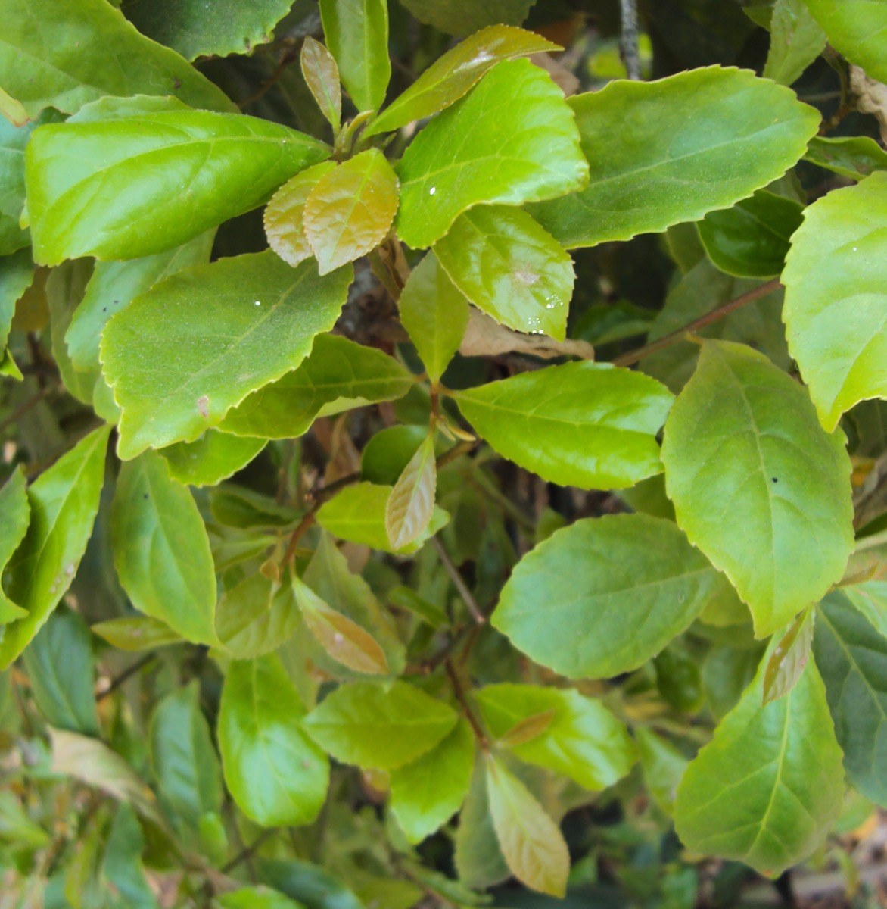

# Elaeocarpus serratus - Aravata

[TOC]

**Elaeocarpus serratus** is a tropical fruit found in the Indian Subcontinent, Indo-China and South East Asia. It is an ornamental medium sized tree indigenous to Sri Lanka, producing smooth, ovoid green fruits.

## Uses
Dandruff, Abscesses, Fungal infections, Joint swelling, Eczema, Perspiration problems.

## Parts Used
Roots, Leaves.

## Chemical Composition
Chemical investigation of the leaves of Elaeocarpus serratus yielded myricitrin (1), mearnsetin 3-O-β-D-glucopyranoside (2), mearnsitrin (3), tamarixetin 3-O-α-L-rhamnopyranoside

## Common names
| Language | Names |
| --- | --- |
| Sanskrit | Chiribilva, Aravata |
| Tamil | Krai, Ulankarai |
| English | Ceylon Olive |

## Properties
Reference: Dravya - Substance, Rasa - Taste, Guna - Qualities, Veerya - Potency, Vipaka - Post-digesion effect, Karma - Pharmacological activity, Prabhava - Therepeutics.
### Dravya
### Rasa
Madhura (Sweet)
### Guna
Guru (Heavy), Snigadh (Unctuous), Sneha(Oily)
### Veerya
Sheet (Cold)
### Vipaka
Madhura (Sweet)
### Karma
Vata, Pitta
### Prabhava
Rejuvenation,Supplement

## Habit
Evergreen tree

## Identification
### Leaf
Simple, Spiral, Leaves simple, alternate, spiral, clustered at twig ends.

### Flower
Inflorescence, 2-4cm long, White, Inflorescence racemes; flower petals white, laciniate, anthers ciliate

### Fruit
7–10 mm (0.28–0.4 in.) long pome

### Other features
## List of Ayurvedic medicine in which the herb is used
## Where to get the saplings
## Mode of Propagation
Seeds, Cuttings.

## How to plant/cultivate
Members of this genus generally grow well in full sun to moderate shade, requiring a fertile, moist but well-drained soil

## Commonly seen growing in areas
Tropical area.

## Photo Gallery

.jpg)

## References

## External Links
* [Chemical profiling of Elaeocarpus serratus L. by GC-MS](https://www.ncbi.nlm.nih.gov/pmc/articles/PMC3805092/)
* [Elaeocarpus serratus-uses, benefits, cures, nutrients](https://herbpathy.com/Uses-and-Benefits-of-Elaeocarpus-Serratus-Cid5596)
* [Elaeocarpus serratus on INTERNATIONAL JOURNAL OF PHARMACEUTICAL SCIENCES AND RESEARCH](http://ijpsr.com/bft-article/in-vitro-anti-arthritic-activity-of-elaeocarpus-serratus-linn-elaeocarpaceae/?view=fulltext)
* [Elaeocarpus serratus on herbal palnts](https://herbalplantslanka.blogspot.in/2013/12/weralu-elaeocarpus-serratus.html)

## References

1. [investigation](Chemical)(https://www.tandfonline.com/doi/abs/10.1080/14786419.2010.551514?scroll=top&needAccess=true&journalCode=gnpl20)
2. [Morphology](https://indiabiodiversity.org/species/show/11305)
3. [Details](Cultivation)(http://tropical.theferns.info/viewtropical.php?id=Elaeocarpus+serratus)
