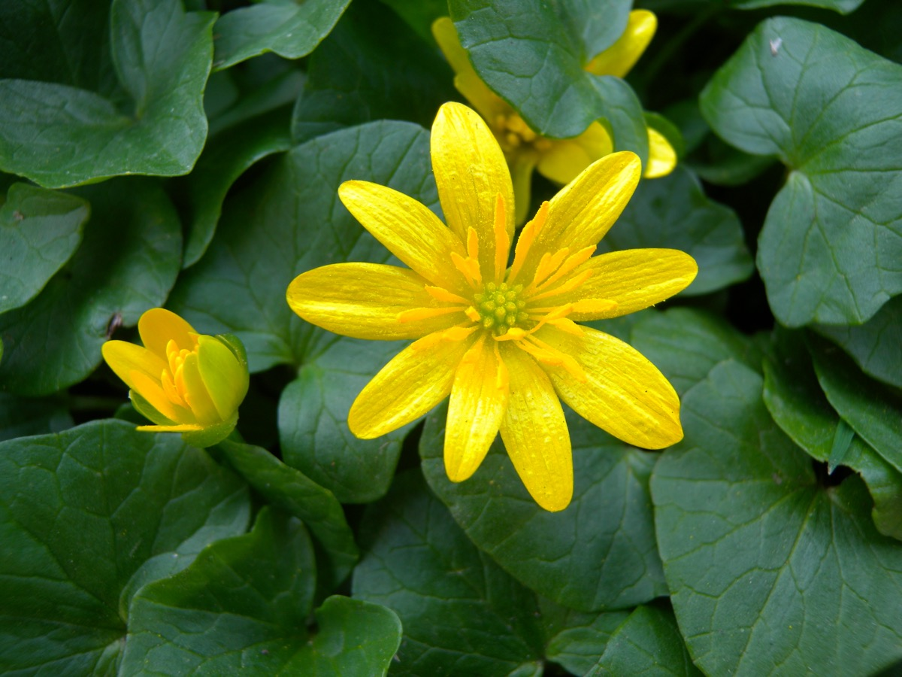

# Ficaria verna - Fig buttercup

[TOC]

**Ficaria verna** commonly known as lesser celandine is a low-growing, hairless perennial flowering plant in the buttercup family Ranunculaceae native to Europe and west Asia.
## Uses
Haemorrhoids, Ulcers, Piles, Curing liver disorders, Perineal damage, Blotches, Pimples, Diarrhea, Sore throats

## Parts Used
Dried folaige, Whole herb.

## Chemical Composition
Chromatographic analysis confirmed the presence of phenolic acids: vanillic, synapic, ferulic, p-coumaric, caffeic, p-hydroxybenzoic, protocatechuic and p-hydroxyphenylacetic

## Common names
| Language | Names |
| --- | --- |
| English | Lesser celandine, Fig buttercup |

## Properties
Reference: Dravya - Substance, Rasa - Taste, Guna - Qualities, Veerya - Potency, Vipaka - Post-digesion effect, Karma - Pharmacological activity, Prabhava - Therepeutics.
### Dravya
### Rasa
### Guna
### Veerya
### Vipaka
### Karma
### Prabhava
## Habit
Herb

## Identification
### Leaf
Simple, Alternate, There is one leaf per node along the stem and the edge of the leaf blade has teeth

### Flower
Unisexual, 2-4cm long, Yellow, 13, There are two or more ways to evenly divide the flower

### Fruit
General, 2.6–2.8 mm, The fruit is dry but does not split open when ripe, With hooked hairs, Many

### Other features
## List of Ayurvedic medicine in which the herb is used
* [Vishatinduka Taila](../medicines/Vishatinduka_Taila.md) as *root juice extract*

## Where to get the saplings
## Mode of Propagation
Seeds, Cuttings.

## How to plant/cultivate
Prefers a moist loamy neutral to alkaline soil in full sun or shade

## Commonly seen growing in areas
Montane forest, Meadows, Shores of rivers, Shores of lakes.

## Photo Gallery

## References

## External Links
* [Charred root tubers of lesser celandine](https://www.sciencedirect.com/science/article/pii/S1040618215009738)
* [Ficaria verna on missouri botonical garden](http://www.missouribotanicalgarden.org/PlantFinder/PlantFinderDetails.aspx?taxonid=368056&isprofile=0&://)
* [Ficaria verna on scottishforestgarden](https://scottishforestgarden.wordpress.com/2017/04/19/eating-lesser-celandine/)
* [Ficaria verna Huds. extracts and their β-cyclodextrin supramolecular systems](https://www.ncbi.nlm.nih.gov/pmc/articles/PMC3365867/)

## References

1. [Chemistry](https://www.researchgate.net/publication/259998140_Polyphenolic_compounds_from_flowers_of_Ficaria_verna_Huds)
2. [Charecteristics](https://gobotany.newenglandwild.org/species/ficaria/verna/)
3. [details](Cultivation)(https://www.pfaf.org/user/Plant.aspx?LatinName=Ranunculus+ficaria)
